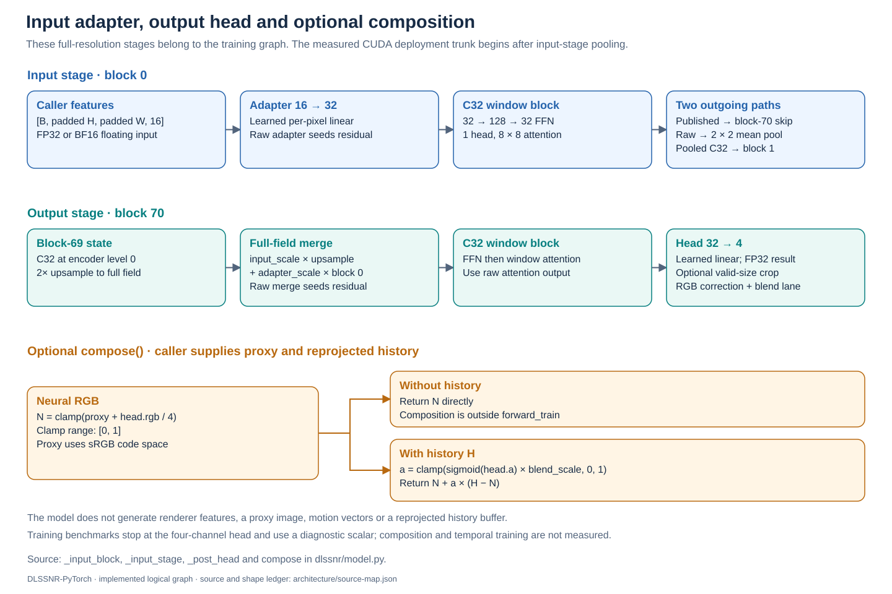
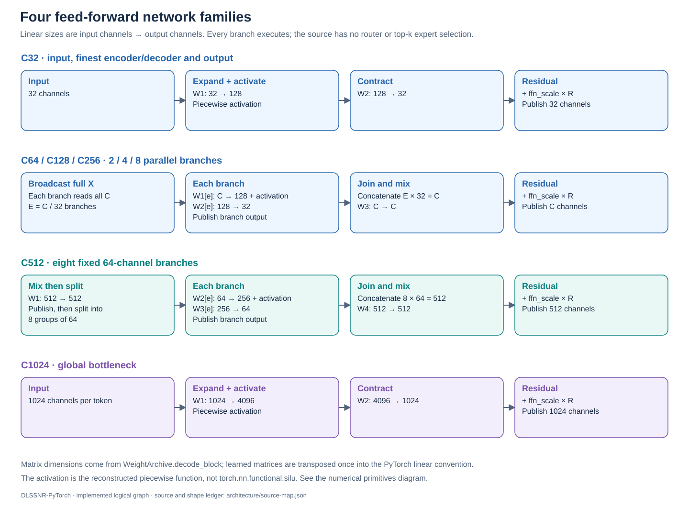

# Network architecture

This atlas follows the implemented graph in [model.py](../dlssnr/model.py), the stage geometry in [geometry.py](../dlssnr/geometry.py), and the learned matrix dimensions in [weights.py](../dlssnr/weights.py). It describes logical computation. A box is not necessarily one CUDA launch: deployment fuses operations and uses precision-specific physical layouts.

The network has 71 numbered records, **0–70**. Records 0 and 70 contain the full-resolution input/output blocks; **39 is a transition only**. The PyTorch training path covers all records. The measured FP8 deployment trunk covers prepared features through blocks **1–69**. Renderer feature extraction, temporal reprojection and a task-specific training pipeline remain external.

## Full network


All dimensions below are **width × height × channels**, using valid 3840 × 2160 input as an example. Fields include geometry padding, so they are not always exact powers-of-two divisions of the valid image.

| Stage | Records | Example field | Attention / repeat count | Saved skip |
|---|---|---|---|---|
| Input | 0 | 3840 × 2176 × 32 after adapter | 1 window block | To 70 |
| Encoder C32 | 1–4 | 1920 × 1088 × 32 | 4 window blocks | 4 → 66 |
| Encoder C64 | 5–8 | 960 × 544 × 64 | 4 window blocks | 8 → 62 |
| Encoder C128 | 9–14 | 480 × 272 × 128 | 6 window blocks | 14 → 56 |
| Encoder C256 | 15–22 | 240 × 136 × 256 | 8 window blocks | 22 → 48 |
| Encoder C512 | 23–30 | 120 × 68 × 512 | 8 window blocks | 30 → 39 |
| Global bottleneck | 31–38 | 60 × 36 × 1024 | 8 global blocks | — |
| Bottleneck up-transition | 39 | 120 × 68 × 512 | No attention or FFN | Merges 30 |
| Decoder C512 | 40–47 | 120 × 68 × 512 | 8 window blocks | Already merged at 39 |
| Decoder C256 | 48–55 | 240 × 136 × 256 | 8 window blocks | Merges 22 at 48 |
| Decoder C128 | 56–61 | 480 × 272 × 128 | 6 window blocks | Merges 14 at 56 |
| Decoder C64 | 62–65 | 960 × 544 × 64 | 4 window blocks | Merges 8 at 62 |
| Decoder C32 | 66–69 | 1920 × 1088 × 32 | 4 window blocks | Merges 4 at 66 |
| Output | 70 | 3840 × 2176 × 4 after head | 1 window block, then head | Merges 0 |

The encoder contains 30 ordinary blocks, the global stage eight, and the decoder 30. Together with the input/output blocks and transition 39, these account for all 71 records. The geometry generator also records the per-block window phase in the [source and shape ledger](figures/architecture/source-map.json).

## Input adapter and output head



The input adapter maps 16 caller-provided features to 32 channels at the full padded field. Block 0 returns a published value for the final skip and a raw value for pooling into the encoder. The output stage upsamples block 69, merges that full-resolution skip, executes block 70, and maps 32 channels to an FP32 four-channel head. `crop=True` removes geometry padding.

`compose()` can combine the head with a supplied proxy and optional reprojected history. It does not perform reprojection itself. The training benchmarks stop at the head; composition is not part of their diagnostic loss.

## Encoder stages


The last block at each encoder level has two consumers. Its published output is retained as the decoder skip. Its raw output goes through a 2 × 2 mean pool, field padding and a learned channel projection that doubles the channel count. The input stage pools without an additional channel projection.

## Decoder stages


Each up-transition projects the lower-resolution state to half as many channels, repeats rows and columns by two, crops to the target field, and adds the corresponding encoder skip with a learned scale. For blocks 48, 56, 62 and 66, those transition weights belong to the first ordinary block of the level. Block 39 holds only the C1024-to-C512 transition; ordinary processing resumes at block 40.

## Repeated block and residual paths


Channel mixing comes **before** attention. Both halves have learned channelwise residual scales. The input to QKV is the published FFN output. The attention residual uses the raw FFN result at C32 and the published result at other widths. Input block 0, decoder block 66 and output block 70 preserve specific raw residual inputs, as shown in the diagrams.

“Publish” marks a working-precision boundary in the training model. The deployment kernels have separate packed FP8/FP16 publication contracts; a logical training tensor is not interchangeable with a deployment buffer.

## Feed-forward variants



The four families share the same position in the block but differ internally. C64–C256 broadcast the full input into parallel branches; C512 first mixes channels and splits the result into eight groups. Every branch executes. Although some source identifiers use `expert`, there is no router or top-k selection in this implementation.

## Local window attention


Each head has 32 channels. Q and K are L2-normalized per head, and Q receives a learned head scale. The model uses four window-padding phases, 8 × 8 windows, a recovered physical key/value ordering, learned bias, and a surrogate exponential followed by normalization. It does not call standard softmax attention. Shifts use positive padding and cropping rather than cyclic rolling. Encoder and decoder share the phase counter at the same spatial level.

## Global bottleneck attention


All bottleneck positions participate in global attention with 32 heads. Q receives an extra √32 factor. Keys and values are padded to a multiple of 64 tokens; the denominator subtracts the nonzero exponential contribution of padded keys. Zero-valued padded V requires no corresponding numerator correction. At 4K the bottleneck has 2,160 tokens, with K/V padded to 2,176.

## Numerical primitives and precision


The activation named `silu` in the source is a reconstructed piecewise formula, not standard SiLU. Norm, exponential and reduction arithmetic use FP32 intermediates. BF16 selects matrix/working precision while FP32 master parameters remain recommended. These choices explain why BF16 memory use does not simply halve the FP32 footprint.

Non-reentrant checkpointing recomputes stage internals during backward. It changes memory use and computation scheduling without replacing the operations in these diagrams. See [training usage](training.md) and the [memory analysis](TRAINING_MEMORY.md).

## Regenerate the diagrams

```powershell
python -B tools/render_architecture.py
```

The generator uses the Python standard library, reads the actual geometry/schedule, and emits nine standalone SVGs plus a source-hash ledger. Operation annotations are maintained alongside it and should be reviewed whenever `model.py` or `weights.py` changes. The diagrams represent the current implementation, not a recovered original NVIDIA source diagram or a proven DLSS5 training recipe.
