# Network architecture

For the CUDA implementation of these model pieces, read the [81 standalone FP16/FP8 kernel lessons](kernel-guide/index.html). Each public kernel has its own start-to-finish document: model equations, a scalar baseline, per-token and lane diagrams, physical addresses, storage lifetimes, optimization rationale, and reconstruction checks. The [HTML architecture companion](kernel-guide/architecture.html) renders this document alongside the walkthroughs.

Start with the master diagram to identify a stage's **FFN variant** and **attention variant**. Then compare variants of that operation together, or follow the complete block to see how they connect. The same variant names appear in the master diagram, comparison views and expanded tensor flows.

## Contents

- [The whole network](#the-whole-network), [variants by stage](#which-diagram-applies-to-each-block) and [level dimensions](#track-a-tensor-between-levels)
- [An ordinary block and its normalization steps](#follow-one-block)
- [FFN variants together: dense, branched and grouped](#channel-mixing-inside-a-block)
- [Attention variants together: window and global](#how-positions-exchange-information)
- [Encoder and decoder transitions](#moving-between-resolutions)
- [Input, output and composition](#entering-and-leaving-the-network)
- [Numerical operations and precision](#the-operations-behind-the-labels)
- [Scope and regeneration](#scope-and-regeneration)

## The whole network


The encoder saves detailed features at five resolutions. The bottleneck exchanges information across the entire coarse image. The decoder brings that context back to higher resolutions and combines it with the saved encoder features.

Each stage names the two operations in its ordinary blocks, in execution order: **FFN → attention**. Encoder and decoder stages at the same channel width use the same variants, with different weights. Input/output blocks use **Dense FFN → Window attention**; the bottleneck uses **Dense FFN → Global attention**. Record 39 is only an up-transition.

The master diagram uses **width × height** at a valid 3840 × 2160 input. Expanded diagrams use **[height, width, channels]**, matching tensor axes; batch is omitted unless written explicitly. Padding belongs to the network geometry, so a level is not always exactly half the preceding field.

## Which diagram applies to each block?

Weights differ between records. The operation flow is shared within each family.

| Channels | Numbered blocks | FFN variant in the master diagram | Attention variant in the master diagram |
|---|---|---|---|
| 32 | 0–4, 66–70 | [Dense FFN](#dense-ffn-c32-and-c1024) · 32 → 128 → 32 | [Window attention](#window-attention-c32-through-c512) · 1 head |
| 64 | 5–8, 62–65 | [Branched FFN](#branched-ffn-c64-c128-and-c256) · 2 full-input branches | Window attention · 2 heads |
| 128 | 9–14, 56–61 | [Branched FFN](#branched-ffn-c64-c128-and-c256) · 4 full-input branches | Window attention · 4 heads |
| 256 | 15–22, 48–55 | [Branched FFN](#branched-ffn-c64-c128-and-c256) · 8 full-input branches | Window attention · 8 heads |
| 512 | 23–30, 40–47 | [Grouped FFN](#grouped-ffn-c512) · premix, 8 groups, postmix | Window attention · 16 heads |
| 1024 | 31–38 | [Dense FFN](#dense-ffn-c32-and-c1024) · 1024 → 4096 → 1024 | [Global attention](#global-attention-c1024-bottleneck) · 32 heads |
| 1024 → 512 | 39 only | None · [projection and up-transition](#decoder-restore-the-field-and-add-the-skip) | None |

Input block 0 adds an adapter before the ordinary body. Output block 70 adds a merge before it and a head after it. Encoder tails and decoder entry blocks also perform transitions.

## Track a tensor between levels

Padded **width × height × channels** for the same 4K example:

| Stage | Records | Field | Saved skip or incoming merge |
|---|---|---|---|
| [Input](#input-block-0) | 0 | 3840 × 2176 × 32 | Save for 70; pool to 1 |
| [Encoder C32](#encoder-save-detail-and-reduce-the-field) | 1–4 | 1920 × 1088 × 32 | 4 → 66 |
| Encoder C64 | 5–8 | 960 × 544 × 64 | 8 → 62 |
| Encoder C128 | 9–14 | 480 × 272 × 128 | 14 → 56 |
| Encoder C256 | 15–22 | 240 × 136 × 256 | 22 → 48 |
| Encoder C512 | 23–30 | 120 × 68 × 512 | 30 → 39 |
| [Global bottleneck](#global-attention-c1024-bottleneck) | 31–38 | 60 × 36 × 1024 | All positions exchange information |
| [Up-transition](#decoder-restore-the-field-and-add-the-skip) | 39 | 120 × 68 × 512 | Merge 30 |
| Decoder C512 | 40–47 | 120 × 68 × 512 | Continue from 39 |
| Decoder C256 | 48–55 | 240 × 136 × 256 | Merge 22 at 48 |
| Decoder C128 | 56–61 | 480 × 272 × 128 | Merge 14 at 56 |
| Decoder C64 | 62–65 | 960 × 544 × 64 | Merge 8 at 62 |
| Decoder C32 | 66–69 | 1920 × 1088 × 32 | Merge 4 at 66 |
| [Output](#output-block-70) | 70 | 3840 × 2176 × 4 | Merge 0, then produce head |

## Follow one block

An ordinary block preserves spatial size and channel count. First its FFN mixes channels **at each position independently**. Then attention lets positions exchange information. Each operation has a separate learned, channelwise residual path.

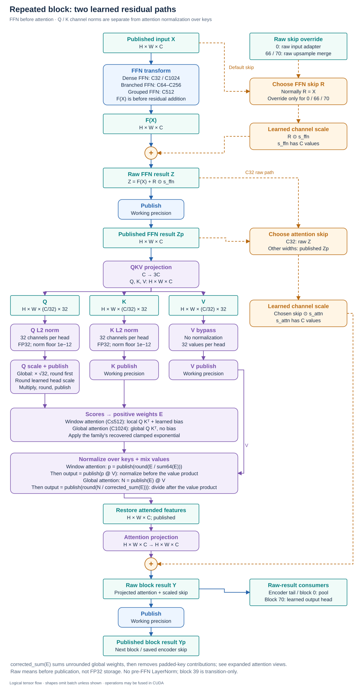

Green boxes represent tensors, rounded boxes represent operations, and `+` circles are elementwise additions. Amber dashed arrows carry bypass or side inputs, such as residuals and saved skips. `Publish` marks a working-precision boundary without changing shape. `Raw` names the value before that publication, retained for particular residual and transition paths.

There are **two different normalization steps**, now shown explicitly in the block flow:

| Normalization | Where it happens | What is reduced |
|---|---|---|
| **Q/K L2 normalization** | After the QKV projection and head split; Q and K separately, V bypasses it | The 32 channels of one token in one head |
| **Attention normalization** | Window attention divides exponential weights before multiplying V; global attention divides the weighted-value result by its corrected denominator | Key positions available to one query |

Q receives a learned scalar per head after L2 normalization; global Q also receives `√32`. The learned channelwise scales on the two residual paths are multipliers, not normalization operations. The implemented block has **no pre-FFN LayerNorm or RMSNorm**. [Numerical details](#the-operations-behind-the-labels) give the exact formulas.

## Channel mixing inside a block

An FFN reads one position's channel vector and returns another vector of the same width. It applies the same learned matrices at every position. **It does not read neighboring pixels.** Attention performs that spatial exchange afterward.

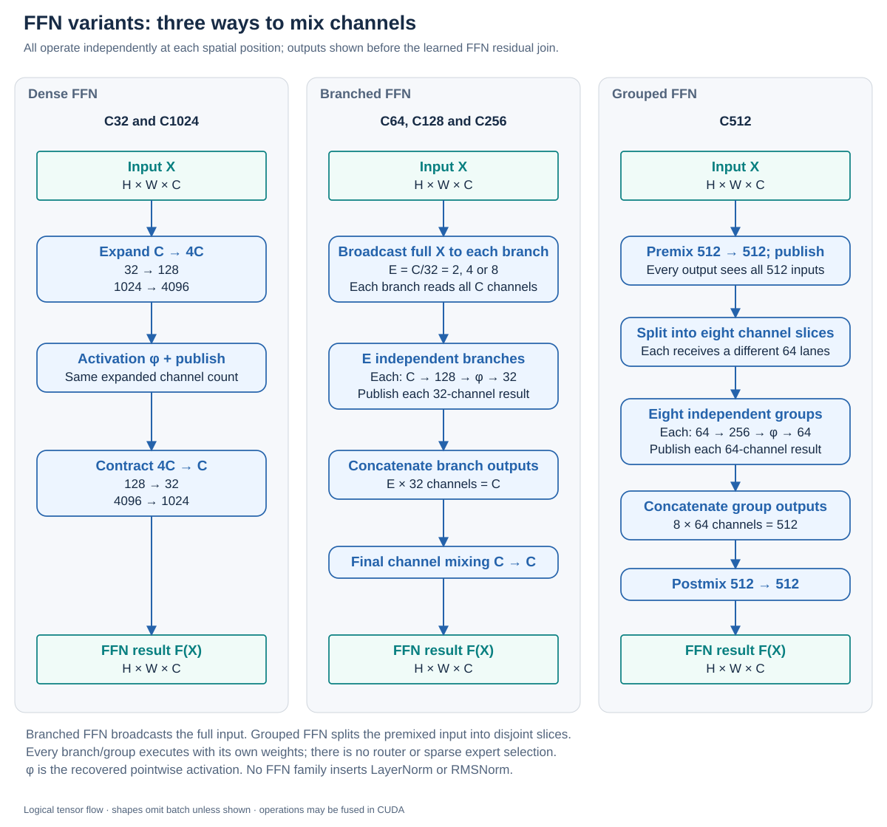

| Variant | What reaches each branch | Transform before the shared residual addition | Used at |
|---|---|---|---|
| **Dense FFN** | One complete C-channel vector | `C → 4C → C` | C32 and C1024 |
| **Branched FFN** | Every branch receives the **same complete input** | `C → 128 → 32` in each of C/32 branches; concatenate, then `C → C` | C64, C128 and C256 |
| **Grouped FFN** | Each branch receives a **different 64-channel slice** after premixing | `512 → 512`; eight `64 → 256 → 64` branches; concatenate, then `512 → 512` | C512 |

`…` stands for the unchanged batch and spatial axes. `Linear A → B` mixes A channels into B channels. `φ` is the [recovered piecewise activation](#activation). FFN outputs below are **before** the enclosing block adds its residual.

### Dense FFN: C32 and C1024

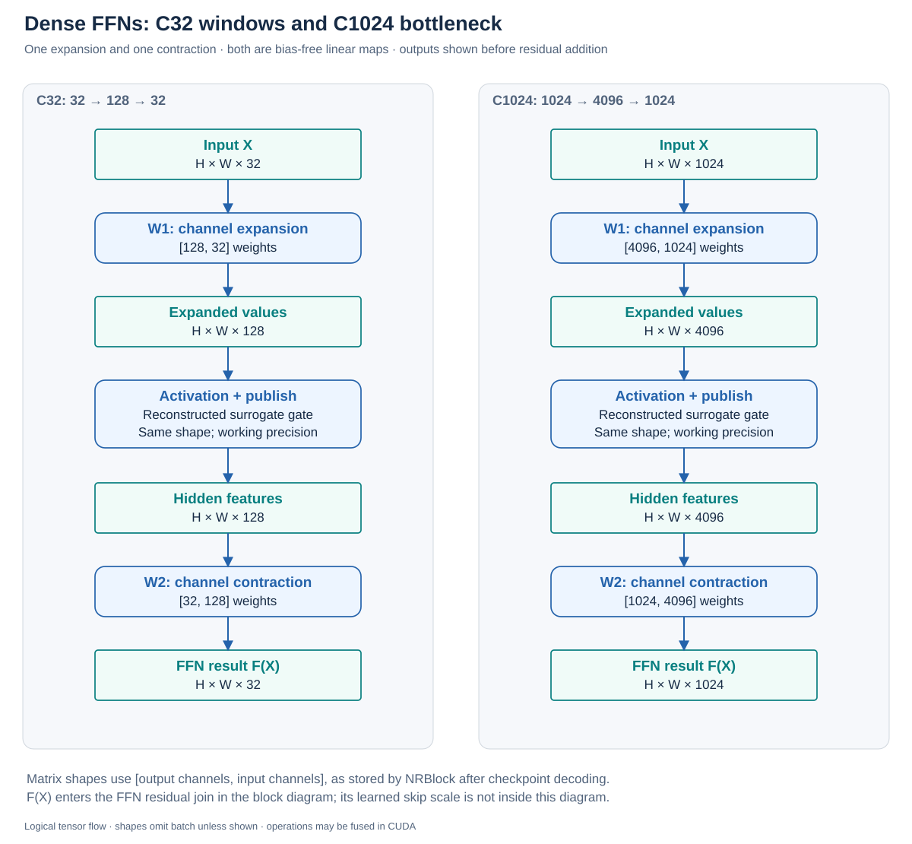

The first matrix expands the channel vector by four. The activation changes each expanded value independently. The second matrix combines those values back into the original width.

| Family | Input | Expanded tensor | Output | Records |
|---|---|---|---|---|
| C32 | `[…, 32]` | `[…, 128]` | `[…, 32]` | 0–4, 66–70 |
| C1024 | `[…, 1024]` | `[…, 4096]` | `[…, 1024]` | 31–38 |

### Branched FFN: C64, C128 and C256

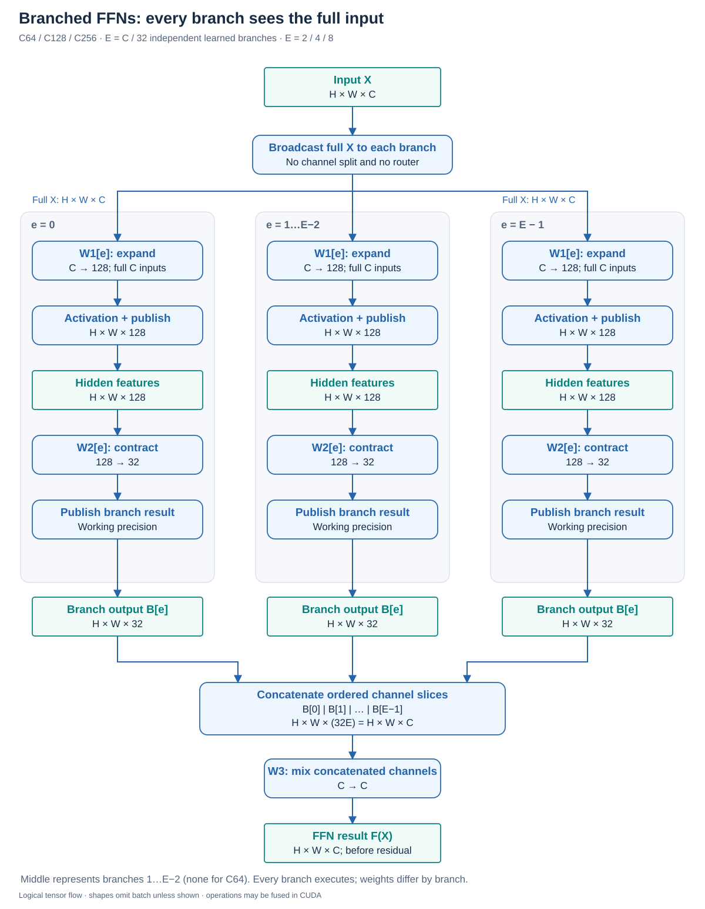

The **entire C-channel vector goes to every branch**. Each branch has its own `C → 128 → 32` matrices. The resulting 32-channel vectors are concatenated, then a final `C → C` projection mixes all branches.

For C128, four branches each read the same 128 channels and each produce 32 channels. Concatenation restores 128 channels; it does not sum four vectors.

| Channels C | Branches E | Each branch reads | Each emits | Concatenated width |
|---|---|---|---|---|
| 64 | 2 | All 64 channels | 32 | 64 |
| 128 | 4 | All 128 channels | 32 | 128 |
| 256 | 8 | All 256 channels | 32 | 256 |

Every branch executes for every position. Some source variables say `expert`, but there is no router, top-k selection or sparse expert dispatch.

### Grouped FFN: C512

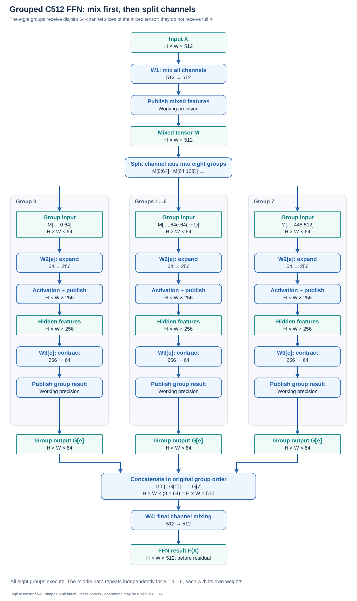

A `512 → 512` projection first mixes the full input. Its output is split into **eight different 64-channel slices**. Each branch transforms its slice through `64 → 256 → 64`. Concatenation restores 512 channels, and a second `512 → 512` projection mixes the branches again.

Here branches receive different slices of a premixed tensor. In the C64–C256 family they receive copies of the full input. The matrices before and after the C512 branches provide communication between slices.

### Where the residual joins

The block computes `Zraw = FFN(X) + ffn_scale ⊙ R`, then publishes `Z`. The scale has one learned value per channel, broadcast over positions. Usually `R = X`; blocks 0, 66 and 70 retain a raw adapter/merge for this path. QKV reads `Z`, after the addition. See the [full block diagram](#follow-one-block).

The later attention residual uses `Zraw` for C32 and the published `Z` for every other width, multiplied by a separate learned `attn_scale`.

Sources: [NRBlock.forward](../dlssnr/model.py#L162), [linear_activate](../dlssnr/model.py#L62), [decode_block](../dlssnr/weights.py#L218).

## How positions exchange information

Attention starts from the FFN result **after its residual addition**. A learned projection produces Q, K and V. Q describes what a position looks for; K describes what each candidate offers; V carries the features to combine. Each head has 32 channels. Head outputs are joined into C channels before the block's output projection and second residual.

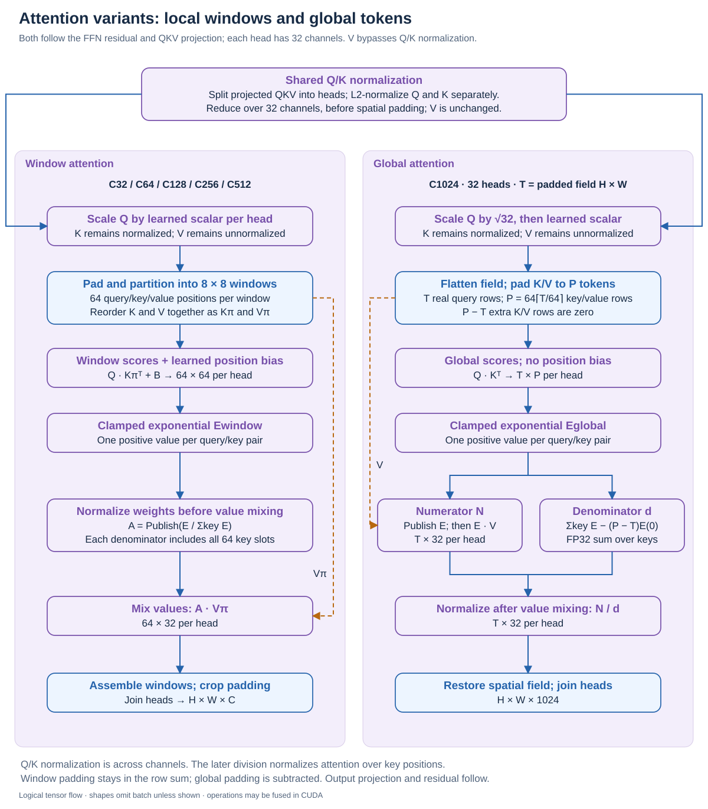

| Property | **Window attention** | **Global attention** |
|---|---|---|
| Used at | C32–C512, encoder/decoder and input/output blocks | C1024, bottleneck blocks 31–38 |
| Positions read by one query | 64 slots in its 8 × 8 window | All T = H × W positions in the padded bottleneck field |
| Q/K normalization | Separate L2 norms across 32 channels | Same |
| Q scaling after its norm | Learned scalar per head | `√32`, then learned scalar per head |
| Bias | Learned table for each head and window query/key pair | None |
| Attention normalization | Divide each exponential row by its sum, then multiply V | Multiply published exponentials by V, then divide by corrected row sum |
| Padding treatment | All 64 window slots participate, including added zeros | Subtract the padded-key exponential contribution from the denominator |

Both variants leave V unnormalized. They use different [surrogate exponential constants](#attention-exponential); neither is a call to standard softmax/SDPA. Their expanded flows follow together below, followed by the window-layout detail.

### Window attention: C32 through C512

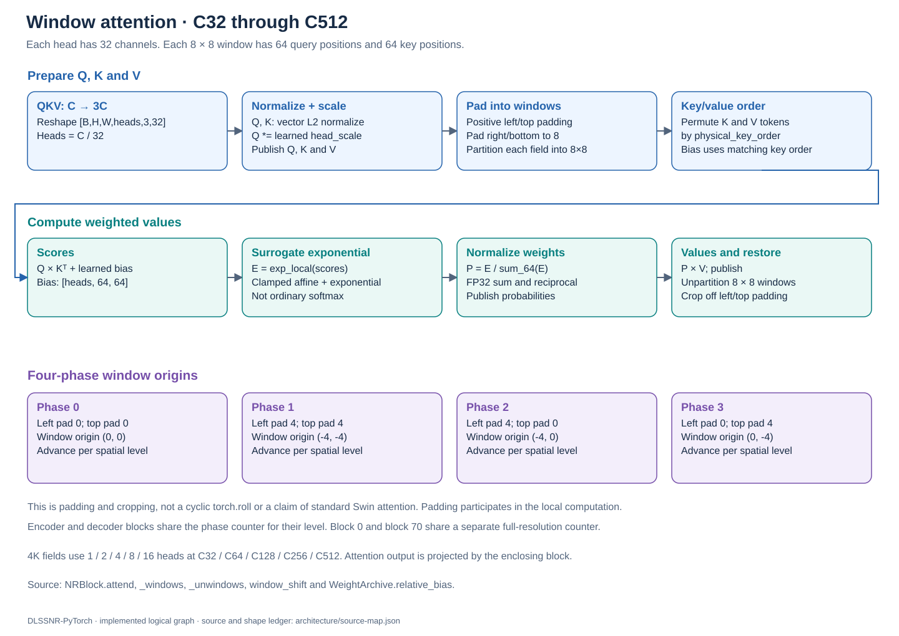

For each head, an 8 × 8 window becomes 64 query rows and 64 key/value rows. `Q Kᵀ` produces a **64 × 64 score matrix**: row i describes what query i reads from all 64 positions. A learned bias adjusts each query/key pair. A recovered exponential makes the scores positive, and division by the row sum normalizes their relative weights.

Multiplying those weights by V produces a 32-channel result for each query. Window assembly and cropping put results back at their image positions. The output projection then mixes heads, and the block adds its attention residual.

| Tensor, one window and one head | Shape | Meaning |
|---|---|---|
| Q | `[64, 32]` | Query vector at each position |
| K, V | `[64, 32]` each | Key and value at each candidate position |
| Scores, exponentials, weights | `[64, 64]` each | Query rows × key columns |
| Row denominator | `[64, 1]` | Total weight for each query |
| Weighted values | `[64, 32]` | Updated features for all queries |

Q and K are separately L2-normalized across 32 channels. Q then receives a learned scalar per head. This graph uses a [clamped exponential surrogate](#attention-exponential), rather than standard softmax/SDPA. Bias is indexed by head, query position and physical key position.

### Global attention: C1024 bottleneck

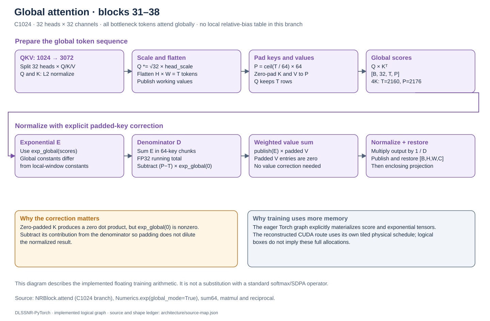

C1024 flattens the field into `T = H × W` tokens and uses 32 heads. A query can read **all T positions in the padded bottleneck field**. Q and K are normalized as above; Q additionally receives `√32` before its learned scale. This branch has no local relative-bias table.

K and V are zero-padded to `P = ceil(T / 64) × 64`. Q keeps T rows, giving `[T, P]` scores per head. The exponential splits into a weighted-value numerator and row-sum denominator. The denominator subtracts `(P − T) × Eglobal(0)`: a zero-padded key still produces a nonzero exponential. Padded V is zero, so it contributes nothing to the numerator. Division restores one vector per query. This correction removes only the additional P − T traversal slots; the network's spatial padding is already part of T.

At 4K the bottleneck is `[36, 60, 1024]`: **T = 2160**, **P = 2176**, removing 16 padded-key contributions per query. Reshaping restores `[36, 60, 1024]` before the output projection and residual.

These are logical shapes. Eager training materializes large score tensors; CUDA deployment tiles the work. A drawn `[T, P]` tensor does not imply a full deployment allocation.

### Window layout: how windows cover the image

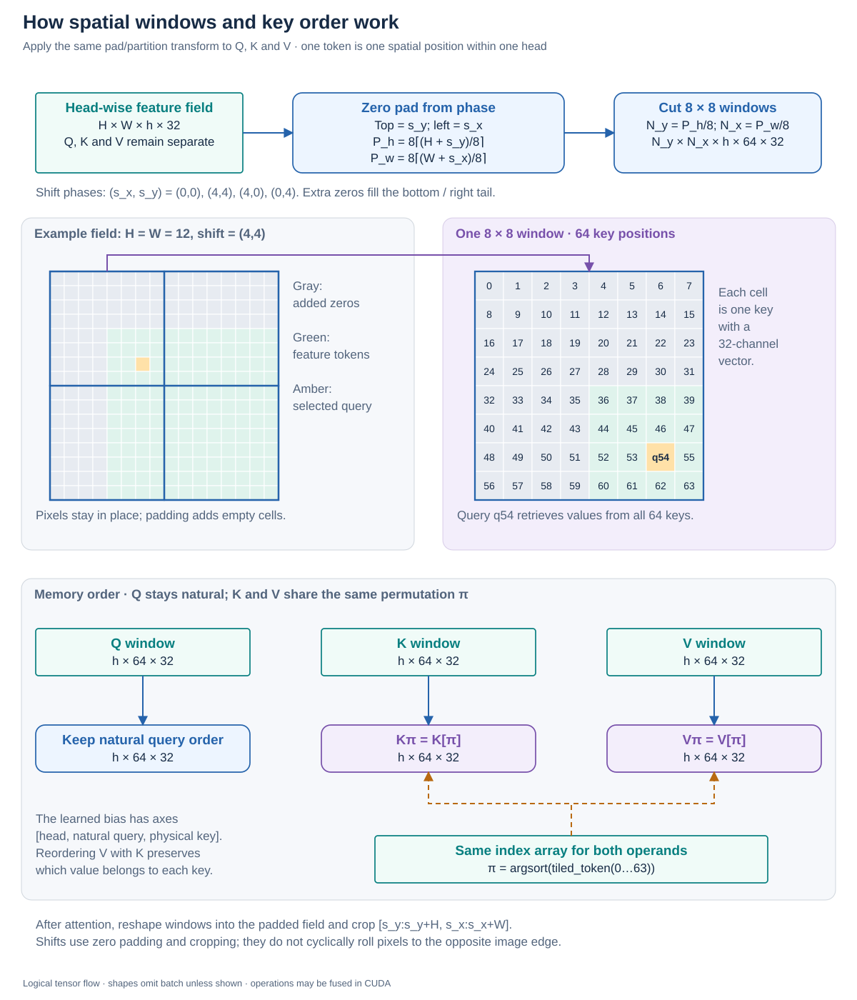

This expands the pad/partition step of **Window attention** above. The field is padded on the left/top according to the phase, then on the right/bottom to complete 8 × 8 windows. Changing the phase changes which positions share a window. Successive blocks can therefore carry features across an earlier window boundary.

| Phase | Left pad | Top pad | Window origin relative to the field |
|---|---|---|---|
| 0 | 0 | 0 | `(0, 0)` |
| 1 | 4 | 4 | `(-4, -4)` |
| 2 | 4 | 0 | `(-4, 0)` |
| 3 | 0 | 4 | `(0, -4)` |

Unpartitioning reverses the reshape and crops away padding. This is **positive padding and cropping**, not a cyclic roll. Local padded positions participate in attention; this branch does not add a standard Swin attention mask. Phase counters advance per spatial level and continue when the decoder revisits that level.

K and V use the same recovered token permutation within each window; bias columns match that order. The permutation changes storage order, not which 64 positions a query can read. Q rows retain natural order.

Sources: [attend](../dlssnr/model.py#L128), [_windows / _unwindows](../dlssnr/model.py#L20), [window_shift](../dlssnr/geometry.py#L58), [relative_bias](../dlssnr/weights.py#L208).

## Moving between resolutions

Ordinary blocks keep their dimensions. Transitions change spatial size and channel count. Encoder skips retain features from before downsampling so the decoder can recover detail at the corresponding resolution.

### Encoder: save detail and reduce the field

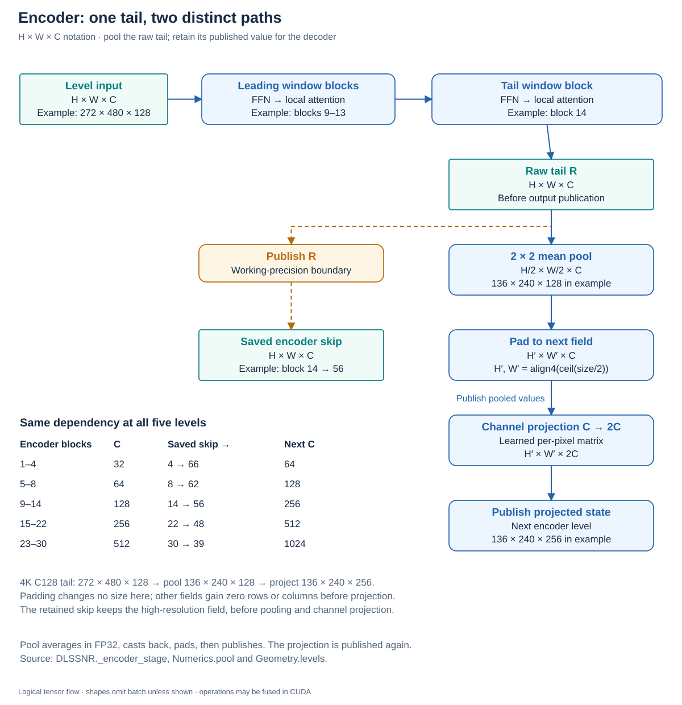

The last block at a level produces a raw attention result and its published form. The **published form is saved as the skip**. The raw result takes the downward path: average each 2 × 2 group, pad to the next level's field, then project `C → 2C` at each remaining position. The pool reduces spatial size; the projection mixes channels at each position.

At 4K, block 14 sees `[272, 480, 128]`. Its skip retains that shape. Pooling gives `[136, 240, 128]`, and the projection gives `[136, 240, 256]` for block 15.

| Tail block | Channels before → after | Skip is read by |
|---|---|---|
| 4 | 32 → 64 | Block 66 |
| 8 | 64 → 128 | Block 62 |
| 14 | 128 → 256 | Block 56 |
| 22 | 256 → 512 | Block 48 |
| 30 | 512 → 1024 | Transition 39 |

Block 0 also forks into a skip and pooled path, but **keeps 32 channels** without an additional down-projection. See the [input diagram](#input-block-0).

### Decoder: restore the field and add the skip

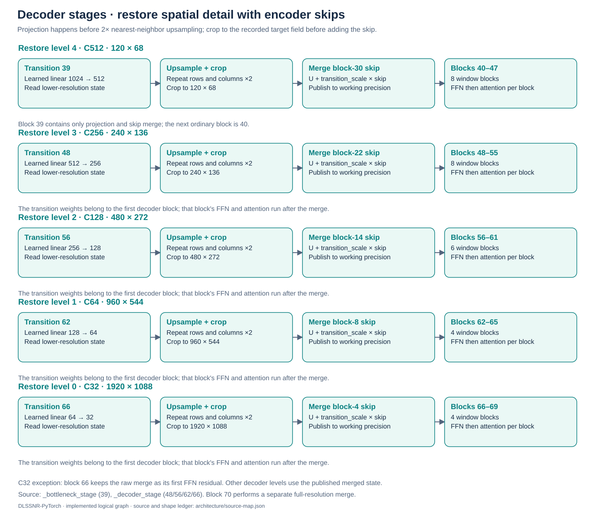

The lower-resolution tensor is projected `2C → C` before upsampling. Each resulting position is repeated into a 2 × 2 patch; cropping matches the target field. The corresponding encoder skip is multiplied by a learned channelwise scale and added. This is **addition**, not concatenation. Ordinary FFN/attention processing follows the merge.

For block 56 at 4K, `[136, 240, 256]` is projected to 128 channels, expanded to `[272, 480, 128]`, and added to the block-14 skip of the same shape.

| Transition | Projection | Incoming skip | After merge |
|---|---|---|---|
| 39 | 1024 → 512 | 30 | Publish only; ordinary block 40 follows |
| 48 | 512 → 256 | 22 | Block 48 body, then 49–55 |
| 56 | 256 → 128 | 14 | Block 56 body, then 57–61 |
| 62 | 128 → 64 | 8 | Block 62 body, then 63–65 |
| 66 | 64 → 32 | 4 | Block 66 body, then 67–69 |

Block 39 is transition-only. For 48, 56, 62 and 66, transition weights belong to the first ordinary block of the destination level. Block 66 keeps the raw merge for its FFN residual while FFN computation reads the published merge. Block 70 has a separate full-resolution merge with two scales and no `2C → C` projection.

Sources: [_encoder_stage](../dlssnr/model.py#L243), [_decoder_stage](../dlssnr/model.py#L249), [_bottleneck_stage](../dlssnr/model.py#L269), [pool / upsample](../dlssnr/model.py#L94).

## Entering and leaving the network

### Input: block 0

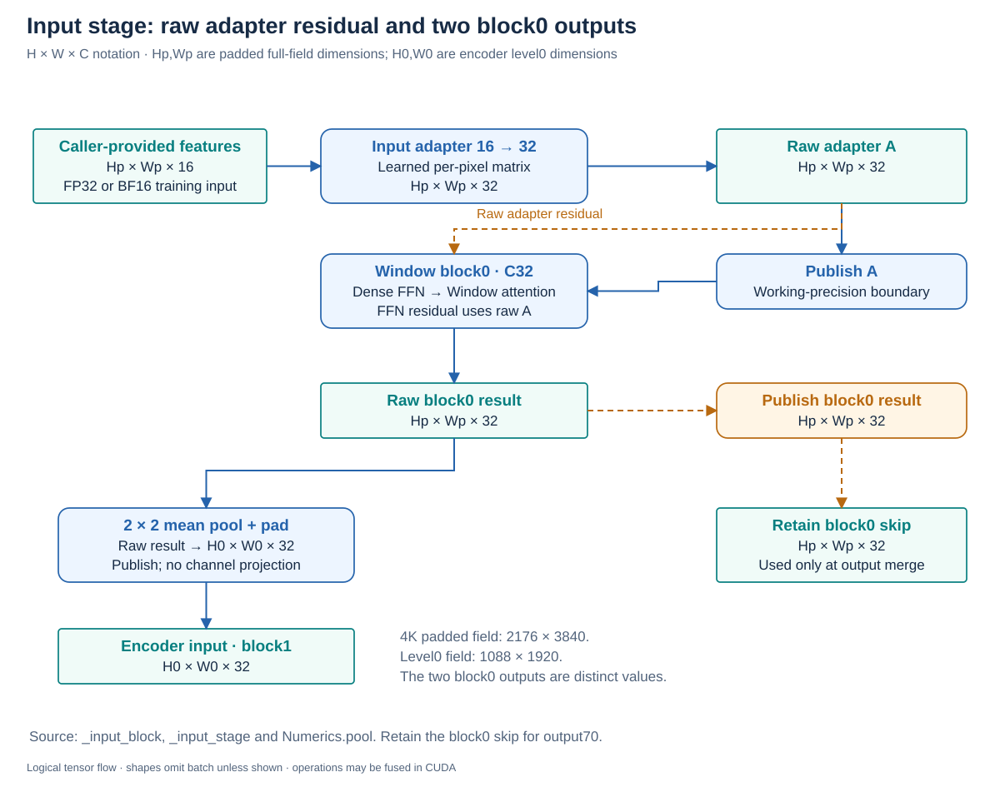

The caller supplies padded `[B, Hfull, Wfull, 16]` features. A learned per-position `16 → 32` adapter produces the block input. The C32 block reads the published adapter output while retaining the raw adapter output for its first residual.

Block 0's published result is saved for the block-70 skip. Its raw result is averaged over 2 × 2 positions and padded to the level-0 field, producing the C32 input to block 1. This path has no channel-doubling projection.

The adapter learns combinations of the supplied lanes. It does not construct renderer features, motion vectors or reprojected history. The measured deployment trunk begins at the pooled tensor entering block 1.

### Output: block 70

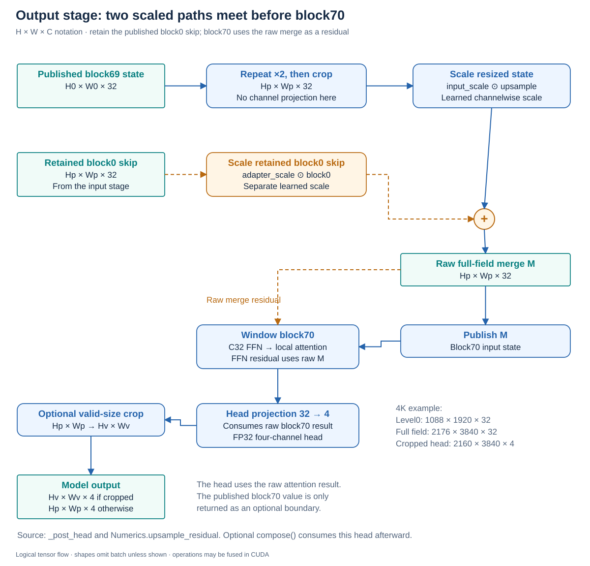

Block 69's C32 output is repeated 2× in height and width and cropped to the full padded field. A learned `input_scale` multiplies this path. A separate `adapter_scale` multiplies the saved block-0 tensor. Their sum enters block 70, with the raw merge retained for its first FFN residual.

The C32 block runs FFN and local attention. A `32 → 4` head reads its raw attention output and returns FP32. `crop=True` removes network padding. Channels 0–2 represent an RGB correction; channel 3 controls optional blending during composition.

### Optional composition after the head

Training forward ends at the four-channel head. `compose()` is separate:

```text
NeuralRGB = clamp(ProxyRGB + HeadRGB / 4, 0, 1)

Without history: return NeuralRGB

With caller-reprojected history:
    Blend = clamp(sigmoid(HeadAlpha) * blend_scale, 0, 1)
    return NeuralRGB + Blend * (HistoryRGB - NeuralRGB)
```

The proxy is in sRGB code space. Composition does not perform temporal reprojection. The training speed benchmark applies a diagnostic loss to the head; it does not establish a temporal loss or DLSS5 transfer-learning procedure.

Sources: [_input_block / _input_stage](../dlssnr/model.py#L257), [_post_head](../dlssnr/model.py#L234), [compose](../dlssnr/model.py#L331).

## The operations behind the labels

Tensor-flow diagrams use short names to keep the data paths visible. These formulas describe floating PyTorch training. Deployment additionally preserves its packed FP8/FP16 arithmetic and rounding contracts.

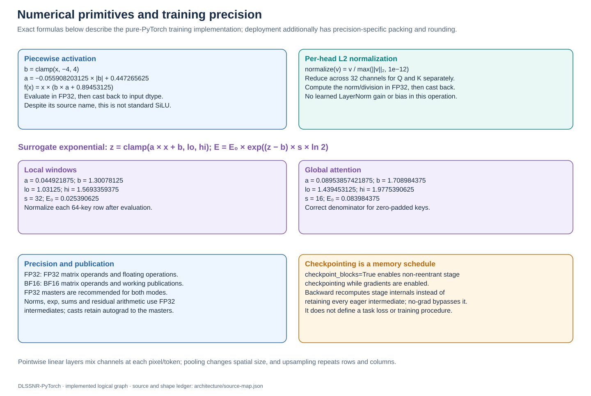

### Activation

The FFN label `φ` means this recovered pointwise function:

```text
b = clamp(x, -4, 4)
φ(x) = x * (b * (-0.055908203125 * abs(b) + 0.447265625) + 0.89453125)
```

It changes values without changing shape. The source method is named `silu`, but its formula differs from standard SiLU. Training evaluates it with FP32 intermediates and casts back to the working dtype.

### Q and K normalization

Each head has a 32-channel vector at every position. Q and K are normalized separately:

```text
L2Norm(v) = v / max(sqrt(sum(v * v, across 32 channels)), 1e-12)
```

The reduction is across channels, not tokens or heads. It does not subtract a mean and is not a LayerNorm. Q subsequently receives the learned head scale; global Q also receives `sqrt(32)`.

### Attention exponential

Both branches use the same form with different constants:

```text
z = clamp(a * score + b, lo, hi)
E(score) = E0 * exp((z - b) * s * ln(2))
```

Local attention divides E by its 64-key row sum before multiplying V. Global attention uses E in the numerator, sums in 64-key chunks, subtracts padded-key contributions, then divides the value vector by the corrected denominator. The [attention diagrams](#how-positions-exchange-information) show these separate paths.

### Publication and precision

`Publish` means cast to the selected working precision in training: FP32 or BF16. It preserves shape. `Raw` marks the value before that explicit publication, **not a promise of wider storage**; many operators already return the working dtype. This distinction identifies the correct residual and pooling sources and connects them to deployment's separate numerical boundaries.

FP32 master parameters are recommended. BF16 changes matrix operands and working tensors, while norms, exponentials, reductions and residual arithmetic use FP32 intermediates. Checkpointing changes what backward stores or recomputes; it does not add a network operation. See [training](SETUP.md#training).

Source: [Numerics](../dlssnr/model.py#L32).

## Scope and regeneration

The diagrams follow [model.py](../dlssnr/model.py), [geometry.py](../dlssnr/geometry.py) and the dimensions decoded by [weights.py](../dlssnr/weights.py). They show logical computation. CUDA fuses operations and uses packed FP8/FP16 layouts: an arrow need not be a global-memory write, and a box need not be a kernel launch. The [kernel template manifest](../csrc/kernel_impl/shared/common/kernel_templates.json) maps public kernel configurations to CUDA source.

Training covers all 71 records, 0–70. The measured deployment trunk covers prepared features through 1–69. Renderer feature extraction and temporal reprojection remain external. Actual DLSS5 transfer-learning losses and training procedures still require investigation.

Regenerate the SVG diagrams:

```powershell
python -B tools/render_architecture.py
```

These diagrams represent this implementation, not recovered NVIDIA source diagrams.
