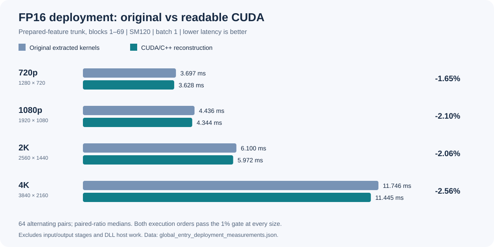
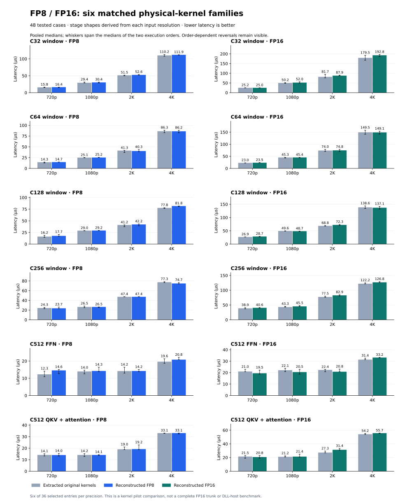
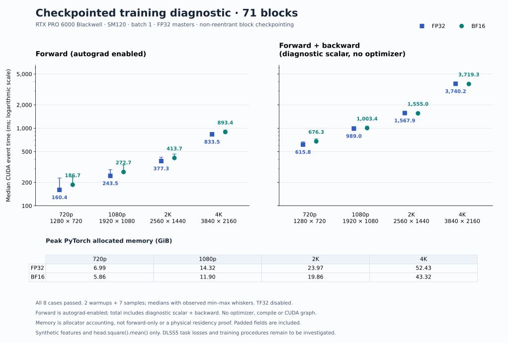

# Performance overview and benchmark scope

Both FP8 and FP16 pass the accepted **at most 1% slowdown** criterion in both execution orders at all four tested sizes. These measurements use an RTX PRO 6000 Blackwell (SM120), batch one. “2K” means 2560 × 1440.

These are fresh measurements of the integrated template build described in the [kernel reading guide](KERNEL_READING_GUIDE.md), using candidate `aa628311b56c0a0c2b374af83ff152512c4f144e3c9abaa58b0777e8c2e6b5b5`. All **81 GPU instruction payloads**, constants and decoded resource counts match the preceding per-entry implementation. Source sharing and symbol binding changed; no new device optimization was introduced. The [per-entry measurements](figures/global_entry_deployment_measurements.json), [earlier measurements](figures/kernel_locality_deployment_measurements.json) and [transcript-era overview](BENCHMARKS_HISTORY.md) remain historical records.

## FP8 deployment

| Resolution | Original kernels | Reconstructed CUDA | Paired change | Original-first ratio | Candidate-first ratio |
| --- | ---: | ---: | ---: | ---: | ---: |
| 1280 × 720 | 2.177404 ms | 2.176068 ms | -0.089% | 0.999818 | 0.998890 |
| 1920 × 1080 | 2.557884 ms | 2.578946 ms | +0.838% | 1.008408 | 1.008335 |
| 2560 × 1440 | 3.592915 ms | 3.553036 ms | -1.260% | 0.988217 | 0.987113 |
| 3840 × 2160 | 6.846234 ms | 6.733464 ms | -1.648% | 0.984517 | 0.982139 |

## FP16 deployment

| Resolution | Original kernels | Reconstructed CUDA | Paired change | Original-first ratio | Candidate-first ratio |
| --- | ---: | ---: | ---: | ---: | ---: |
| 1280 × 720 | 3.689266 ms | 3.634707 ms | -1.469% | 0.985703 | 0.985049 |
| 1920 × 1080 | 4.436933 ms | 4.350075 ms | -2.026% | 0.980222 | 0.979237 |
| 2560 × 1440 | 6.098652 ms | 5.964050 ms | -2.160% | 0.978032 | 0.979263 |
| 3840 × 2160 | 11.752854 ms | 11.471992 ms | -2.372% | 0.976203 | 0.976331 |

## Measurement contract

The prepared-feature trunk covers blocks 1–69: 152 compute/repack calls and 33 clears. It excludes input preparation, output processing and DLL/NGX/renderer host work. The baseline executes extracted original kernels with matched scheduling and physical buffers.

Each role receives 20 warmup graph replays. Timing uses 64 alternating pairs, 32 per order, with three trunk calls per graph and ten replays per CUDA-event interval. The table shows per-role latency medians and median paired changes/ratios; those statistics need not equal the ratio of the displayed medians. Every per-order median is at most 1.01.

All 74 published boundaries compare byte-exactly in all eight cases. Poisoned replay, changed-input replay, guard/immutable-buffer checks and completion counters pass, including post-timing checks. Separate current-build checks pass 24 C512 dispatcher cases and FP8/FP16 individual Torch, default Inductor, AOT eager and C++ graph execution, including the retained C32 output-view operators. See the [current validation receipt](template_integration_validation.json). The preceding build's broader frontend fixtures remain recorded in its [historical receipt](global_entry_validation.json); they are not new measurements of this build.

The measured build uses the CUDA 12.8 frontend/runtime and CUDA 13.4 assembler. [Current timing summaries](figures/template_integration_deployment_measurements.json), [raw pairs and binary identities](template_integration_validation.json) and [the compiler comparison](COMPILER_SCHEDULING.md) make the scope explicit. These results qualify the named GPU and four plans; they do not establish continuous-resolution tuning, other GPU architectures, universal per-kernel parity or an 85% roofline.

## Individual FP8 and FP16 kernels

This preserved historical suite predates the semantic rewrite and does not describe the current binary. It covers six families per precision: C32/C64/C128/C256 ordinary windows, C512 FFN and C512 QKV/attention. Each is tested at four resolution-derived internal fields, for 48 cases. All numerical and guard checks pass. This does not establish a complete FP16 deployment graph.

Bars show pooled medians; whiskers span the two execution-order medians. **36 of 48 cases reverse ranking with execution order.** Three FP8 and eight FP16 cases are slower in both orders. The full-trunk acceptance therefore must not be read as a universal individual-kernel speed result. See the tracked [per-kernel and per-order chart data](figures/deployment_measurements.json).

## FP32 and BF16 training

All eight checkpoint-enabled cases pass. The benchmark includes all 71 numbered records, autograd forward, and backward through `head.square().mean()`, at batch one with FP32 master parameters. It uses two warmups and seven samples, without an optimizer, compilation or CUDA graphs. Recomputed work is included in backward time. The two precisions ran sequentially, so the plot is descriptive rather than a balanced precision-speedup experiment.

See [training results and reproduction commands](training.md) for exact timings, settings and memory. The original uncheckpointed implementation's [chart](figures/training_resolutions_eager_v1.svg) and [raw data](figures/training_resolutions_eager_v1.json) preserve the FP32 2K/4K and BF16 4K OOM outcomes. The [memory investigation](TRAINING_MEMORY.md) explains their cause and the checkpointing correction.

Actual DLSS5 transfer-learning losses, data preparation and training procedures remain to be investigated. These timings do not establish trained output quality.

## Historical cleanup qualifications

The earlier semantic timing series remains unchanged in [its raw measurements](figures/semantic_deployment_measurements.json) and [eight graph receipts](semantic_graph_qualification.json). These records predate the fresh kernel-body measurements above.

An earlier release added an assembler cache key after its timing run. All 81 GPU kernels, resource records and constants, host machine code and imports were byte-identical to that timed build. Its installed 720p FP8/FP16 boundary and replay checks also passed. [Release identities and source hashes](semantic_release.json) and [compiled equivalence](semantic_build_equivalence.json) preserve that historical distinction.

The later [semantic naming audit](NAMING_AUDIT.md#validation), [flat-symbol migration](FLAT_SYMBOLS.md) and [storage-prefix cleanup](STORAGE_PREFIX_AUDIT.md) each preserved all 81 GPU instruction payloads and received separate correctness checks. They retained the earlier timing series without claiming fresh latency samples. The subsequent per-entry-body refactor changed some instruction streams and earned its own measurements. The current template build preserves that device code and has the fresh measurements shown above.
