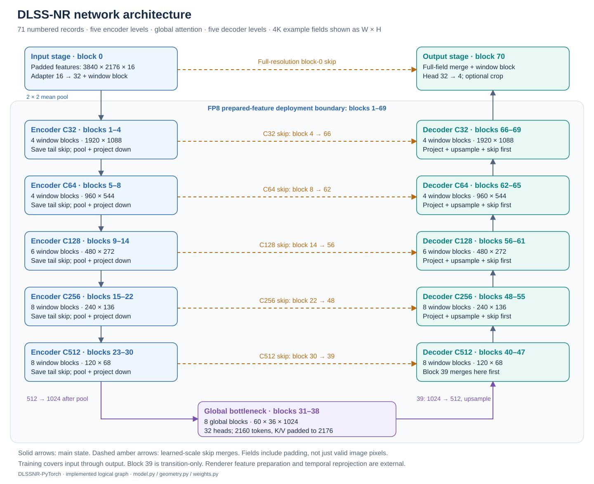
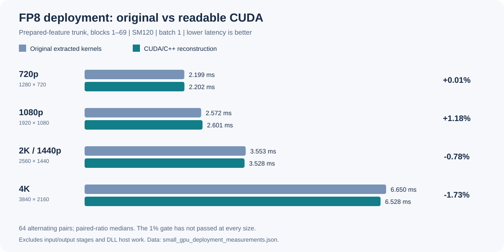

# DLSSNR-PyTorch

Reconstructed DLSS-NR CUDA kernels for PyTorch, plus a differentiable network for training research. The project follows the recovered network and packed weights, with graph/layout work adapted from [OpenDLSS-NR](https://github.com/maanHimself/OpenDLSS-NR/tree/9d08f4184bbcb9d858e2fb7a7834ec0837a9d2f1).

## What works today

| Route | What you can use |
|---|---|
| **FP8 deployment** | CUDA-graph-compatible prepared-feature inference at 720p, 1080p, 2K and 4K; tested on SM120. |
| **FP16 deployment** | Complete prepared-feature CUDA/C++ trunk at the same four sizes; within 1% of original kernels in both execution orders. |
| **FP32 / BF16 training** | All 71 numbered network records, ordinary autograd and optional activation checkpointing. All eight resolution/precision benchmark cases pass. |

The current deployment target is **SM120**, tested on an RTX PRO 6000 Blackwell. Other GPUs and continuous-resolution deployment remain future work. Inputs are prepared features; renderer integration is not included.

## Network at a glance

A multiscale encoder–decoder combines local window attention, a global-attention bottleneck and skip connections. Different channel widths use different feed-forward blocks.



Explore the [architecture guide](docs/ARCHITECTURE.md) for expanded SVGs of every stage, FFN family, attention path, input/output component and numerical primitive.

## Getting started

Use PyTorch with CUDA and a compatible C++ compiler. The measured Windows build uses PyTorch 2.8.0+cu128, the CUDA 12.8 compiler/runtime and CUDA 13.4's PTX assembler. The newer assembler improves SM120 tensor-instruction scheduling; [build details](docs/COMPILER_SCHEDULING.md) explain the controlled comparison.

Portable FP8 and FP16 [PyTorch checkpoints](ckpts/README.md) are provided through Git LFS. Run `git lfs pull` after cloning. Both load directly for training; the FP8 file also supplies the complete deployment record set. FP16 weights are losslessly widened from the original mixed-precision resource.

```powershell
$env:CUDA_HOME = "C:\Program Files\NVIDIA GPU Computing Toolkit\CUDA\v12.8"
$env:DLSSNR_PTXAS_PATH = "C:\Program Files\NVIDIA GPU Computing Toolkit\CUDA\v13.4\bin\ptxas.exe"
python setup.py build_ext --inplace
python -B run_tests.py cpu --optimized
```

Adjust the installation paths above. Omitting `DLSSNR_PTXAS_PATH` uses the toolkit's default assembler; the published speed results require the measured build configuration.

For training research, keep FP32 master parameters and enable checkpointing to reduce activation memory:

```python
import torch
from dlssnr import load_checkpoint, Geometry

model = load_checkpoint("ckpts/dlss5_nr_fp16.pt").training_model(
    device="cuda", precision="bf16", checkpoint_blocks=True,
)
geometry = Geometry.from_valid(1280, 720)
features = torch.randn(1, geometry.full_height, geometry.full_width, 16,
                       device="cuda") * 0.02
head = model.forward_train(features, geometry=geometry)
head.square().mean().backward()  # Diagnostic only; not a task loss.
```

See the [training guide](docs/training.md) for input contracts and benchmarking, or the [deployment guide](docs/API_MIGRATION.md) for FP8/FP16 entry points and packed-buffer preparation. The [FP16 integration report](docs/FP16_DEPLOYMENT.md) explains recovered layouts and profiler-guided tuning. Training does not require the custom CUDA extension.

Deployment supports a single C++ call or individually composable Torch kernels:

```python
from dlssnr import prepare_kernels

result = plan.run_fp16()  # Complete prepared-feature trunk in C++.
sequence = prepare_kernels(plan)
compiled = torch.compile(sequence, fullgraph=True)
result = compiled(*sequence.tensors)
kernel = sequence.kernels[0]
kernel(kernel.inputs, kernel.outputs)  # One named CUDA kernel.
```

All 81 entries have individual Torch operators. Default Inductor and `aot_eager` are tested; the measured Windows/PyTorch 2.8 setup uses `triton-windows==3.4.0.post21` for Inductor. The [deployment guide](docs/API_MIGRATION.md) covers installation, tensor layouts, frontend preparation and composing a bound chain for C++ execution.

**Actual DLSS5 transfer-learning methodology, task losses, data preparation and training procedures still require investigation.** This is a minimal trainable implementation.

## Speed overview

**FP8 inference:** the prepared-feature trunk meets the 1% limit at all four sizes. At 4K: **6.731 ms reconstructed / 6.855 ms original**.



**FP16 inference:** the prepared-feature trunk meets the 1% limit at all four sizes. At 4K: **11.445 ms reconstructed / 11.746 ms original**.


These are fresh measurements of the per-entry CUDA source build. Inference charts exclude input/output stages and DLL host processing.

**Training:** full-network FP32/BF16 forward and backward, with checkpointing, batch one and no optimizer. At 4K, peak allocated memory is **52.4 / 43.3 GiB**, respectively.


<details>
<summary><strong>FP8 / FP16 kernel speed comparison</strong> — expand the six-family overview</summary>


This historical individual-kernel suite predates the current semantic rewrite. Execution order affects many rankings; some kernels remain slower than their original counterparts.

</details>

See [benchmark scope and detailed results](docs/BENCHMARKS.md) for methodology, per-kernel comparisons and the preserved original OOM results.

## Project layout and further reading

`csrc/kernel_impl` contains one exact-name `.cu` file per exported kernel: its global function shows storage, loops, pipelining and writeback. Shared intrinsics, `MMA`, memory helpers and ABI declarations live alongside them. `kernel_launcher` contains host dispatch and launch policies; `torch_api` registers the PyTorch interfaces. `dlssnr` contains Python entry points and the training model. `tests` and `tuning` hold validation and offline policy tools.

- [Architecture atlas](docs/ARCHITECTURE.md) · [Current coverage and limitations](docs/RECONSTRUCTION_STATUS.md)
- [Kernel reading guide](docs/KERNEL_READING_GUIDE.md) · [Source layout and shared helpers](docs/SOURCE_LAYOUT.md) · [Code conventions](docs/CODE_READABILITY.md) · [Naming audit](docs/NAMING_AUDIT.md) · [Readable CUDA reconstruction](docs/SEMANTIC_RECONSTRUCTION.md) · [Historical optimization log](docs/optimization_log_2026-10-05.md)
- [Training memory diagnosis](docs/TRAINING_MEMORY.md) · [Kernel reconstruction workflow](skills/dlssnr-reconstruction/SKILL.md)
