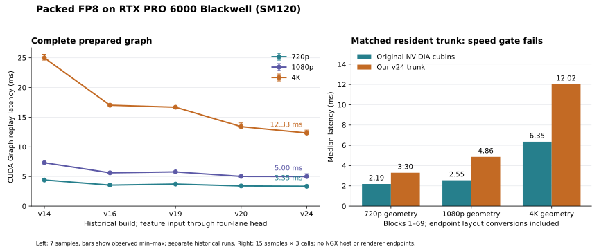
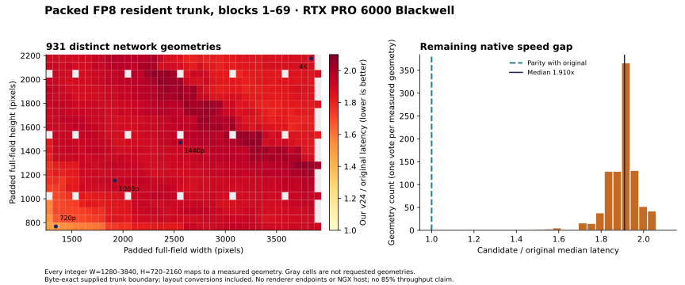
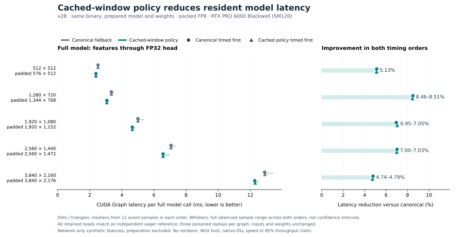
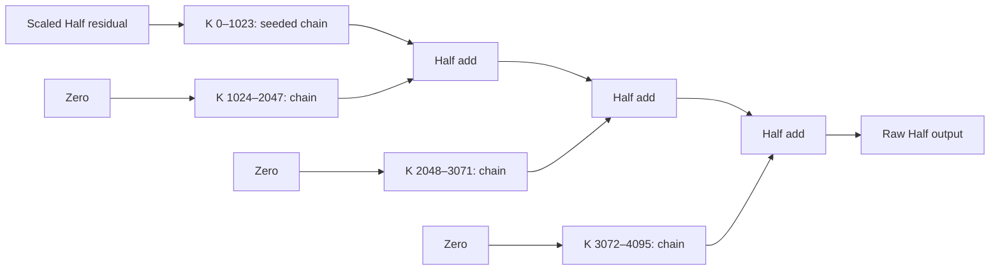

# How we are bringing DLSS-NR inference toward the original DLL

This is a practical explanation of the implementation, the optimizations that
have survived testing, and the measurements that motivated them. It is written
for someone who wants to understand the decisions without reading every CUDA
file first. The original DLL's speed and the requested 85% hardware-throughput
target are **still open acceptance gates** for the deployment as a whole. Two
boundary converters exceed 85% measured DRAM throughput at the 4K geometry;
the dense compute kernels and native speed comparisons still have gaps. An
improvement over our previous kernel is not automatically an improvement over
NVIDIA's kernel.

The [original-PTX/SASS compute-flow audit](native_compute_flow_audit.md)
compares the DLL's operand packing, tensor instructions, intermediate storage
and synchronization with our active source, with a per-entry coverage table.

The measured machine is an RTX PRO 6000 Blackwell Workstation GPU, `sm_120`,
with driver 610.62. We compile FP16 paths for Ampere and newer and FP8 paths for
Ada and newer, but physical testing here covers only this Blackwell GPU.
Performance policies are specific to the measured architecture and contract.

The largest measured improvements come from removing intermediate work and
giving the GPU more independent work. This table is a quick guide to the
results, with the measured boundary kept beside each number. These gains come
from different experiments and **must not be multiplied together**.

| Change | Measured result | What that result covers |
|---|---|---|
| Prepare vector weight caches and select the measured window implementation | About 4.7–8.5% lower latency at five sizes | The v28 whole-model comparison with the previous implementation; see [cache integration](#27-put-measured-cache-choices-behind-c-dispatch) |
| Replace indexed endpoint conversion with direct byte permutations | 6.5× as fast for the conversion pair at 4K | Only the two layout adapters; each separately exceeds 93% measured DRAM throughput; see [direct conversion](#28-replace-indexed-trunk-conversions-with-direct-byte-permutations) |
| Run the existing ordered K partitions in parallel | About 1.50× as fast at the 1080p global field | The resident FP8 FFN contraction; the smaller 720p case loses; see [ordered partitions](#32-give-large-gemm-tiles-enough-independent-work) |
| Fuse C512 QKV projection, attention and publication | 1.273–1.290× as fast at the measured 4K fields | Complete C512 blocks, including their other branches; see [C512 fusion](#33-fuse-c512-qkv-projection-attention-and-publication) |
| Prefetch the next C512 weight fragment | 1.091–1.095× as fast at the measured 720p fields | Complete blocks compared with the original fusion; this candidate loses at 4K; see [the crossover](#34-prefetch-the-next-c512-weight-fragment-then-measure-the-crossover) |
| Load and reduce eight Half values per thread | 1.46–1.50× as fast for the reducer, about 1.04× for its whole contraction | The resident FP8 4K contraction; see [vector reduction](#35-reduce-eight-half-values-per-thread-without-changing-the-sum) |
| Fuse the incoming projection into decoder block66 | 18.7% lower latency than the prior merge fusion | Complete block66 at the 4K field; see [projection fusion](#68-compute-the-low-resolution-projection-inside-the-decoder-block) |
| Limit the fused kernel to 168 registers | 10.45% lower latency despite spills | Same complete block66 boundary; see [residency and spills](#69-trade-a-small-spill-allocation-for-more-resident-work) |
| Match the original direct FP8 conversion | 8.30% lower latency and corrected tested NaN behavior | Same-cap comparison; 159.136 microseconds versus the original's 127.488; see [conversion semantics](#70-match-the-original-conversion-of-nans-between-layers) |
| Combine affine addressing with vector output stores | 8.33% lower latency than the prior best private candidate | Complete 4K block66: 146.912 versus 160.256 microseconds; original 128.976. The store-only increment misses its separate parent gate; see [output stores](#73-coalesce-published-bytes-without-changing-their-conversion) |
| Fuse encoder block4, Half pooling and down-projection, then match native FP8 publication | 2.53% lower whole-trunk latency in the qualified field | Same-binary selected/composed comparison: 9.433189 to 9.194939 ms at valid 3713×2049; see [integration](#85-validate-the-corrected-publication-inside-the-trunk) |

The native comparison is the final check on these local gains. Fresh balanced
measurements on the installed encoder build take about 37–55% longer than
the original kernels at the three measured trunk sizes. At exact valid
3840×2160, the times are **9.194 versus 6.433 milliseconds**; matching the
reference still needs about a 30.0% reduction in our latency. All 74 numerical
boundaries pass at each size, but both execution orders fail the speed gates.
These are resident trunk timings, not complete DLL host or renderer timings.
The installed encoder fusion has a separate 2.53% same-binary shared-field
improvement and passes 55 installed tests plus eight subtests. See the
[current integration evidence](performance.md).

For a first read, sections 1–4 explain the network and its numerical rules;
sections 5–8 explain the main fusions; sections 9–12 explain how we measure
and verify them. The later sections examine individual experiments, including
the ones that failed. Each timing table names its computation boundary, because
a resident logical tensor, a native physical buffer, and a complete renderer
are different workloads. Sections 36 onward track subsequent integrations
and private experiments; each result retains its own build and scope.

Build tags such as **v24** and **v35** identify compiled releases. **C512** means
a 512-channel stage; **block 30** names one particular network entry. **GEMM**
means matrix multiplication, **FFN** is the feed-forward subnetwork, and **QKV**
means attention's query, key and value projections.

Read timing ratios by their labels: **baseline/candidate above 1 means faster**;
**candidate/native above 1 means slower**. A 1.10× speedup means about 9.1% lower
latency. Byte equality, a local policy's 3% promotion margin, the original-DLL
speed requirement, and the 85% measured hardware-throughput target are separate
checks. Passing one does not establish the others. Removing memory traffic can
also make a kernel faster while lowering its measured memory utilization.

| Status | What it means in this checkout |
|---|---|
| Historical full-domain native baseline | v24 includes packed states, tiled/grouped GEMMs, whole-window C32/wider fusions, input/pool fusion, global prefetch, C512 branch/residual fusion, and post70/head fusion. Its native FP8 trunk comparison covers all 931 requested geometries, with exact outputs and a remaining speed gap. |
| Measured component improvements | v27 validates the vector cache, rolling B-prefetch, fused QKV and two-bank prefetch. Rolling B-prefetch wins the measured C256 resident comparisons. Bounded native component checks are exact; native speed and the 85% throughput gate still fail. |
| Public cache integration | v28 compiles 72 measured cache anchors into C++ dispatch. Focused tests, memcheck and selected kernel racechecks pass. The paired whole-model benchmark is exact and reduces latency at all five measured sizes; fresh native results are separate. |
| Direct native-layout conversion | v29 replaces indexed byte conversion with vector loads, word permutations and warp shuffles. Its copy pair is 6.5× faster at the 4K boundary; the two isolated converters reach 93.56% and 94.50% measured DRAM throughput there. Three exact native trunk checks still show candidate/native ratios of 1.311–1.681×. |
| Earlier component experiments | v31–v34 add ordered split-K, C512 attention fusion, prefetch and vector reduction. Their measured benefits vary by shape; the later integrations and ablations record the resulting dispatch behavior. |
| Earlier v35 integration | Both split reducers become ordinary GEMM choices; C512 initially has an empty policy. The full regression suite passes. This is a historical build, before the completed ordinary scan and C512 model hookup. |
| Current integrated build | Binary `c2d47cbe…` adds encoder policy `141b6e8049c51a68`, retaining ordinary `19c64573272a45c8`, C512 `40557fe031d98701` and decoder `217be58b13099077`. Fresh balanced 720p/1080p/4K comparisons pass all 74 numerical boundaries but fail native speed gates in both orders. Installed checks pass 55 tests and eight subtests. |
| Installed block66 fusion | Affine addressing and vector output stores reach 146.912 microseconds versus 160.256 for the prior best and 128.976 native in the component trial. The combined change clears all 24 improvement gates; the isolated store increment clears only 18 against its affine parent. Its exact-field C++ route is installed, with a separate same-binary 4K padded-trunk improvement of 3.62%. This is not a performance claim across the complete resolution range. |
| Installed block4 fusion | The qualified scalar fusion retains raw fragments in registers and matches native direct FP8 publication. It reduces the selected/composed shared-field trunk comparison by 2.53%, and preserves all tested finite and exceptional native component outputs. Wider input loads and converted-pair join trials fail their separate speed gates and are not selected. |
| New bounded native correctness | On the unchanged v35 build, the original FP8 0–70 chain matches three padded fields and two seeds. Twelve native FP16 global contraction/projection cases also match. These checks collect no speed evidence; [section 38](#38-connect-the-original-endpoints-and-check-fp16-global-gemms) explains their input and output limits. |
| Open performance gates | Faster-than-original results throughout the requested domain and the 85% throughput gate remain unmet. |
| Coverage limits | Native timings cover the FP8 trunk, blocks 1–69. Continuous original 0–70 validation, visible-image preprocessing, native FP16 full-graph results, and physical RTX 30/40-series tests remain unverified. Renderer and NGX host execution are outside the current harness. |

In the kernel discussion, **C64** means 64 channels. A matrix product produces
**M** rows and **N** columns by summing over **K**, its reduction dimension.
That K is distinct from attention's key projection, also called K. An
**MMA** instruction performs a tensor-core matrix multiply-accumulate. A
**warp** has 32 threads; a **CTA** is a CUDA thread block. These distinctions
matter because a larger logical tile can improve reuse while making fewer
thread blocks fit on each streaming multiprocessor (SM).

| Read to understand… | Route through the guide |
|---|---|
| The network and why ordinary replacements change its result | [The computation](#1-start-with-the-actual-computation), [rounding and accumulation](#2-numerical-details-are-part-of-the-kernel-interface), [training versus deployment](#3-keep-training-straightforward-and-deployment-specialized) |
| The main tricks that remove inference work | [Cache weights and keep packed activations](#4-stop-repeatedly-converting-weights-and-activations); sections 5–8 show progressively larger fusions; [direct layout conversion](#28-replace-indexed-trunk-conversions-with-direct-byte-permutations) removes endpoint indexing |
| Why a kernel is slow and how we decide what to change | [NCU and executable assembly](#10-use-ncu-and-sass-to-choose-the-next-change), [register lifetimes](#16-shorten-register-lifetimes-without-changing-arithmetic), [whole-execution attribution](#30-profile-the-complete-execution-before-choosing-the-next-kernel) |
| How timings, correctness and the native comparison are established | [CUDA Graph measurement](#9-make-cuda-graph-timing-representative), [the original-kernel reference](#12-build-a-trustworthy-original-kernel-reference), [the complete native range and its limits](#25-complete-the-native-trunk-comparison-across-the-requested-range) |
| How every input resolution gets a compiled choice | [Continuous tuning and endpoint clamping](#11-tune-continuous-resolutions-then-compile-the-decisions), [actual cache operands and C++ dispatch](#27-put-measured-cache-choices-behind-c-dispatch) |
| Which newer ideas are still being evaluated | [Large ordered partitions](#32-give-large-gemm-tiles-enough-independent-work), [C512 fusion](#33-fuse-c512-qkv-projection-attention-and-publication), [its prefetch crossover](#34-prefetch-the-next-c512-weight-fragment-then-measure-the-crossover), [vector reduction](#35-reduce-eight-half-values-per-thread-without-changing-the-sum) |
| What failed, and what the current build actually enables | [A failed prefetch](#21-a-prefetch-experiment-that-did-not-earn-deployment), [cache hints](#29-retained-cache-hints-can-still-make-a-kernel-slower), [the asynchronous ring](#31-an-asynchronous-shared-memory-ring-that-worked-but-lost), [a schedule compiled away](#37-check-that-the-experiment-survives-compilation), [fewer slots without a useful speedup](#39-fewer-instruction-slots-can-leave-latency-unchanged); [current catalogue and validation state](#36-keep-public-choices-and-profiling-evidence-unambiguous) records the integrated build |

## 1. Start with the actual computation

The first useful optimization was avoiding the wrong model. The recovered
network has 71 numbered entries and 153 checkpoint records. It contains
parallel feed-forward branches, cosine-normalized attention, shifted 8×8
windows, global attention at the bottleneck, pooling, upsample merges, and a
four-lane output head. It does not use ordinary LayerNorm, GELU, or spatial
convolution. Replacing its pieces with familiar transformer primitives would
produce a plausible network, but a different one.

We used the pinned [OpenDLSS-NR graph reference][opendlss] and extracted the
embedded checkpoint from the publicly archived NVIDIA-signed DLL. We verified
the archive and DLL hashes, record sizes, stage hashes and layouts. The DLL's
host entry points were not executed. Later comparisons load unchanged cubins
(compiled CUDA device code) extracted from that same DLL through the CUDA driver. These comparisons are
original **device-kernel** comparisons, not a recreation of the entire NGX host
runtime, NVIDIA's host integration layer. [Asset provenance](assets.md) records the exact inputs.

In the performance discussion, resident inputs, weights and buffers are already
on the GPU. Model loading and preparation are outside those timings unless a
measurement explicitly includes them.

The deployment graph roughly follows this path:

The tensor shapes are padded fields, not just the visible image size. A valid
1920×1080 image can therefore exercise a 1920×1152 full field. The geometry
object computes the same hierarchy before tuning or inference. Resolution
sweeps use that hierarchy, so every swept operator is measured on its actual
padded workload. Separate microbenchmarks also include smaller diagnostic anchors.

For example, one 3840×2160 visible image produces these different workloads.
Image sizes below use **width × height**; tensor shapes elsewhere use **height ×
width**, or **BHWC** for batch, height, width, channels.

| Stage of that 4K image | Width × height | Flattened matrix rows |
|---|---:|---:|
| Padded full field | 3840 × 2176 | — |
| First C32 field / native trunk endpoint | 1920 × 1088 | 2,088,960 |
| C512 field | 120 × 68 | 8,160 |
| Global C1024 field | 60 × 36 | 2,160 |

A “4K kernel” therefore need not operate on a 3840×2160 matrix.

See [the operator inventory](operators.md) for exact operands and layouts.

## 2. Numerical details are part of the kernel interface

For this model, “FP8 matrix multiplication” does not specify enough to reproduce
the output. The accumulator type, order of partial sums, publication points,
rounding instructions and residual seed all affect subsequent E4M3 bytes.

### Preserve the ordered MMA chain

The deployment kernels use half accumulators with ordered FP8 K32 or FP16 K16
tensor-core steps. Some bottleneck operations split K at fixed boundaries.
Those boundaries are mathematical requirements recovered from the native
computation: global FFN contraction 1024, global QKV 512, global output
projection 256, and the block-39 up-projection 256.

The first partial starts from the scaled residual. Later partials start at
zero, and the half partial results are added in order. We can change how
operands reach the MMA instruction, but cannot arbitrarily rearrange these
partial sums or switch to a float accumulator and expect byte equality.

This is why an ordinary fast library GEMM is useful as a performance reference
but is not a sufficient correctness oracle for deployment.

### Publish at the original boundaries

Publication applies the required rounding and encoding at a network boundary;
it need not write a separate tensor. A raw value is the Half result before that
outgoing publication. E4M3 is the FP8 representation used here: four exponent
bits and three fraction bits, plus a sign bit. Packed storage holds its byte
encodings directly.

FP8 publication first rounds to half, then converts to saturated E4M3 with
round-to-nearest-even. Finite saturation is ±448, NaNs publish to positive zero,
and signed zeros are preserved. Cubic activation, attention probabilities and
inter-block states have specific publication points. Fusion removes storage
and launches around those points; it does not remove the rounding itself.

The “SiLU” is a bounded native cubic with individually rounded half operations.
The attention exponential is a native half-affine bit construction, and its
ordered denominator reduction is not ordinary softmax. Cosine normalization
and denominator reciprocals use a squared-norm/denominator floor of
`6.198883056640625e-5` (half bits `0x0410`). Tiny-vector probes against unchanged
native kernels established this floor.

### A half FMA is not a float FMA followed by half conversion

Upsample residual merges need a true half fused multiply-add. Separately
rounding the multiplication and addition changes midpoint cases. Computing a
float FMA and then rounding can also introduce a double-rounding difference.
For example, the correctly fused half result of
`2^-24 + half(0.6669921875) * half(1.5)` is `1.0009765625`, whereas a wrongly
rounded route produces `1.0`.

SASS, the native instructions executed by the GPU, was decisive here. PTX is an
intermediate GPU instruction representation. A PTX listing containing a multiply and add did not
mean the executable performed two independent half roundings: the compiled
instruction sequence used a fused operation. Conversely, the final input scale
must remain a separate half multiply before its adapter FMA.

We added a targeted unchanged-original-kernel probe. Across all four window
phases, its 32,768 compared output bytes matched the corrected implementation;
the old arithmetic differed at every compared byte for the constructed case.
See `outputs/vendor_residual_half_fma_v11.json` and
`tools/vendor_residual_probe.py`.

The lesson is simple: preserve what the executable does, and use adversarial
values to distinguish seemingly equivalent expressions.

## 3. Keep training straightforward and deployment specialized

Training forward uses FP32 or BF16 matrix operands with FP32 master parameters
and sensitive reductions. It reuses ATen, PyTorch's tensor-operator library,
and PyTorch autograd. Its smooth
floating operations are deliberate training functions, not a claim of byte
equality with a discontinuously quantized DLL.

Deployment has a separate prepared snapshot. Preparing it freezes an
independent copy of weights, converts static matrices once, and establishes
the caches needed by the C++ dispatcher. Forward never silently refreshes
those buffers. A new training checkpoint requires a new prepared snapshot.

This separation lets the deployment code use packed bytes and aggressive
fusion without making backpropagation depend on those representations.
Optional quantization-aware paths have explicitly documented surrogate
gradients. [Training details](training.md) explain their limits.

## 4. Stop repeatedly converting weights and activations

The early general path repeatedly packed FP8 operands and materialized half
intermediates. Those operations become expensive across dozens of blocks.

We first cached static packed weights. We then kept published activations as
`uint8` E4M3 bytes between deployment operators. The value represented by each
byte remains identical; only its storage representation changes. This cuts
traffic and eliminates redundant pack/unpack kernels.

Here a prepared weight cache is an additional software tensor layout, distinct
from the GPU's hardware L2 cache. The retained ordinary weight layout is called
canonical; a specialized kernel may consume a second prepared layout instead.

Raw half outputs are still necessary at some pooling and skip boundaries.
The graph requests them where needed and omits them elsewhere. In particular,
most C32 blocks do not need a separate raw output. Avoiding an unused output
saves both a store stream and the buffer itself.

The implementation retains a half-storage path for independent boundary
comparison. Tests compare all 77 named boundaries, not just a final image that
could conceal an earlier mismatch.

### Make the remaining conversions wide and exact

Caching cannot remove every conversion. For those that remain, each aligned
thread loads and stores 16 bytes at a time and works on independent pairs of
Half values. The scalar path handles misaligned storage offsets and tails.
SASS confirms 128-bit loads/stores; tests exhaust all 65,536 Half encodings to
check NaN-to-zero, signed zero and saturation rather than just typical values.

At `[1,512,576,32]`, Half-to-packed-FP8 conversion falls from 19.262 to
5.502 µs under the same graph protocol, comparing the best thread count for
each implementation. The final conversion profile reaches 79.26% DRAM read
throughput. An earlier publication build reached 83.91%, but that is a
different operator/build observation, not the final converter's result. Neither
passes 85%, and adding read and write percentages would be invalid.
The [conversion evidence](performance.md#recorded-sm120-measurements-2026-10-03-local-time)
links both the saved scalar baseline and the full/source reports.

### Feed several independent matrix accumulators from shared tiles

The first exact GEMM assigned one 16×8 result fragment to each warp and
repeatedly loaded its operands from global memory. At M96/N4096/K1024, NVIDIA
Nsight Compute (NCU), the kernel profiler, found 44.7% long-scoreboard stalls
and just 3.68% tensor-pipe utilization. A long-scoreboard stall means a warp
is waiting to use the result of an outstanding memory operation. It locates
a dependency without proving that memory bandwidth is saturated. This profile
motivated changes to operand delivery and independent work; the timings below
then test those changes on larger workloads.

The tiled version copies aligned 16-byte chunks asynchronously with
`cp.async`, alternates between two shared-memory buffers, and keeps multiple
independent result fragments in registers. While the warp computes one tile,
the next tile can arrive. Padding the shared rows avoids bank conflicts;
coalesced stores write neighboring results together. Every result still uses
the original Half-accumulator instruction and ascending K order.

Some native operations already require partitioned sums. Scheduling those
existing partitions independently is valid only because the final Half
reduction preserves their specified order; introducing new partitions would
change rounding. At M640/N4096/K1024, the best second-round tile measures
16.254 µs versus the earlier warp kernel's 72.074 µs. At M2160 it measures
41.075 versus 231.738 µs. The M640 tile's profile has zero bank conflicts and
spills, but still only 27.17% tensor activity: 160 thread blocks do not fill
188 SMs well, and dependent instructions still incur waits.

We also tried `ldmatrix` shared loads and an eight-warp tile. They remained
exact across 1,010 candidate observations, but did not win every shape. The
policy retains ordinary shared loads where they are faster. Tile size and
instruction choice are measured decisions, not universal upgrades. See
[GEMM operand delivery](performance.md#gemm-operand-delivery-and-register-tiling).

### Keep a second weight layout when different shapes need it

The original NVIDIA FFN SASS reads coalesced 128-bit weight fragments directly
into registers and stages only activations in shared memory. That motivated
another layout: prepare the warp's weight fragments once, then use three
activation buffers to overlap copies with computation. It avoids repeatedly
staging the same weights inside each GEMM.

The comparison retains both formats in memory. The row-major baseline does
not pay an invented inverse-conversion cost. Packed-output M640 measures
14.83 µs versus 16.01 µs for the best resident row-major path, and M2160
measures 31.99 versus 47.16 µs. M96 favors row-major. We therefore retain
both layouts and let C++ select by the measured contract, rather than forcing
the prepacked representation everywhere. This is an earlier matrix-weight
cache; section 23's C256 whole-window cache is a separate implementation.
Samples are in `outputs/gemm_prepacked_v6.json`.

## 5. Fuse GEMM epilogues without changing accumulation

An epilogue is the work immediately after the matrix multiplication. Here it
often consists of cubic activation, half rounding and E4M3 publication.
Doing that work while the accumulator is still resident avoids writing a
large raw matrix only to read it into another kernel.

Grouped FFN contractions also had layout conversions around the matrix call.
Direct grouped kernels read the actual branch strides and write the requested
packed layout. Across 20 measured shape keys at five representative image
sizes, all 200 tested candidates were byte-exact. The selected kernels were
2.57–3.94× faster than the earlier resident composed path, which included
those conversions. At the 4K C64 contraction, the result was 115.03 µs versus
421.43 µs. This is an operator improvement against our earlier path, not an
original DLL speedup. Evidence: `outputs/grouped_ep3_v11.json`.

### Put the residual into the accumulator before the first MMA

The next fusion combines a half-rounded scaled residual seed, ordered GEMM,
and optional packed publication. The seed is loaded before the first MMA;
adding a residual after the GEMM is not equivalent.

On v13, all tested candidates in both precisions matched the resident
composition. Best improvements were 1.15–2.06× for packed FP8 and 1.06–1.36×
for FP16. For `M=522240, N=K=64`, packed FP8 took 84.588 µs versus 174.068 µs.
The public C++ dispatch path for this fusion is integrated in v14.

Its next short-K candidate narrows the output tile and uses a single operand
stage when K needs no multi-stage pipeline. That reduces shared memory and
register demand. It has passed v14 correctness and memory checks, but those
resource reductions alone are not evidence of a speedup. Timing determines
whether a policy may select it.

The subsequent complete v14 residual sweep measured 3,626 keys across all 931
padded geometries, with 11,996 exact candidate checks and no failed or
unsupported keys. Every one of the 1,677 packed-FP8 keys promoted a fusion;
best speedups were 1.130–3.567× over resident composition. Of 1,949 FP16 keys,
86 retained composition because the best fusion did not clear the margin.
The short-K single-stage candidate won 985 keys across the two precisions.
The generated 3,632-row policy includes six older out-of-range anchors and
has version `9505d20b293cb2b9`. It is compiled into v15c;
the v14 complete-network timings later in this document used the previous
24-row residual policy. Evidence: `outputs/residual-v14-full/`.

The largest C64 case makes the effect concrete: on the same v14 binary,
candidate 4 takes 84.672 µs and the new candidate 5 takes 49.456 µs, versus
176.396 µs for composition. Its cold NCU run is 57.888 µs with 64 registers,
18,432 shared bytes, no spills and 62.84% achieved occupancy. DRAM throughput
reaches 67.61%, up from the earlier candidate's approximately 45%. The new
bottlenecks include narrow residual loads and their FP8 decode consumers,
plus the first operand barrier. The 85% gate still fails. This is stronger
evidence for the tile change than comparing timings from unrelated builds.
See `profile/residual-fp8-522240x64x64-v5-20261003T014447_903827Z/`.

## 6. Fuse the two expert-FFN matrices

For C64, C128 and C256 blocks, independent expert branches compute W1, cubic
activation/publication, then W2. The fused kernel keeps the published W1
intermediate in shared memory and consumes it directly for W2. In this
standalone expert-FFN fusion, W3 remains a separate residual-seeded operation.
The later whole-window fusion also absorbs W3.

Both candidate tile sizes preserve the ordered half arithmetic. We compare
them with the **fastest measured resident composed variant**, rather than
choosing a weak baseline to make fusion look good.

The full v13 continuous-domain sweep completed all 1,677 expert dispatch keys
derived from the 931 padded geometries. All 3,354 fused candidates and 16,770
composed candidates matched byte-for-byte, with no unsupported or failed key.
Best fused results were 1.579–2.269× faster than the best composed result.
The generated v14 expert policy contains those keys plus three earlier small
anchors: 1,680 rows, version `ef32bc0605560067`.

Evidence is in `outputs/resolution-group-ffn-v13-full/`. This complete sweep
covers this operator family; it does not imply that every other network
operator or original-DLL comparison has been swept.

NCU identified waits on asynchronous operand copies in the first fusion.
A private C64 experiment prefetches W2 while the W1 work is running and avoids
an unnecessary second W1 stage. All ten v14 candidate comparisons at five
representative sizes are exact. Its best tile is 4.1–6.7% faster at the middle
three sizes, but 2.1% slower at the smallest and only 2.2% faster at 4K.
The benchmark compares against both existing fused tiles, not composition.
This is a modest, shape-dependent improvement and remains private.

At M138240, the new cold profile uses 54 registers and 25,088 shared bytes,
with 44.68% achieved occupancy. The old W2 wait is no longer a long-scoreboard
hotspot, but the initial W1 wait remains. The historical report shows 32.25%
aggregate L2 throughput, a diagnostic counter, alongside 25.36% elapsed tensor
activity and 17.72% DRAM throughput. Removing one diagnosed stall did not remove
every bottleneck or establish an 85% result.
See `outputs/group_ffn_k64_v14.json` and
`profile/group-ffn-k64-fp8-c64-m138240-v2-20261003T012838_002649Z/`.

## 7. Keep the complete C32 block inside one CTA

Thirty-two-channel blocks are especially frequent. A complete block includes
FFN expansion, activation, contraction, residual, QKV, normalization, attention,
and residual projection. Executing each part as a separate operator makes
small matrices pay repeated launch, publication and memory costs.

The complete-block kernel assigns a shifted 8×8 window to one CTA and keeps
intermediates local. It handles all four phase origins and zero-padded keys,
including their contribution to the probability denominator. The public
individual operators remain available for testing and composition.

The first fused version used shared memory extensively. Subsequent versions
kept more values in MMA register fragments and reduced scalar address and
conversion work. One measured step reduced dynamic instructions from about
36.05 million to 25.92 million and cold profile time from 70.11 to 54.304 µs,
with zero spills. These counts describe the same profiled case, not every
image size.

### Rotate cached weight layouts to match register ownership

The register version still moved fragments into layouts that the next MMA
wanted. We added an alternate static weight layout that fits the fragment
ownership more directly. Preparing the model stores both canonical and
rotated views. This work is paid once, outside inference and graph capture.

The transformation preserves each K16 membership group. We checked mapping
coverage and adversarial accumulation cases, then compared unchanged native
outputs. It is a tested transformation for these kernels; it is not a general
proof that arbitrary tensor-core permutations preserve half accumulation.

The 192-case sweep compared the same storage, raw-output requirement, residual
mode and phase. It selected the rotated version in 123 cases and retained the
canonical version in 69. Every 128×128 case retained the canonical version:
extra layout machinery is not free on small work.

For phase one with packed input, packed-only output and implicit residual:

| Block field, H×W | Rotated | Canonical register | Shared baseline |
|---|---:|---:|---:|
| 128×128 | 9.502 µs | 9.078 µs | 14.052 µs |
| 512×576 | 29.478 µs | 35.544 µs | 103.491 µs |
| 1088×1920 | 175.328 µs | 222.928 µs | 896.624 µs |

These are v12 graph-event measurements, with historical rotated policy
`757f135b0e474f97`. The complete sweep later produces the v24 policy
`3195b6b2f05f58f8`, described in section 23. Thirty-two unchanged-original-kernel cases matched 65,536
output bytes, including all four phases and every finite E4M3 encoding.
See `outputs/block32_rotation_v12_measurements.json` and its verification
report.

### Coalesce the packed stores

The next private candidate rearranges byte pairs across lanes so each lane
can issue one wider contiguous store instead of several small stores that
revisit the same sectors. It trades shuffle/permutation instructions for
better memory transactions. Its mapping proof and v14 tests pass. A six-case
phase-one comparison is exact and improves on the rotated version by 2.8–16.0%.
However, the largest packed-only case gains only 2.8%, below the usual 3%
promotion margin. The candidate remains private pending broader phase/native
checks and profiling. Evidence: `outputs/block32_coalesced_v14.json`.

## 8. Fuse the final merge, C32 block and head

Block 70 is a valuable fusion boundary because it includes cropped upsampling,
the separately rounded input scale, adapter half-FMA, a C32 block and the FP16
32→4 output head. Materializing every intermediate touches a full-resolution
field several times.

The fused post kernel computes those steps together and writes the float32
head. It reuses token coordinates rather than repeating integer divisions and
keeps the head's FP16 K16 accumulation order. All eight measured v13 cases
matched the composed head exactly.

| Full field, H×W | Fused, packed input | Composed, packed input |
|---|---:|---:|
| 128×128 | 7.902 µs | 16.518 µs |
| 576×512 | 26.491 µs | 58.731 µs |
| 1152×1920 | 174.336 µs | 672.585 µs |
| 2176×3840 | 689.344 µs | 2759.840 µs |

The v14 public dispatcher selects this fusion only for measured SM/storage/
phase families with the required caches. Other contracts use composition.
Requesting diagnostic intermediate boundaries also uses the composed route,
so boundary collection does not masquerade as the production schedule.
Evidence: `outputs/post70_v13.json`.

## 9. Make CUDA Graph timing representative

Launchers use PyTorch's current CUDA stream. Device/shape policy selection is
C++, with no Python autotuning decision during inference. Weight preparation
and offline measurements occur before capture. Calls can allocate their
outputs through PyTorch's graph pool during capture; replay reuses those
allocations. “Graph compatible” does not mean the uncaptured API is allocation
free.

The timing harness warms up the selected path, captures resident work, and
times replay with CUDA events. It records individual samples and a median.
Operator tuning retains distinct outputs for captured invocations within a
memory budget, rather than repeatedly overwriting a tiny output buffer and
accidentally measuring an unrealistically cache-friendly workload.

Each result records device identity, driver, extension hash, compiled policy
versions, shape, precision and timing settings. A new binary or policy is a
new experiment. Graph-replay tests mutate inputs to catch kernels that
accidentally depend on stale data.

## 10. Use NCU and SASS to choose the next change

We installed the pinned NVIDIA Kernel Design Agents (KDA) skills and use their
profile/diagnose/plan workflow. The [dependency lock](../dependencies.lock.json)
records their exact revisions, and [the reference-fetching script](../tools/fetch_references.py)
restores those sources. Every profile has a new directory containing the harness, full and
source reports, extracted SASS, analysis and conclusions. Metric names come
from the actual report because availability differs across GPU generations.

Three distinctions prevent misleading conclusions:

1. A high L2 hit rate is not high L2 data throughput. The gate uses elapsed-cycle
   sustained-throughput metrics for L2 data sectors, DRAM or tensor pipes.
   Aggregate L2 throughput can be limited by the request/tag path; that counter
   is diagnostic and cannot satisfy the data-bandwidth gate.
2. Register count and occupancy are clues, not objectives. Fewer registers may
   add instructions; more occupancy may not reduce the limiting dependency.
3. A cold-cache NCU replay and a warm resident CUDA Graph measure different
   conditions. We label both and never divide one by the other as a speedup.

Representative profiles explain the experiments above:

| Kernel/profile | Key measurements | Consequence |
|---|---|---|
| v12 rotated C32, 1088×1920 | 147 registers, zero spills, 24.08% occupancy; tensor 37.86%, L2 29.18% | Inspect dependencies and packed stores rather than calling it bandwidth-saturated. |
| v12 fused experts, C64/M522240 | 70 registers, 40,960 shared bytes, tensor 28.64%, L2 32.91%; asynchronous-copy waits dominate | Experiment with prefetching and a smaller single W1 stage. |
| Residual GEMM, C64/M522240 | 102 registers, 40,960 shared bytes; DRAM 45.01%, L2 13.61%, tensor 7.53%; CTA barrier stalls 32.6% | Test a narrower tile and remove unused pipeline stages for short K. |
| Fused post70, 1152×1920 | 144 registers, zero spills; tensor 45.22%, L2 9.32%, DRAM 24.94%; fixed-dependency stalls 31.94% | Investigate instruction dependencies; memory traffic alone does not explain the limit. |

The historical profiles in this table reported aggregate L2 throughput. Earlier
experiment sections retain those diagnostic values; later measurements label
the eligible counter as **L2 data**. Section 30 explains the criterion correction
and the re-evaluation of saved reports.

None of these profiles passes 85%. The project does not turn a missing metric,
an isolated operator gain or a high hit rate into a passing throughput result.
Full paths and reports are indexed in [performance.md](performance.md).

## 11. Tune continuous resolutions, then compile the decisions

The scan covers every integer width from 1280 through 3840 and height from
720 through 2160: **3,690,401 visible input pairs**. These map to **931 distinct
padded geometries**. The tuner deduplicates actual operator dispatch keys
across those geometries instead of launching millions of redundant tests.

Each family preserves its complete contract: architecture, precision, storage,
channel dimensions, partitioning, phase and output requirements where relevant.
It tests candidate configurations on the actual derived workload. The best
passing measured choice is saved to JSON and emitted into a C++ header for the
next compile. A safety margin, typically greater than 3%, prevents promoting
noise-level differences.

Within a matching family, inference transfers the nearest measured
configuration. Below the smallest anchor it uses that anchor's configuration;
above the largest it uses the largest. **Only the configuration is clamped.**
Input tensors retain their actual dimensions, and the selected kernel still
handles their actual bounds. Unknown families use a valid fallback.

The continuous drivers checkpoint each case in SQLite and validate resume
identity against the device, extension, source and settings. Unsupported or
failed cases remain visible gaps. A completed manifest of shapes is not
reported as completed GPU tuning. The expert-FFN and residual families are
fully swept; other family coverage is tracked separately.

The post70 sweep on v15c also completes all 931 geometries in both precisions:
1,862 physical cases, 1,640 dispatch keys, no failed or unsupported cases.
FP16's 931 cases explicitly retain composition. The 931 FP8 cases are exact,
preserve their inputs, and beat the matching resident composition by
2.906–3.929×. They collapse to 820 FP8 policy keys; when different H/W pairs
share a window count, **every pair must pass** and promotion uses the slowest
relative gain among them. Measuring one arbitrary shape per key would hide
shape-dependent regressions. The sweep takes 326.2 seconds and writes
`outputs/post70-v15c-full/`; its isolated header version is
`734a80f294bf907c`. Merging six earlier small anchors produces the 826-row
deployment header `159238b1286db1c6`, compiled into v17. This does not
retroactively change v15c or v16 measurements.

The continuous C32 runner additionally keeps each actual checkpoint block in
its physical-case journal. Its bounded 720p validation measures 20 block/shape/
precision cases with 40 exact candidate comparisons, and tests interrupted
resume and an already-complete no-op. The later complete run measures all
18,620 physical cases; section 23 records that result separately from this
smoke run. Both drivers preserve prior results only when the complete
resume identity matches; a changed binary or source starts a new measurement.

## 12. Build a trustworthy original-kernel reference

Extracting a function name and launching it is not enough. We recovered packed
weight layouts, activation layouts, launch dimensions, parameter structures,
texture/surface requirements and completion-buffer protocols. Each adapter
records what is known and what its comparison actually observes.

One important failed experiment involved original global attention. Its plain
entry produced allocation/order-sensitive mismatches on this SM120 device,
despite exact Q/K/V inputs. Frozen native-only replays, immutable-buffer checks
and Compute Sanitizer isolated a shared-memory write-after-read race in that
harness route. SASS showed replacement asynchronous copies without the needed
consumption barrier. Warming up until an answer matched would have hidden the
problem rather than established a valid reference.

The same original cubin contains a chained entry with a barrier before those
replacement copies. We recovered its input/output completion-buffer contract,
used actual producer counters, guarded the buffers and included counter reset
in timing. Thirty-two native-only replays of the previously failing fixture
were exact. A bounded one-CTA racecheck reported zero errors and warnings.
That small sanitizer result is not a full-network racecheck.

The chained entry is now the default trunk reference. First-launch comparisons
and two additional complete boundary replays must pass before timings count.
This uses unchanged original device code in a sequential-stream harness; it
does not claim to reproduce concurrent NGX scheduling.

See [the native race investigation](vendor_attention_race.md),
[runtime adapters](vendor_runtime.md) and [endpoint ABI notes](vendor_endpoints.md).
The ABI describes each kernel's parameter and buffer-layout contract.

## 13. What the measured improvements add up to

This section records the historical v11–v14 comparison. The opening status
table and final sections identify later builds and their measured scope.

The complete-network figures below start at prepared 16-lane features and end
at the four-lane head. They exclude renderer feature generation, temporal
reprojection and final compositing. All use batch one on the same GPU, with
three warmups and seven graph timing samples.

| Valid image | v11 packed FP8 | v13 packed FP8 | v14 packed FP8 |
|---|---:|---:|---:|
| 512×512 | 3.280 ms | 2.799 ms | 2.701 ms |
| 1920×1080 | 9.980 ms | 7.956 ms | 7.327 ms |
| 3840×2160 | 36.424 ms | 27.818 ms | 24.994 ms |

The v13 4K path has 23.6% lower latency than v11. Its deployed changes include rotated
C32 and expert fusion; the post70 and residual fusions measured above were
still private at that point. Summing individual operator speedups would
overstate the total, so we always remeasure the whole prepared graph.

For comparison, the stable **v13 half-storage trunk** still lost to unchanged
original kernels: 5.448 ms versus 2.187 ms at 720p, and 8.614 ms versus
2.544 ms at 1080p. This trunk covers 74 compared boundaries and excludes the
renderer endpoints. Its candidate storage differs from the packed complete
network table, so these numbers must not be mixed into a single ratio.

v14 integrates the public residual and post70 fusions plus the full expert
policy. Binary SHA-256:
`20341e11d0d7f1e117dd6642bd603eab0587035c41d9dd6c01342f3dc5c1fac4`.
It passes 809 focused tests, including the complete graph/boundary/capture
checks, and 255 new-kernel Compute Sanitizer tests with zero errors. Its full
opt-in suite passes 1,797 tests and seven subtests. The 147 skips are 146 cases
for the newly added, not-yet-installed private wider-block fusion and one
two-GPU case. Reports: `outputs/v14-all-tests.xml` and
`outputs/v14-new-kernels-memcheck.log`.

The complete v14 packed graph measures 4.414 ms at 720p and 11.067 ms at 1440p
in addition to the table above. The 4K latency is 10.2% lower than v13 and
31.4% lower than v11. FP16 complete-graph latency is 51.684 ms at 4K; it does
not inherit the FP8-only C32/post70 optimizations. Individual samples are in
`outputs/model_packed_v14.json` and `outputs/model_prepared_v14.json`.

The v14 packed trunk passes all 74 eager boundary checks and two complete
native replays at all three representative sizes. Its captured final endpoint
is also stable:

| Valid image | v14 packed trunk | Unchanged original chained trunk | Candidate/original |
|---|---:|---:|---:|
| 1280×720 | 4.143 ms | 2.192 ms | 1.89× |
| 1920×1080 | 6.554 ms | 2.555 ms | 2.57× |
| 3840×2160 | 21.707 ms | 5.998 ms | 3.62× |

The greater-than-one ratios mean the candidate is slower. These results show
why further complete-block fusion is necessary. They do not cover every one
of the 931 geometries. Reports are
`outputs/vendor_trunk_chained_packed_{720,1080,4k}_v14.json`.

The original post70 endpoint also matches all observable RGBA bytes in twelve
small four-phase probes and actual 1080p/4K-field probes. With identical native
physical inputs and RGBA32F surface outputs, the v14 comparison path needs
layout gathers, alpha filling and a tensor-to-surface copy. Including those
costs gives 0.831 ms versus original 0.117 ms at 1080p and 3.458 ms versus
0.485 ms at 4K. This is a stricter and different boundary than the internal
fused-post table: the original kernel directly reads and writes those layouts.
It identifies the adaptation cost addressed by the direct-surface work in
section 14. No-history RGB output does
not expose the fourth learned head logit or validate temporal compositing.

## 14. Validate the wider-block and direct-surface experiments

The next private whole-window kernel assigns one expert/head/output group to
each warp: two warps for C64, four for C128 and eight for C256. It exchanges
published MMA fragments through a shared buffer instead of writing all
intermediates to global memory. The buffer is 4/8/16 KiB respectively. Seven
barriers protect its successive input, expert, FFN and attended-value uses.
The projection seeds from the **published** FFN, which differs from the C32
block's raw-FFN residual rule.

Compiled SM120 resource usage is 186 registers without spills for C64, 248
without spills for C128, and 255 with 92-byte spill stores/loads for C256.
Spilling is a warning to investigate, not evidence by itself that the complete
fusion loses to the composed path. The v15c measurements below qualify the
arithmetic for measured policy integration; full-network validation remains a
separate step after rebuilding.

We also added a private final-stage kernel that reads the original physical
byte layouts and writes RGBA32F directly to a borrowed CUDA surface. It reuses
the tested post70 arithmetic body. The caller owns the array/surface through
every graph replay and synchronizes before destruction. The diagnostic
contract is RGB plus zero alpha, not the fourth learned head component or
temporal composition. This removes the gather and copy operations identified
in the matched-endpoint timing gap. Its measured matched-surface latency is
0.191 ms versus original 0.114 ms at the 1080p field, and 0.867 ms versus
0.478 ms at the 4K field. Removing layout adaptation substantially improves
the earlier 0.831/3.458 ms results, but the original remains faster. This
private physical-surface entry point is distinct from the public tensor head.

An offset-view test found a real bug in the older standalone attention
operator used as the comparison path. A contiguous half bias view can still
start at a two-byte offset, while the kernel loads four-byte pairs.
`contiguous()` does not fix that alignment. Compute Sanitizer isolated the
misaligned read. We repaired only the affected bias buffer and added eight
FP8/FP16 offset, capture and input-mutation regressions. The new fused block
already repaired the same alignment; changing the oracle inputs would have
hidden the existing operator bug.

v15c, SHA-256
`ce4884e136b2520321c1a4def12444ef65284a4d97f2880e08d560dc3999d80d`,
includes that fix, both private experiments and the full residual policy.
It passes 384 focused tests, including full-network checks and all new private
operator cases. The 32 offset regressions pass memcheck with zero errors.
The unchanged private arithmetic also passed 180 tests under memcheck on
v15b, and twelve shifted, batch-two wider-window cases across all three
channel sizes passed racecheck with zero errors and warnings.

Independent checks against unchanged original window cubins cover 240 cases:
all four phases, C64/C128/C256, six checkpoint blocks, input/output plane
views, and zero, random, high-amplitude and finite-E4-code inputs. All
13,762,560 published bytes agree, with intact guards and unchanged inputs and
weights. This native contract exposes published bytes; raw half tensors are
checked against the separate ordered composition. The aggregate evidence is
`outputs/window_experts_native_verification_v15c.json`, SHA-256
`a88865689def47aa027e6f0967d9bed2858a9a5eb3f6d3164c4f3f0762ee0f69`.

Resident measurements compare all eight input/output contracts, all phases,
three channel families and three real spatial sizes. The baseline is the
fastest of the existing half-storage and packed-storage compositions, with
any required I/O conversions inside the timed graph. All 288 contracts are
exact; gains range from 1.25× to 5.89×. Representative phase-one, packed-input,
packed-output cases with no raw-output consumer are:

| Channels | Block H×W | Complete-window fusion | Best composition | Speedup |
|---|---|---:|---:|---:|
| 64 | 192×336 | 24.26 µs | 75.43 µs | 3.11× |
| 64 | 288×480 | 41.31 µs | 141.72 µs | 3.43× |
| 64 | 544×960 | 137.80 µs | 743.86 µs | 5.40× |
| 128 | 96×168 | 22.81 µs | 50.17 µs | 2.20× |
| 128 | 144×240 | 42.61 µs | 88.79 µs | 2.08× |
| 128 | 272×480 | 118.32 µs | 274.63 µs | 2.32× |
| 256 | 48×84 | 30.72 µs | 40.33 µs | 1.31× |
| 256 | 72×120 | 36.14 µs | 60.62 µs | 1.68× |
| 256 | 136×240 | 113.13 µs | 175.92 µs | 1.55× |

The data is in `outputs/window_experts_c{64,128,256}_v15c.json`. These are
component improvements over our earlier implementation, not speedups over the
original cubins. Policy `ea4a2ddb5f19542d` records all 288 measured anchors,
their timing samples and the hashed native proof. It selects in C++ by
device, channel family, storage/output flags, phase and window count. Only
SM120 has measurements; other devices retain the ordered composition.
The nearest-count rule clamps configurations below/above the measured endpoints
without altering the requested tensor geometry. These anchors do not replace
the required continuous-resolution sweep.

NCU explains why fusion alone does not finish the task. With cold-cache
collection, the C64 288×480 case takes 57.18 µs, uses 186 registers with no
spills, and reaches 16.50% occupancy. Tensor utilization is 29.37%, aggregate L2 12.17%
and DRAM 9.33%. Schedulers have no eligible warp in 70.73% of cycles; the
packed stores use only eight bytes per 32-byte sector. The C256 136×240 case
takes 136.70 µs, uses 255 registers with local spills, and reaches 16.71%
occupancy. Its aggregate L2 counter is 66.63%, with tensor
38.33% and DRAM 4.05%. Aggregate L2 remains diagnostic, not eligible bandwidth
evidence. Both profiles fail the 85% gate. Cold NCU durations must not
be substituted for the resident graph timings in the table.

The next experiments therefore target register lifetimes and output-store
layout. Increasing fusion indiscriminately can increase register pressure;
the useful decision is whether fewer global transfers and launches outweigh
the reduced concurrency, as established by measurement. Reports, source
counters, binary snapshots and SASS are under
`profile/window-experts-fp8-b5-288x480-p1-20261003T020729_047224Z` and
`profile/window-experts-fp8-b15-136x240-p1-20261003T021019_206640Z`.

## 15. Deploy the measured wider-window policy

v16 compiles the 288-anchor window policy and routes the C64/C128/C256 FP8
prepared blocks through its public C++ dispatcher. Python supplies graph roles
and storage contracts; it does not pick a kernel variant. Only encoder stage
ends require their raw half result for pooling. Omitting unused raw outputs
avoids their allocation and stores. The original constituent operators remain
available through an explicit composed entry point, so future benchmarks do
not accidentally compare the new fusion against itself.

The binary SHA-256 is
`f79e96c8c37698e5a6989cad8b62f62806262cbe4633ba65f58e79b144c11553`.
It passes 220 focused tests and the 38 new dispatch tests under Compute
Sanitizer with zero errors. Its full opt-in suite passes 2,103 tests and seven
subtests. The 67 skips are 66 cases for the next uninstalled residual-seed
experiment and one two-GPU check. The full suite includes FP32/BF16 training,
ordered deployment, complete network boundaries and mutated graph replay.
Reports are `outputs/v16-focused-tests.xml`, `outputs/v16-all-tests.xml`, and
`outputs/v16-window-dispatch-memcheck.log`.

Fresh prepared-feature-to-head measurements use batch one, three warmups,
seven event samples, and the same GPU. They include all graph stages:

| Valid image | v14 packed FP8 | v16 packed FP8 | Latency reduction |
|---|---:|---:|---:|
| 512×512 | 2.701 ms | 2.459 ms | 9.0% |
| 1280×720 | 4.414 ms | 3.551 ms | 19.6% |
| 1920×1080 | 7.327 ms | 5.625 ms | 23.2% |
| 2560×1440 | 11.067 ms | 8.404 ms | 24.1% |
| 3840×2160 | 24.994 ms | 17.022 ms | 31.9% |

The half-storage FP8 path measures 2.597/6.019/18.842 ms at 512×512,
1080p and 4K. FP16 measures 3.964/13.237/50.109 ms. It keeps the existing
FP16 composition and does not inherit the FP8 wider-window fusion. Samples,
binary and compiled-policy identifiers are recorded in
`outputs/model_packed_v16.json` and `outputs/model_prepared_v16.json`.
Fresh v16 original-trunk comparisons also pass every one of the 74 published
boundaries on the first launch, two complete additional replays and captured
execution. They use unchanged original chained kernels and matched resident
inputs and outputs:

| Valid image | v16 packed trunk | Original trunk | Candidate/original |
|---|---:|---:|---:|
| 1280×720 | 3.282 ms | 2.185 ms | 1.50× |
| 1920×1080 | 4.885 ms | 2.550 ms | 1.92× |
| 3840×2160 | 13.847 ms | 5.999 ms | 2.31× |

The native speed gate still fails. The report
`outputs/vendor_trunk_cached_anchors_v16.json` pins the binary and policies.
Its v16 private-window companion repeats the independent 240-case,
13,762,560-byte native proof, so later tuning can use evidence from the
matching installed binary instead of silently reusing an older binary hash.

Preparing a correct native comparison was itself expensive, so the harness
now caches immutable modules, weights and coordinate maps, and binds consumers
directly to guarded producer buffers. Outputs, scratch and counters remain
fresh per case; every borrowed buffer retains its owner and guard checks.
The warm 720p harness wall time falls from 2.454 seconds to 0.727 seconds;
1080p and 4K take 1.116 and 3.394 seconds. These are **benchmark setup and
verification costs**, not inference latency reductions. They make the full
931-geometry audit practical without reducing its comparison coverage.

## 16. Shorten register lifetimes without changing arithmetic

The next window experiment changes scheduling and stores while leaving the
ordered MMA chain intact. The original dense helper unrolls the K32 loop.
Unrolling exposes independent loads, but it also keeps more operands live at
once. A rolled K loop tells the compiler to process those groups sequentially
and release their registers sooner. It preserves increasing K order and every
half-accumulator rounding point.

A second variant changes packed output stores. Four lanes exchange their
already computed bytes using three shuffle instructions and two byte
permutations. Eight aligned 64-bit stores then replace 32 scattered 16-bit
stores per warp. The exchange happens before the boundary predicate, so
partial windows do not make some lanes skip a required shuffle. A third
variant combines these changes.

For packed input and output without an extra raw output, the SM120 compiler
reports these resources:

| Channels | Original registers | Rolled K | Combined | Original / combined spill bytes, each direction |
|---|---:|---:|---:|---:|
| 64 | 186 | 162 | 162 | 0 / 0 bytes |
| 128 | 248 | 160 | 164 | 0 / 0 bytes |
| 256 | 255 | 168 | 168 | 92 / 0 bytes |

The last column is the compiler's reported spill-store and spill-load size
(92 bytes each for the original C256 case), not measured runtime traffic.

Removing spills is useful, but it does not guarantee a win. At C256, 168
registers still permits only one 256-thread block per SM. Rolling the loop
also gives up some load overlap. This explains why the large C256 experiment
does not improve simply because its spill count becomes zero.

The v17 measurements make that tradeoff visible. These are resident graph
medians for phase one, packed input/output, with no raw output:

| Channels and block H×W | Earlier fused kernel | Rolled K | Coalesced stores | Combined |
|---|---:|---:|---:|---:|
| C64, 192×336 | 24.88 µs | 18.23 µs | 24.99 µs | 17.80 µs |
| C128, 96×168 | 22.31 µs | 26.00 µs | 22.00 µs | 24.98 µs |
| C128, 272×480 | 116.01 µs | 108.60 µs | 114.13 µs | 103.34 µs |
| C256, 136×240 | 107.63 µs | 109.96 µs | 107.64 µs | 108.02 µs |

The small C128 case is a useful failed experiment: reducing register count
makes it slower. We therefore measured all 288 phase/shape/storage contracts
instead of enabling the combined variant everywhere. Selection requires a
gain of more than 3% against both the original fusion and the fastest matching
half/packed composition. The resulting policy `34eeab7d3ac605cc` retains the
original fusion for 117 keys and selects rolled K for 58, coalesced stores for
20, and their combination for 93. These are measured anchors; the complete
continuous window-family sweep remains outstanding.

Correctness evidence is tied to each actual variant. v17 passes 420 focused
tests and 368 new-kernel tests under memcheck, with zero errors. Each of the
four variants also passes its own 240-case unchanged-cubin comparison:
13,762,560 exact published bytes per variant, with guards and input/weight
immutability checks. Raw half intermediates are checked against ordered
composition because they are not part of that native published-byte contract.

NCU on the combined C128 272×480 case reports 164 registers, no spills and
24.94% occupancy. It reaches 41.87% tensor, 28.99% aggregate L2 and 7.38% DRAM
utilization. The no-eligible-warp fraction remains 71.40%, so the 85% gate
still fails. Its cold-profile duration of 134.85 µs is distinct from the
resident timings above.

Evidence: `outputs/window_variants_v17_resources.json`,
`outputs/window_variants_packed_v17.json`,
`outputs/window_policy_candidates_v17.json`, the four
`outputs/window_experts_native_verification_v17*.json` reports, and
`profile/window-experts-fp8-b9-272x480-p1-v3-20261003T025018_741479Z`.
v17 binary SHA-256 is
`0790676a673a9e36c88139ef804f2f7dc12504bb175fc63c5cad78fa04c9d385`.
The selective policy is compiled in v19. v17's production dispatcher still
used the original fusion; its experimental timings must not be presented as
a measured v17 whole-network improvement. The v19 whole-network result is
reported separately below.

## 17. Vectorize the residual seed, then keep the result in perspective

Residual candidate 6 loads adjacent E4 bytes together, converts them to a
half pair, loads an aligned half-pair scale, and performs the original half
multiply before the first MMA. Odd column counts and offset views retain a
scalar-safe path. It preserves both signed zero and the fused operator's
NaN-to-zero publication rule. The arithmetic is unchanged; the intended gain
comes from fewer load and conversion instructions.

All 24 measured contracts are bit-exact. For packed-only C64 output, the
candidate improves M18432 from 5.43 to 5.08 µs, and M522240 from 49.22 to
48.24 µs. The larger case gains only 2%. An odd N63 case gets slower, from
15.26 to 16.19 µs. Other output contracts also have mixed results, so this
candidate remains private.

The M522240 profile reaches 69.39% DRAM, 29.56% aggregate L2 and 9.09% tensor
utilization. It does not meet the 85% requirement. A source-level reduction
in instruction count is therefore a hypothesis to measure, not a reason to
claim the kernel is optimal. Evidence: `outputs/residual_vector_v17.json`
and `profile/residual-fp8-522240x64x64-v6-20261003T025233_161387Z`.

## 18. Normalize global attention once, then load whole words

The v16 full-network profile pointed to repeated preparation work. Its numbers
are attribution measurements with profiler overhead, not inference latency
benchmarks. Operator rows and their nested kernel rows describe the same work
and must not be added together.

Global attention originally normalized each key again for every query tile.
Its 4K bottleneck profile had only 6.66% tensor utilization, with long-scoreboard
waiting accounting for 50.3% of the inter-issue interval. Preparing Q/K/V once
per token removes this repeated computation. The first kernel writes contiguous
`[batch, head, Q-or-K-or-V, padded-token, 32]` storage. The second consumes it.

This transformation is safe only if preparation preserves the old rounding.
For Q, normalization is rounded to half, multiplication by 5.65625 is rounded
to half, and multiplication by the half head scale is rounded again before
publication. K keeps its own normalization and publication; V is published
without that normalization. The attention kernel keeps the original ordered
MMA, exponent, denominator, tail correction and probability-times-V sequence.
It does not replace them with a mathematically similar online softmax.

The first implementation loaded the prepared elements individually. A second
loads aligned 32-bit words for Q and K, and loads V words before scattering
their bytes or halfwords into the original shared-memory transpose. That change
reduces address and load instructions without changing any numeric conversion.
An exhaustive CPU coordinate proof checks 2,048 positions in each storage
format. GPU comparisons then test the values, including tails and offset views.
SM120 uses 45 registers for the FP8 word-load kernel versus 48 for the scalar
version; both have zero spills. Shared memory remains 13,440 bytes for FP8 and
23,680 bytes for FP16.

Both preparation and attention are inside the candidate's timed graph. Omitting
the first kernel would conceal its preparation arithmetic, memory traffic and
captured launch. Replay reuses graph-pool allocations. v19 medians are:

| Tokens per head | Earlier local FP8 | Prepared scalar FP8 | Prepared word-load FP8 | Earlier local FP16 | Prepared word-load FP16 |
|---|---:|---:|---:|---:|---:|
| 96 | 13.90 µs | 7.42 µs | 5.28 µs | 13.78 µs | 6.01 µs |
| 288 | 26.31 µs | 11.74 µs | 9.31 µs | 26.44 µs | 10.09 µs |
| 640 | 49.46 µs | 20.47 µs | 17.19 µs | 51.20 µs | 20.13 µs |
| 2,160 | 208.58 µs | 111.40 µs | 86.18 µs | 330.52 µs | 131.80 µs |

These are local ordered-operator comparisons. A separate native test starts
from the same packed FFN input, includes QKV projection and preparation on both
sides, and checks original published Q/K/V and attended bytes. Blocks 31 and 38,
five token counts, and three input fixtures produce 30 passing contracts and
81,985,536 exact bytes per pass. First launches, two additional replays, and a
verification graph that poisons intermediate/output buffers after capture all
pass. Poisoning matters: a graph that accidentally leaves old correct results
untouched must fail the test. Poisoning is outside the latency graph.

The candidate/native latency ratio for random inputs remains about 1.08–2.02×.
This stage is much faster than our first implementation, but it is still slower
than the unchanged original chained kernel. FP16 promotion was based on equality
to our existing ordered FP16 path. A later PTX audit suggested separately rounded
normalization squares, but inspection of the original cubin found fused `HFMA2`
instructions. The subsequent C32/global operand traces match our existing fused
helper, and a bounded native C32 runtime comparison passes. That source-level
observation was not an executable mismatch; no normalization change was made.
The native global FP16 completion protocol still differs from FP8, and its
runtime parity remains separate from C32's bounded proof.

The 4K FP8 NCU profile reaches 54.57% DRAM utilization for preparation and
23.90% tensor utilization for attention. Both miss 85%. Preparation takes
14.30 µs under the cold profile; the PM sampling interval is large relative to
that duration, so its few time samples do not establish a fine-grained timeline.

For v20, eight measured anchors select the word-load variant in C++ under
policy `b0d65b62b131a953`. Unmeasured device/batch families retain the original;
nearest-token selection clamps outside the measured interval. The original
entry point remains callable for independent benchmarks. This policy compiles in v20 and passes its CPU table diagnostics. Public
dispatch and full-network validation are tracked below.

Evidence: `outputs/global_prepacked_{scalar,vector}_v19.json`,
`outputs/vendor_global_prepacked_vector_v19.json`, and
`profile/global-prepacked-vector-fp8-36x60x32-phase1-20261003T033358_020360Z`.
Implementation: `csrc/kernel_impl/global_prepacked.cuh`,
`global_prepacked_vector.cuh`, and the corresponding launchers/API files.

## 19. Fuse the input adapter without losing its raw residual

The old input path materializes a full FP16 feature tensor, the adapter result,
and a published block-0 input. The fused provider reads FP32 features directly,
rounds each pair to half in registers, performs the original K16 FP16 adapter
MMA, and feeds the result into the rotated C32 body. It avoids those three
intermediate buffers and their launches.

There are three different values to keep straight:

1. The raw adapter accumulator seeds block 0's FFN residual. Reconstructing it
   from an E4 publication would lose information and change the result.
2. Block 0's published output is retained for the final post70 skip.
3. Block 0's raw output feeds the first pool.

The fused operator still writes the last two. Pooling and renderer feature
preparation are outside this fusion. One warp handles an 8×8 window, using
134 registers and no spills on SM120. Its stateful input provider computes both
M16 row groups together, returns one, and retains the other for the immediately
following call. All lanes issue the same MMA sequence, including edge windows;
invalid pixels are zeroed and do not write output.

All four phases and both published-output storage formats were tested at four
field geometries. All 32 timed contracts are exact and leave their inputs and
weights unchanged. The phase-zero packed results retain the raw output too:

| Valid image | Full field H×W | Composed input + block 0 | Fused | Gain |
|---|---:|---:|---:|---:|
| 512×512 | 512×576 | 62.52 µs | 33.04 µs | 1.89× |
| 1280×720 | 768×1344 | 256.96 µs | 110.79 µs | 2.32× |
| 1920×1080 | 1152×1920 | 682.21 µs | 243.02 µs | 2.81× |
| 3840×2160 | 2176×3840 | 2729.28 µs | 938.21 µs | 2.91× |

Across all 32 contracts the gain is 1.887–3.027×. The baseline includes the
FP32-to-half cast, adapter projection, publication and C32 block; it does not
receive a precomputed adapter for free.

Native validation here has a deliberately narrow scope. A separately
instrumented original pre0 prefix captures its 16 half features before the
adapter. Those captured features are converted exactly to FP32 and passed to
our fused operator. The untouched original pre0 kernel supplies the reference
published result. Six 16×24 fixtures, covering three input patterns and two
seeds, match all 73,728 published bytes per pass, with two additional replays,
guards and bytewise input/weight immutability checks. The instrumented capture
is a diagnostic, never the speed baseline. This proves the phase-zero FP8
adapter/block arithmetic for those captured features. It does not prove raw
half output, all phases, general renderer feature generation, temporal behavior,
or original pre0 performance.

The 4K cold NCU profile takes 916.86 µs and reaches **81.21% of sustained DRAM
throughput**, with 55.05% aggregate L2 and 38.66% tensor utilization. This is close to the
requested memory threshold but still below 85%. NCU reports average sector
use of 23.4/32 bytes for loads and 12/32 bytes for stores. Those figures justify
studying coalescing; its estimated potential savings are not measured gains.
The launch is 130,560 one-warp CTAs, so occupancy analysis must use 32 threads
per CTA, not a presumed 128-thread block.

For v20, policy `60faa7bd26e563ad` selects fusion at all 32 measured anchors.
The public dispatcher requires the four prebuilt dual FP8 weight caches.
FP16, missing-cache and unmeasured device/batch families use the exact composed
path. It validates all operands before selecting either path, and creates no
weight cache during graph capture. The v20 all-architecture build and CPU table diagnostics pass; integrated
GPU validation is tracked below.

Evidence: `outputs/block0_adapter*_v19.json`,
`outputs/vendor_pre0_capture_assembled2_v19.json`, and
`profile/block32-adapter-fp8-b1-2176x3840-phase0-block0-20261003T033540_960320Z`.
[The adapter notes](block0-adapter-draft.md) describe the provider and layout
proof in more detail.

## 20. Reuse residual fusion in the C512 blocks

The packed C512 path still performed a separate scaled residual, GEMM and E4
publication for its W4 and attention projection. The residual-seeded GEMM
already implements the right arithmetic: round the scaled residual to half,
seed the accumulator before the first ordered MMA, and publish the final value.
Routing those two C512 operations through it removes materialization and
launches without inventing another arithmetic path.

The measurement uses actual checkpoint blocks 23, 30 and 40, row counts 1,056,
2,160 and 8,160, and both roles. Projection timing includes packing the half
attention result. Block 30 also retains the raw result needed by pooling. The
24 contracts produce 96 exact candidate checks and 192 mutated captured
replays, with immutable inputs and weights.

Variant 2 wins at the two smaller row counts; variant 4 wins at 8,160. Against
the faster of the old composition and candidate 1, the worst gains across
matching roles/blocks are 1.225×, 1.197× and 1.629× without a raw output, and
1.279×, 1.200× and 1.630× with one. These are operator gains, not a measured
whole-C512 or whole-network speedup.

Six additive anchors preserve all 3,632 prior residual records and produce
v20 policy `61acd20342d20301`. Every peer sharing a dispatch key must pass;
the stored representative is the worst peer, not the easiest block. Nearest
selection transfers those configurations to other row counts. The continuous
C512 enumeration contains 332 actual keys, of which only six have these
measurements; the other 326 are still unmeasured.

Evidence: `outputs/c512_residual_v19.json`,
`outputs/residual_sm_120_c512_candidate_v19.json`, and
[the C512 implementation notes](c512-fusion-proposal.md).

## 21. A prefetch experiment that did not earn deployment

Rolling the window K loop reduces register pressure but can lose load overlap.
The paired-prefetch experiment tries to recover that overlap by preparing two
consecutive K32 groups before issuing their MMAs, while preserving increasing
K order. In the SM120 SASS, the two groups of scalar B loads do appear before
the first QMMA in each pair. The compiler also hoists four A fragments, keeping
16 A words live; the source's apparent lifetime is not the actual register
lifetime.

There are no SM120 spills, with 206/168/170 registers for C64/C128/C256 packed
cases. Some SM90 specializations spill, so those resources cannot be generalized
to every supported architecture.

Nine phase-one shapes were timed against all existing variants. None clears
the 3% promotion gate against the fastest existing choice. Small C64 loses
about 35%; C128 loses 6–9%. At C256 72×120 it beats the public baseline by
3.72%, yet still loses to the existing combined variant, 38.198 versus
37.979 µs. Comparing only with an obsolete baseline would have promoted a
regression. The experiment remains private.

Evidence: `outputs/window_pair_prefetch_v19.json` and
`outputs/window_pair_prefetch_v19_analysis.json`. No throughput or native-speed
claim is attached to this rejected candidate.

## 22. Validation status and remaining acceptance work

This is the historical v19 validation record. Its counts and acceptance status
belong to that build; the final sections record newer validation results.

v19 binary SHA-256 is
`d28b19f8cb15e612d716ca6ebd721962c65772efe3b89780e5132156c3693acd`.
It passes 288 focused new-kernel tests, the same 288 under memcheck with zero
errors, and 20 selected mutated-capture cases under bounded racecheck with zero
errors or warnings. The first unfiltered racecheck was interrupted and is not
counted as a pass. The full opt-in suite passes 2,784 tests and seven subtests;
one test requiring a second GPU skips. `outputs/validation_v19.json` binds
report hashes and records how the binary association was established.

The production v19 graph includes the selective window policy but not the
private adapter/global/C512 changes above. Its prepared-feature-to-head FP8
medians are 2.647/3.723/5.782/8.600/16.684 ms at 512 square/720p/1080p/1440p/4K.
Only the 4K result improves on the earlier v16 measurement; several smaller
measurements are slower. These separate runs do not establish that every
whole-network shape improved. The raw samples and policy identifiers are in
`outputs/model_packed_v19.json`.

v20 integrates the validated components into public C++ dispatch and the
prepared graph. Binary SHA-256 is
`da62d2d5d7f966e113b26c7e3eb322e39a34b9d845b0c850e1ce00ae08ecc73c`.
It builds all target architectures, passes 181 focused public-dispatch tests,
and passes the 179 GPU dispatch cases under memcheck with zero errors. One
focused current-device test needs a second GPU. The full opt-in suite passes
3,056 tests and seven subtests; two second-GPU tests skip. Report hashes are
recorded in `outputs/validation_v20.json`.

| Valid image | v19 packed FP8 graph | v20 packed FP8 graph | Change |
|---|---:|---:|---:|
| 512×512 | 2.647 ms | 2.505 ms | 5.3% lower |
| 1280×720 | 3.723 ms | 3.406 ms | 8.5% lower |
| 1920×1080 | 5.782 ms | 5.021 ms | 13.2% lower |
| 2560×1440 | 8.600 ms | 7.317 ms | 14.9% lower |
| 3840×2160 | 16.684 ms | 13.409 ms | 19.6% lower |

These use the same prepared-feature-to-head contract, batch one, three warmups
and seven event samples. FP8 with half publications measures 2.519/5.196/15.480 ms
at 512 square/1080p/4K; FP16 measures 3.907/12.975/48.628 ms. Each captured head
is finite and equals eager output. Samples are in
`outputs/model_packed_v20.json` and `outputs/model_prepared_v20.json`.

Fresh native comparisons retain all 74 boundary checks, two additional complete
replays and captured output, using the unchanged original chained kernels:

| Valid image | v20 packed trunk | Original trunk | Candidate/original |
|---|---:|---:|---:|
| 1280×720 | 3.428 ms | 2.184 ms | 1.57× |
| 1920×1080 | 4.771 ms | 2.553 ms | 1.87× |
| 3840×2160 | 12.206 ms | 6.027 ms | 2.03× |

All checked boundaries, replays, guards and immutable operands pass. The speed
gate still fails. Trunk timing excludes the input and final renderer endpoints,
so it must not be compared directly with the full prepared graph above. Its
layout adapters are included; `outputs/vendor_trunk_cached_anchors_v20.json`
records that contract and raw samples.

The new full-network attribution profile shifts the priorities. At 4K, C256
window blocks account for about 1.85 ms, C128 windows 1.33 ms, seven C32 blocks
1.21 ms, and C64 windows 1.05 ms. Global attention is now about 0.69 ms for all
eight blocks. The fused adapter is 0.92 ms, with its subsequent full-field pool
still about 0.44 ms. These profiler measurements are not additive with their
nested kernel rows, and they are not event-timing replacements. They identify
where further work may matter. The saved profile is
`profile/network-fp8-packed-20261003T040126_448805Z`.

The v23 build contains five further private candidates: coalesced adapter
stores, adapter-plus-pooling fusion, a C512 branch fusion, global K/V register
prefetch, and a vector cache for C256 weights. They compile for all target
architectures. CPU mapping proofs, independent reviews and the focused GPU
checks now pass. Section 23 records their measured results; their public
integration is a separate build. The continuous C32 sweep completed on its
pinned v16 binary, without mixing builds into its measurements.

The candidates pursue different costs, rather than applying one generic
optimization everywhere:

| Candidate | Cost it tries to remove | Important constraint |
|---|---|---|
| Coalesced adapter stores | Many narrow stores of raw and published values | Both full outputs must retain their exact bytes |
| Adapter plus pool | A full raw-Half write, reread, and separate pooling launch | Pool raw values, retain the separate published skip, and preserve crop/padding semantics |
| C512 branch fusion | The expanded branch intermediate and one GEMM launch | Publish the cubic activation before the ordered contraction |
| Global K/V prefetch | Waiting for the next tile's dependent global loads | Preserve attention order and shared-memory synchronization |
| C256 vector cache | Scalar weight loads and repeated address calculations | Change weight storage only, without rotating or reordering K |

SM120 resource reports show why compilation alone is insufficient. Adapter
store variants use 135/136 registers for packed/half output, and global
prefetch uses 62/80 for FP8/FP16, without spills. C512 branch fusion uses
56 registers with two or four warps, versus 78 with one warp. The rolled
C256 cache variants use 168 registers without spills, but unrolled cache
variants reach 255 registers and spill. A wider load can save instructions
while still losing time through register pressure or occupancy. Only matched
timing can decide which variant should become public.

The detailed derivations are in [adapter stores](block0-coalesced-store-draft.md),
[adapter/pool fusion](block0-pool-fusion-draft.md),
[C512 branches](c512-branch-draft.md), and
[C256 weight caching](c256-vector-weight-proposal.md). The
[QKV traversal analysis](c256-qkv-traversal-sketch.md) also records why reducing
live accumulators can cause extra weight traffic. Two private M32/M64 variants
are compiled in v26 and GPU-tested in v27. They use 175/208 registers without
SM120 spills, but neither beats rolling B-prefetch in the later matched C256
benchmarks. Fewer source-level loads or instructions are not evidence of a speedup.

The outstanding acceptance work is to finish operator-family resolution sweeps,
compare unchanged native work at all required geometries, validate renderer
endpoints and their feature contract, and demonstrate the requested native
speed and 85% throughput targets. Live original NGX timing and physical
RTX30/40-series validation remain separate gaps. Nothing in this document
relabels these unfinished measurements as completed performance.

The useful pattern has been to preserve arithmetic first, remove unnecessary
storage and launches, inspect the generated instructions, and promote only
variants that win the same measured contract. Every technique above includes
its evidence and limits so the next experiment can start from facts.

## 23. What the v23 experiments actually changed

The private v23 binary is
`06c3ad6f0c7f297dd7685d58d902a6b628fb3fa3df20f4383026ad51cabb4923`.
All 546 focused cases pass, including the same 546 under memcheck with zero
errors. Fourteen selected global/cache tests exercise mutated graph replay
under kernel-filtered racecheck, with zero errors or warnings. The evidence
manifest is `outputs/component_validation_v23.json`. These are local operator
checks, not a claim that an integrated v23 model beats the DLL.

### Pool before the raw values leave registers

Block 0 has two consumers with different numerical requirements. Post70 needs
the full published skip. The first pool needs the raw Half accumulator, before
its E4 rounding. The fusion retains both roles but avoids writing the entire
raw field and reading it back for pooling. Warp shuffles bring each 2×2 group
together; explicit Half additions preserve the horizontal-pair order, followed
by the vertical addition, quarter scaling and E4 publication. Padding writes
remain part of the operator's contract.

| Padded field, H×W | Best existing adapter + pool | Fused adapter/pool | Speedup |
|---|---:|---:|---:|
| 512×576 | 43.210 µs | 31.860 µs | 1.36× |
| 768×1344 | 152.469 µs | 94.501 µs | 1.61× |
| 1152×1920 | 363.227 µs | 217.125 µs | 1.67× |
| 2176×3840 | 1622.667 µs | 807.691 µs | 2.01× |

Both paths return the same full skip and pooled state. Baseline timing includes
pooling, target adjustment and publication, and uses the faster of the original
and coalesced adapter implementations. Samples are in
`outputs/block0_pool_v23.json`. The coalesced adapter alone does not clear the
promotion threshold at these anchors: wider stores are useful implementation
evidence, but do not by themselves establish a latency improvement.

The unchanged original downsampling entry also matches both published outputs
in 12 bounded fixtures: 16×16 and 16×24 constant proxy inputs, three colors,
two seeds, phase zero, no history and exact half-size targets. The proof checks
153,600 full-plus-pooled bytes per pass, three native launches, poisoned
candidate graph outputs, guards and immutable operands. It captures the actual
DS entry's feature prefix; it does not assume a different entry has identical
preprocessing. This remains a bounded endpoint proof, not native raw-Half,
arbitrary padding or general renderer parity. See
`outputs/vendor_pre0_ds_v23.json`.

The 4K cold-cache NCU result is 860.22 µs with 58.62% DRAM, 13.78% aggregate L2 and
40.14% tensor throughput. The fusion is faster while its DRAM percentage falls:
it removed traffic, leaving more arithmetic and dependency cost exposed.
Occupancy is 24.47%, with 0.83 eligible warps per active scheduler cycle.
ALU Heavy utilization is about 52.5%. The requested 85% gate still fails.
Counters and source stalls are preserved in
`profile/block32-adapter-pool-fp8-b1-2176x3840-phase0-block0-20261003T045821_338391Z`.

### Use the time spent computing one tile to fetch the next

Global attention's register prefetch keeps the same K/V shared-memory buffers,
barriers and arithmetic order. It issues the next tile's loads before the
current tile's QK/exponential/PV work, then consumes the loaded words on the
next iteration. This gives memory requests more time to finish.

| Tokens | FP8 vector / prefetch, including preparation | FP16 vector / prefetch |
|---|---:|---:|
| 96 | 5.392 / 4.389 µs | 5.973 / 5.296 µs |
| 288 | 9.259 / 6.619 µs | 10.150 / 8.187 µs |
| 640 | 16.958 / 12.779 µs | 20.125 / 17.565 µs |
| 2160 | 85.899 / 78.078 µs | 131.566 / 119.194 µs |

These are 1.10–1.40× speedups over the retained vector path, corresponding to
roughly 9–29% lower latency. Both implementations
receive fresh, same-binary native proofs across 30 FP8 contracts each, including
published Q/K/V and attended output, repeated execution and poisoned graph
intermediates. The new matched native comparison still fails at most anchors:
random-input candidate/native ratios are roughly 0.99–1.89. One ratio near one
does not establish a broad native speed win. At this stage, original FP16
runtime parity was still unverified. The PTX-versus-SASS normalization investigation described above
also shows why source inspection alone cannot establish it. Reports are `outputs/global_prefetch_v23.json` and
`outputs/vendor_global_prepacked_{vector,prefetch}_v23.json`.

At 2160 tokens the new attention profile measures 90.208 µs cold, 26.66% tensor,
19.58% aggregate L2 and 4.42% DRAM throughput. Long-scoreboard samples fall substantially
relative to the previous profile, while barrier and shared-load stalls become
prominent. Register use also lowers achieved occupancy to 35.06%. Prefetch
addresses one bottleneck; it does not eliminate the remaining synchronization
and scheduling costs. The report is
`profile/global-prepacked-prefetch-fp8-36x60x32-phase1-20261003T050219_094126Z`.

### Keep the small C512 branch intermediate inside a warp

Each C512 branch expands 64 channels to 256, applies the native cubic, publishes
to E4, then contracts to 64. The fusion performs those stages in registers.
It still rounds the activation before contraction; removing that publication
would change the network. One, two or four independent warps per CTA are timed.

Across real blocks 23, 30 and 40 at 1056, 2160 and 8160 rows, the best fused
variant gains 1.10–1.59× over the two existing grouped launches. At 8160 rows,
about 25.4–25.6 µs becomes 16.1–16.2 µs. Close warp-count choices vary by case,
so the policy must consider repeated block samples rather than selecting from
one fastest observation. See `outputs/branch_ffn_v23.json`.

The public policy therefore uses one warp at 1056 rows, two at 2160, and one
at 8160. It requires a gain greater than 3% over the composed path for every
measured block sharing the key. Near-tied candidates use the smaller warp
count; selection between measured sizes uses the nearest anchor, with lower
ties and endpoint clamping. FP16 and other storage contracts retain their
existing grouped operations.

The selected one-warp kernel at 8160 rows measures 20.768 µs in the cold-cache
NCU run, using 78 registers and achieving 41.29% occupancy. Its aggregate L2
counter is 47.59%; tensor throughput is 22.43%. The L2 value is diagnostic,
not eligible data-bandwidth evidence. It removes an
intermediate and a launch, but still falls short of the 85% gate. The exact
selected symbol and SM120 SASS are saved in
`profile/branch-ffn-fp8-b23-m8160-w1-20261003T051105_982434Z`.

### Store C256 weights in the order the MMA load consumes them

The vector cache changes addresses, not K order. It stores the four words
needed for two neighboring N8 fragments together, permitting a 128-bit load.
The canonical copy remains available for existing paths. Preparing all five
matrices consumes 1,245,184 cache bytes per C256 block and happens outside
resident inference timing.

Six initial real-weight contracts cover blocks 15 and 49 at 48×84, 72×120 and
136×240, phase one with packed input/output and no unused raw result. The best
cached variant gains 1.13–1.27× against the fastest of all four canonical
variants. At 136×240, 106.6–107.7 µs becomes 86.7–86.9 µs. At smaller anchors,
the unrolled coalesced variant wins despite spilling. This is another reason
to use register counts as diagnostic evidence, not a winner-selection rule.
See `outputs/window_vector_weight_v23.json`.

The cached combined kernel's profile reaches 40.96% tensor throughput; the
unchanged original C256 kernel reaches 59.53% at the same shape. Both remain
below the requested 85%. A matched physical-I/O smoke comparison checks all
8,355,840 published bytes and three graph replays, but measures 0.208 ms for
our candidate versus 0.07195 ms for the original. Gather/scatter conversions
are included in that contract. This timing is different from the resident
logical-I/O table above and must not be hidden by the cache improvement.
Evidence: `outputs/vendor_window_vector_weight_smoke_v23.json` and the paired
`profile/window-vector-weights-fp8-b15-136x240-p1-v3-20261003T050345_438229Z` /
`profile/vendor-window-c256-136x240-phase1-block15-20261003T050414_453788Z` runs.

### Finish a resolution sweep without overstating its scope

The pinned v16 C32 sweep completed all 18,620 physical cases: 931 geometries,
9,310 FP8 cases and 9,310 FP16 cases, covering 11,898 policy keys and 37,240
candidate checks with no failures or unsupported cases. All FP16 keys retain
the shared implementation; 5,948 FP8 keys select the rotated implementation
and one selects the canonical register path. The merged table retains 182
unrelated earlier anchors, for 12,080 records. Policy `3195b6b2f05f58f8` is
compiled into v24; it is not part of the v23 binary.

The global-attention sweep is also complete for the requested range: 83
physical H×W shapes in two precisions, or 166 cases, cover 106 dispatch keys
across those same 931 network geometries. All four implementations pass eager
and captured-output checks in all cases. The prefetch variant wins throughout,
by 1.109–1.412× over vector loading for FP8 and 1.068–1.226× for FP16. Four
additional physical cases requalify the smaller 96-token anchors. The resulting
108-key policy is version `4e692b46715fbc99`.

This sweep measures preparation plus attention, not just the attention kernel.
Promotion requires the candidate to beat every peer by more than 3% for every
physical shape sharing a dispatch key. The checkpoint records each case and
its samples before generating the header, so interrupted work resumes without
mixing binaries or treating token-count collisions as independent coverage.
The raw artifacts and merged-policy hashes are in
`outputs/global-attention-v23` and `outputs/v24-policy-staging`.

Completing this family does not complete every operator-family sweep or the
original-DLL range comparison. Nearest-anchor selection and endpoint clamping
transfer a kernel configuration; they never resize the requested tensor or
relabel an unmeasured native comparison as measured.

## 24. Integrated v24 results

The v24 binary integrates the full C32 and global-attention policies, the
adapter/pool dispatcher, and packed C512 branch fusion. Its SHA-256 is
`baab87033c6725bd298db2d42fb00a48f2d19290471574ade2dc3a6ff9c9cf98`.
The C256 vector cache remains private. The newer v25 rolling B-prefetch and
v26 fused-QKV experiments were later GPU-tested in v27, separately from these
integrated v24 results.

Validation passes 342 focused public-dispatch cases, including complete
prepared-graph comparisons in packed FP8, Half-stored FP8 and FP16. The 339
non-full-model cases also pass memcheck with zero errors. The complete opt-in
suite passes 3,968 tests and 42 subtests; two tests require a second GPU and
skip on this host. `outputs/validation_v24.json` pins the binary, compiled
policy versions and report hashes.

| Valid image | v20 packed FP8 graph | v24 packed FP8 graph |
|---|---:|---:|
| 512×512 | 2.505 ms | 2.490 ms |
| 1280×720 | 3.406 ms | 3.349 ms |
| 1920×1080 | 5.021 ms | 5.000 ms |
| 2560×1440 | 7.317 ms | 7.087 ms |
| 3840×2160 | 13.409 ms | 12.326 ms |

The 4K graph latency is about 8.1% lower. Several smaller changes are close
enough to run-to-run variation that this table should not be read as proof of
a gain at every size. These are seven-sample medians after three warmups,
including the prepared feature input through the four-lane head. Every captured
output is finite and equals eager output. Raw samples are in
`outputs/model_packed_v24.json`.

The left panel shows separate historical runs, with observed min–max ranges
around seven-sample medians. The right panel compares the same native trunk
boundary on v24; its values must not be divided into the complete-graph values
on the left. [Plot source hashes](figures/deployment_latency_sources.json) and
[`plot_performance_history.py`](../tools/plot_performance_history.py) reproduce
the figure without running any GPU work.

The fallback storage paths remain comparable to the prior build. FP8 with Half
publications measures 2.499/5.162/15.510 ms at 512 square/1080p/4K; FP16 measures
3.907/12.953/48.489 ms. The new packed-only fusions do not promise speedups for
those paths. See `outputs/model_prepared_v24.json`.

The native range harness now snapshots all prepared weights and caches once,
checks them across cases, and poisons the public output bytes of each timed
captured graph before two extra replays. These checks run outside the timing
interval. They prevent an unchanged eager result from masquerading as a valid
captured output. Resume identity also pins the driver, PyTorch/CUDA versions,
compiled policies, binary and helper sources. These stronger gates still do
not execute the original NGX host or include renderer endpoints in trunk timing.

The saved smoke run at geometry IDs 0, 212 and 900 passes all 74 eager boundary
checks, two complete native replays, poisoned captured endpoint checks and
immutable-weight/guard checks. Candidate/original ratios are 1.508, 1.903 and
1.892, so all three speed gates fail. These IDs match the padded geometry of
720p, 1080p and 4K. The latter two manifest representatives have valid sizes
1793×1025 and 3713×2049; their graph shapes match 1920×1080 and 3840×2160.
This is geometry coverage for a supplied trunk boundary, not renderer validity
at every image size. `outputs/native-trunk-v24-smoke.json` retains the initial
result. The completed continuation is described below.

## 25. Complete the native trunk comparison across the requested range

The v24 run completed **931 of 931 geometries**, covering every integer width
from 1280 through 3840 and height from 720 through 2160. Those 3,690,401 valid
dimension pairs collapse to 931 actual padded network geometries. No geometry
was replaced with a nearby measured size for this comparison.

All cases pass the same numerical and integrity checks: 74 eager boundaries,
two extra native boundary replays, poisoned public endpoints of the timed
candidate and native CUDA Graphs, allocation guards, and immutable inputs and
weights. That gives 68,894 initial boundary checks over 545,123,368,960 compared
bytes, plus 137,788 native replay boundary checks. The journal records no
execution or integrity failures; all 931 geometries still have `speed_gap`
status. These counts describe this fixed synthetic
input recipe and supplied trunk boundary; they do not test every possible image.

The speed gate fails in every geometry. Candidate/original median-latency ratios
range from **1.484× to 2.057×**, with **1.910×** as the unweighted median across
geometries. A ratio above one means our candidate takes longer. This result is
the historical full-domain native baseline. Later bounded improvements are
reported separately; this result does not establish DLL performance.

The grid uses padded full-field dimensions. Gray cells are geometry combinations
outside the requested manifest, not missing measurements. Every cell in the
histogram gets one vote per distinct measured geometry; it is not weighted by
the number of valid image sizes mapping to that cell. See the
[plot data and source hashes](figures/native_trunk_v24.json) and
[CPU-only plotting script](../tools/plot_native_trunk_range.py).

The completed report is `outputs/native-trunk-v24.json`; the read-only audit is
`outputs/native-trunk-v24-audit.json`. Repeating the identical command performs
a no-op resume. The second audit is exactly equal to the first, including the
journal's canonical record digest:
`1a8a2f72b1aee583244445ae097a0b84781b9b7e47279644eac0baeed95e2ed5`.
This checks that resumption neither retimes nor silently replaces old cases.

The measured boundary is original resident **blocks 1–69**, with internal
pooling, transitions, attention counter reset, and candidate endpoint layout
conversions included. Block 0's renderer-facing input stage and block 70's head
are excluded. The original NGX host is not invoked, native FP16 is a separate
investigation, and this event-timing sweep collects no NCU throughput counters.
Thus full trunk geometry coverage does not close whole-DLL, renderer, FP16, or
85%-throughput acceptance gates.

### Resolve a false FP16 lead before changing the arithmetic

The FP16 investigation offers a concrete example of why we inspect executable
SASS as well as PTX. The original PTX lists separate Half squares and additions.
A literal interpretation disagrees with our fused square-plus-sum on a tiny
vector: channels 0 and 16 equal 0.5400390625 and 0.2022705078125, with all other
channels zero. Separate rounding gives norm-sum bits `0x3553`; our fused route
gives `0x3552`.

However, the original cubin contracts those PTX operations into `HMUL2` followed
by `HFMA2`. Tracing the weight offsets and MMA registers shows that it first
rounds the squares of channels 16–31, then fuses channels 0–15 into those sums.
That is exactly the existing candidate's choice. The C32 trace checks 128 Q/K
rows through the reduction and floor; an independent global-QKV trace confirms
the same operand grouping. The CPU counterexample disproves a literal PTX
oracle, not our deployed normalization. We did not deploy the proposed fix.

The unchanged native C32 FP16 entry then passes four fixtures at all four phases
on a 16×24 field: identity residual, FFN basis, attention basis, and the real
block-1 weights. The derived Half weight record is checked against the decoded
checkpoint. All 48 ordinary replays and 48 poisoned captured replays are byte
exact, with intact guarded inputs/weights/native output. Memcheck reports zero
errors. Candidate result allocations are retained and checked but are not
wrapped in the helper's external guards.

Evidence is `outputs/vendor_fp16_c32_v24.json` and
`outputs/vendor_fp16_c32_v24_memcheck.log`. This establishes the stated ordinary
C32 contract on the tested field and fixtures. It does not establish wider
blocks, the global FP16 completion/reduction protocol, the whole FP16 graph,
native FP16 speed, or an exhaustive arithmetic proof for all inputs.

## 26. Compare load scheduling experiments on the same binary

The private v27 build puts four further ideas through the same tests and timing
protocol. Its binary SHA-256 is
`410a3ac9d04df3f5912a708fba16d179990aa24ce8d4ed2f25741b2f82062839`.
All 516 focused cases pass, including actual checkpoint weights, awkward
boundaries, storage offsets, noncontiguous operands, changing captured inputs,
and poisoned graph outputs. The same 516 pass memcheck with zero errors;
64 captured-mutation cases pass racecheck with zero errors or warnings.
`outputs/component_validation_v27.json` pins those reports. Public selection
is unchanged by this private build.

### Give the next weight load time to finish

The winning C256 variant retains the vector cache and rolled K loop, but loads
the next K32 group's eight B words before computing the current group. After
the current MMAs finish, those words become the current bank. Shared A loads,
accumulator order, residual seeds, seven barriers and publication points stay
unchanged. The SM120 function uses 162 registers without spills, versus 168
for the rolled cache baseline.

The matched benchmark includes all four canonical variants, all four cache
variants, public selection, the older pair-prefetch, rolling prefetch, two QKV
traversals and the new alternating-bank prefetch. Each competitor gets the
same input/output contract, retained-output budget and CUDA Graph call count.
The order is shuffled, then reversed in a separate run; preparation remains
outside resident timing.

For C256, rolling prefetch wins **all 96 timing observations**, covering 48
distinct contracts in two timing orders: two real blocks,
three field sizes, four phases, both raw-side-output choices and both orders.
Its gain is 1.246–1.427× over the fastest canonical/public/older-pair route,
and 1.037–1.120× over the fastest of every other measured competitor.

| Packed C256 field, phase 1, no raw output | Best canonical/older route | Rolling B-prefetch |
|---|---:|---:|
| 48×84 | about 29 µs | about 23 µs |
| 72×120 | about 36–37 µs | about 26–27 µs |
| 136×240 | about 107–108 µs | about 79–81 µs |

These are resident logical components, not original-DLL end-to-end latencies.
The raw samples are `outputs/window_all_candidates_v27*.json`; separate
`raw_phase*` reports cover the raw-side-output cases.

### Removing instructions can still make the kernel slower

Rolling prefetch has eight carry moves at seven K handoffs in nine dense
loops: 504 moves per warp/window. The alternating-bank experiment removes
those assignments. Its two banks are overwritten only after their old MMAs
finish, and it keeps the same 152 requested B-vector loads and 1,280 tensor
instructions per warp/window.

SASS confirms all 504 moves disappear and there are no spills. However, eight
of nine compiled loops delay the next even-bank loads until the odd-K MMAs
have already started. Several also keep more shared A fragments live. The
source contains earlier loads, but the executable does not preserve all that
overlap. The kernel loses to rolling prefetch in every measured C256 contract.
We retain it as a controlled failed experiment, not a public policy choice.
The [instruction audit](../profile/pingpong-sass-v27-cpu-20261003T061500Z/REPORT.md)
separates static code size, dynamic instruction counts and actual load placement.

The QKV experiment tries a different tradeoff: reuse shared A fragments across
Q, K and V. Its M32 and M64 variants reduce requested shared A traffic, but M32
doubles QKV B traffic while M64 retains more accumulators. Their compiled
register counts rise to 175 and 208, without spills. Both pass correctness;
neither beats rolling prefetch. The
[QKV SASS audit](../profile/qkv-sass-v26-cpu-20261003T055001Z/REPORT.md)
explains why a source-level reuse improvement was insufficient.

### Reuse the weight layout at smaller channel widths

C64 and C128 can use the same `[group][K32][N16][lane][four words]` cache without
changing K order. Dual caches take 90,112 bytes per C64 block and 327,680 per
C128 block. Four schedules preserve the existing rolled/unrolled and
coalesced-store choices. All cache bytes and lane-MMA addresses are checked
independently before GPU testing.

The benefit depends on width and field size. At phase one, C128's 96×168 field
falls from about 22.8 to 17.4 µs; its 272×480 field falls from about 104 to
88 µs. C64 gains are smaller, typically a few percent. A common candidate must
beat every sampled block/order sharing a policy key by more than 3%; near ties
are handled consistently. Some C64 keys therefore retain canonical fallback.
The same nearest-anchor and endpoint-clamping rules apply to configuration
selection. These initial anchors are not a completed cached-window family sweep.

### Check what improved, and what remains below target

At C256 136×240 phase one, cold-cache NCU duration falls from 122.688 µs for
cache variant 3 to 110.848 µs for rolling prefetch. Tensor utilization rises
from 40.96% to 48.56%. The separate source-sampling runs record 7,098 and
4,129 long-scoreboard samples. Those counts describe different profiling
replays, not an exact count of cycles saved.

The new profile has 16.73% active warps, only 0.282 eligible warps per scheduler,
39.75% aggregate L2 throughput and 4.83% DRAM throughput. The aggregate L2
counter is diagnostic rather than the later data-bandwidth acceptance counter.
This is not a saturated DRAM
stream. Many remaining long-scoreboard samples occur at carry instructions
that consume prefetched data: the values are still late when needed. Removing
the moves did not solve that dependency. A deeper lookahead is the next
isolated hypothesis, not an established improvement.

The new C128 and C64 profiles reach 48.28% and 43.78% tensor utilization at their
large fields. None reaches 85%. Exact report directories are
`profile/window-vector-prefetch-fp8-b15-136x240-p1-v3-20261003T062752_050764Z`,
`profile/window-small-vector-weights-fp8-b9-272x480-p1-v3-20261003T063036_449311Z`,
and `profile/window-small-vector-weights-fp8-b5-544x960-p1-v3-20261003T063119_523518Z`.

Fresh native component checks cover 24 cases each for C256 rolling prefetch,
C64 cache variants 0/3 and C128 cache variants 2/3: two real blocks, four phases
and three input fixtures at each selected field. All published bytes, three
poisoned graph replays and immutable operands agree with the unchanged native
kernels. The original physical-input/output comparison includes candidate
gather/scatter, so its ratios remain substantially worse than the resident
logical table. For C256 136×240, random-case ratios span roughly 2.67–2.78×.
The proofs validate the transformation; they do not close the native speed gate.

## 27. Put measured cache choices behind C++ dispatch

The v28 integration turns the selected v27 experiments into an ordinary prepared
inference call. Python prepares immutable weight tensors; C++ validates each
operator call and selects the kernel. Forward execution does not repack weights
or run a Python autotuner. FP16 inference and FP32/BF16 training keep their
existing paths.

### Pay for the useful weight layout once

A matrix is constant during inference, but its usual row/column layout is not
the layout in which a warp's MMA instructions consume it. We prepare a second
byte arrangement so that each lane can fetch four adjacent 32-bit words with
one 16-byte load. The canonical path needs separate loads and address
calculations for these words. Their FP8 bits and the order in which K contributes
to the accumulator are unchanged.

The layout is `[group][K32][N16][lane][four words]`. A K32-by-N16 tile has 512
FP8 bytes; 32 lanes × four words × four bytes also covers exactly 512 bytes.
Groups are packed independently. This cache is a persistent software tensor,
distinct from the GPU's hardware L2 cache. Preparation occurs before capture.

Each prepared tensor holds both layouts: slice 0 is canonical and slice 1 is
the vector layout. The fallback can use the canonical view directly. The cost
is one extra copy of the five eligible window-weight arrays:

| Width | One canonical copy | Total dual storage | Additional storage |
|---|---:|---:|---:|
| C64 | 45,056 bytes | 90,112 bytes | 45,056 bytes |
| C128 | 163,840 bytes | 327,680 bytes | 163,840 bytes |
| C256 | 622,592 bytes | 1,245,184 bytes | 622,592 bytes |

These are per-block totals, not the full model footprint. Canonical tensor names
are views of slice 0, so they do not allocate a third copy. Device moves can
otherwise copy a buffer and its view separately. `InferenceBlock._apply`
restores those aliases after whole-model or individual-block moves. Reported
packed-weight bytes count distinct storage allocations. Recreate the prepared
snapshot after changing the source model's weights.

### Keep failed anchors visible

The initial table has **72 SM120 anchors**, from 288 timing observations across
32 reports. They represent 144 distinct block/shape/storage/phase contracts,
each measured in two orders. Two real checkpoint blocks share each dispatch
key. Policy version `86bfe65380016080` identifies the compiled decisions.

A promoted candidate must take less than 97% of the fastest existing
canonical/public/pair/composed time in every recorded block and timing-order
observation for its key. The exporter retains every repeat, including slower
ones. Among qualifying new candidates, it prefers a common choice within 1%
of each observation's fastest peer when possible. Nearly tied cache schedules
do not need to beat each other by another 3%.

| Width | Compiled decisions |
|---|---|
| C64 | Seven canonical fallbacks, one cache-0 anchor, 16 cache-3 anchors |
| C128 | 12 cache-2 anchors and 12 cache-3 anchors |
| C256 | Rolling B-prefetch at all 24 anchors |

The public policy IDs are 0 for existing canonical dispatch, 1–4 for cached
variants 0–3, and 5 for rolling prefetch. QKV fusion, ping-pong and three-bank
experiments are not promoted by this table. Explicit fallback rows prevent a
failed anchor from disappearing and borrowing a faster-looking neighbor.

### Transfer a configuration without changing the image

The measured family is batch-1 FP8 with packed input and packed publication,
all four normalized shift phases and both raw-output choices, at three fields
per width. Lookup matches SM, channel width, precision, input/output storage,
phase, batch and raw-output requirement. It then chooses the nearest measured
shifted-window count, the lower anchor on a tie, and endpoint configurations
outside the measured interval. Tensor dimensions and data remain unchanged.

For example, C128 phase 1 without raw output has anchors 286, 589 and 2,135
windows. The first two use cache variant 2; the last uses variant 3. Count 1,362
is exactly halfway between 589 and 2,135 and takes the lower anchor. Count
1,363 takes the upper anchor. Below 286 and above 2,135, the corresponding
endpoint configuration applies. This transfer is not a new speed measurement.

Unknown architectures, unmeasured storage/batch families, missing caches and
mixed canonical/cache operands use existing canonical dispatch. The fast route
requires all five dual caches. Half-weight preparation leaves Half weights
unchanged; FP16 execution uses its existing API.

The [JSON policy](../tuning/sm_120_window_cached.json) records its measurement
and validation provenance. The [generated header](../csrc/kernel_launcher/window_cached_policy.h)
contains the C++ decisions. Runtime does not load the JSON.

### Enumerating a range and measuring it are different steps

`run_tuning.py window-cached-range --manifest-only` enumerates all 3,690,401
requested integer input pairs and their 931 padded geometries. Its CPU manifest
has 7,212 dispatch keys and 67,032 physical timing-order cases. It preserves
actual block/shape membership rather than combining unrelated blocks and
shapes. The initial 72-anchor table is a smaller measured subset; the complete
cached-window GPU sweep has not finished.

Every GPU result is journaled. Resume identity pins GPU UUID, extension and
source hashes, checkpoint, full requested membership, timing settings, driver,
Torch/CUDA versions and compiled policies. A changed runtime cannot silently
reuse old measurements. Timestamps and free-memory readings are excluded from
identity. `window-cached-generate` requires complete requested membership before
promoting a range report; failures and unfinished cases remain visible.

### Validate the integrated call, then measure the complete network

v28 passes 306 focused public-cache, prepared-snapshot and three-bank tests;
the same tests pass memcheck with zero errors. Fifteen captured/mutating tests
pass racecheck with zero hazards for the selected custom kernel families.
An earlier unfiltered racecheck was stopped without a final summary and is
retained as incomplete evidence. These results do not replace the full suite
or a fresh native comparison.

The paired network benchmark captures two graphs from the same prepared model
and weights: one forces canonical fallback and one uses public cache selection.
Its temporary operator substitution is confined to baseline capture and
restored in `finally`. Both graphs exist before either is timed. Normal and
reversed timing rounds retain equal call counts and output budgets.

The head is FP32 with four channels. The retained-output budget uses its actual
shape and dtype, applies per graph, and also reports the combined allocation.
Every retained head is compared, poisoned and replayed three times. Inputs and
weights are checked for mutation. This measures resident network work and
excludes preparation and renderer/NGX work. The C256 component gain must not be
projected onto the whole network.

The first paired-benchmark attempt caught an error in the harness before any
timings were accepted. CUDA capture records launches; it does not execute them.
Reading a captured head before replay can therefore read uninitialized bytes,
and two such heads can even appear equal. The repaired harness executes an
eager canonical reference, captures both graphs, replays both, and only then
compares their heads. Regression cases deliberately give both graph outputs
equal incorrect initial bytes and check that either incorrect replay is rejected.
The failed report is retained, not overwritten.

The repaired same-binary measurement gives the following medians. Each range
shows normal and reversed timing order, not a confidence interval:

| Valid image | Canonical fallback (ms) | Cached policy (ms) | Latency reduction |
|---|---:|---:|---:|
| 512×512 | 2.5137–2.5139 | 2.3848–2.3848 | 5.1% |
| 1280×720 | 3.3433–3.3463 | 3.0605–3.0617 | 8.5% |
| 1920×1080 | 4.9970–5.0037 | 4.6496–4.6509 | 7.0–7.1% |
| 2560×1440 | 7.0621–7.0632 | 6.5669–6.5675 | 7.0% |
| 3840×2160 | 12.8934–12.9134 | 12.2755–12.3011 | 4.7–4.8% |

All retained FP32 heads match the independent eager reference exactly. Both
graphs pass three poisoned replays, with unchanged inputs and weights. See
[the paired report](../outputs/window_cached_model_v28_replayed.json).

The plot shows both timing orders and observed sample ranges; those whiskers
are not confidence intervals. Its [source data and hashes](figures/window_cached_v28.json)
and [standalone plot script](../tools/plot_window_cached_model.py) are retained.

The existing single-graph benchmark also measures v28 at 2.370 / 3.068 / 4.660 /
6.537 / 11.899 ms for those five sizes, with captured output matching eager.
Its retained working set differs from the paired experiment, so the paired
table is the controlled evidence for the cache-policy gain. Neither report is
a comparison against the DLL. See [the single-graph report](../outputs/model_packed_v28.json).

### A deeper source prefetch that did not survive compilation

The private three-bank experiment keeps K0, K1 and K2 weights in separate
register banks. Source order places each K+2 load before two complete preceding
K computations, and avoids the early bank-copy consumer of a naive three-stage
pipeline. CPU proofs verify ordered K accumulation, bank ownership and no K8/K9
tail access. The compiled body has no spills and uses 168 registers, versus
162 for rolling prefetch.

That source schedule is not the executed schedule. SASS tracing shows that only
8 of 108 dynamically prefetched vectors retain two complete preceding K groups
before first use. No entire dense call preserves the intended lookahead. The
compiler sinks most loads and increases static instructions from 5,992 to
6,776. Every accumulator still receives K0…K7 in order; the failure is overlap,
not arithmetic.

Measured at phase 1 without raw side output, three banks lose all 12 observations
covering two checkpoint blocks, three fields and two orders. At 48×84, rolling
takes about 22.9–23.1 µs and three banks 26.1 µs. At 136×240, rolling takes
77.8–81.2 µs and three banks 83.2–86.2 µs. Outputs, immutable operands and
poisoned replays are exact. The public table retains rolling prefetch.

See [the compiled-schedule audit](../profile/threebank-sass-v28-cpu/REPORT.md),
[normal-order measurements](../outputs/window_threebank_v28.json) and
[reversed-order measurements](../outputs/window_threebank_v28_reverse.json).

### Verify that the native benchmark uses the prepared fast path

The first v28 native smoke run exposed an integration gap in the benchmark's
single-block preparation helper. It prepared rotated C32 weights and ordinary
activation weights, but had not adopted the five wider window caches. A compiled
cache-policy version in metadata proves that the policy exists; it does not
prove that a call supplied its required operands. That run therefore measured
canonical fallback. It remains preserved with its own audit.

The helper now follows the public `PreparedInference` branch: prepare all five
wider caches, register their full allocations, keep canonical slice-0 aliases,
and skip the older activation-layout branch for those widths. Twenty-four
integration tests compare every named buffer with the actual public snapshot
constructor, including encoder-down and decoder-up weights, both storage modes,
all four phases and poisoned graph replay.

A fresh journal then measures the cached path against unchanged native kernels:

| Target resolution sharing this geometry | Candidate trunk (ms) | Native trunk (ms) | Candidate/native |
|---|---:|---:|---:|
| 1280×720 | 2.961 | 2.181 | 1.358× |
| 1920×1080 | 4.447 | 2.544 | 1.748× |
| 3840×2160 | 11.208 | 6.296 | 1.780× |

All 74 published boundaries per geometry match, as do native replay boundaries
and poisoned timed endpoints; guards and immutable operands remain intact.
All three speed gates still fail. These results cover the supplied blocks-1–69
physical boundary with indexed endpoint conversions, not block0, block70,
renderer work, or the NGX host. The complete 931-geometry result remains the
historical v24 run, not a v28 result.

Evidence: [cached v28 native report](../outputs/native-trunk-v28-cached.json),
[its audit](../outputs/native-trunk-v28-cached-audit.json), and
[validation manifest](../outputs/validation_v28.json). The preceding canonical
report is retained at `outputs/native-trunk-v28.json` with
`outputs/native-trunk-v28-canonical-audit.json`.

### Extend the native FP16 evidence without changing its arithmetic

Wider ordinary FP16 entries now have bounded native runtime checks in addition
to the earlier C32 proof. Encoder blocks 5/9/15 at 8×8 and decoder blocks
63/57/49 at 12×20 cover C64/C128/C256, four phases and four fixtures each:
identity residual, FFN basis, attention basis and real derived weights.

All 96 cases pass three ordinary and three poisoned graph replays: 576 exact
comparisons, intact native allocation guards and unchanged supplied operands.
Both memchecks report zero errors. A further 12 real-weight encoder cases pass
selected-kernel racecheck with zero hazards. Candidate outputs are extension
allocations checked by replay and sanitizer; they have no separate external
guard allocation.

The original cached checkpoint contains FP8 records. These probes derive Half
records with independently checked layouts and bit values; they do not prove
the DLL host's conversion path. They also do not establish native FP16 speed,
transition/global-kernel parity, or complete FP16 network equivalence. The
arithmetic was left unchanged after the PTX-versus-SASS false lead described
earlier.

The first sanitizer attempt timed out while waiting through CPU preflight and
is retained as incomplete. Successful reruns use a 300-second attach timeout.
Reports: [encoder](../outputs/vendor_fp16_window_v28_retry.json),
[decoder](../outputs/vendor_fp16_window_v28_decoder.json), and
[bounded racecheck](../outputs/vendor_fp16_window_v28_race_corrected.json).

## 28. Replace indexed trunk conversions with direct byte permutations

The native comparison begins and ends in the DLL kernels' physical layouts.
Our prepared blocks consume ordinary BHWC tensors, so both conversions belong
inside the candidate's timed call. The previous harness implemented them with
`index_select` and `index_copy_`, using an independently constructed index for
every byte. That is a useful correctness oracle but an expensive deployment
implementation: two int64 index arrays require 16 bytes for every byte in one
endpoint. At the 4K trunk boundary, the arrays alone occupy 1,069,547,520 bytes.

The new private operators calculate the addresses directly. They move bytes;
they never decode FP8 or change a floating-point value. The input converter
loads one 16-byte vector from a channel plane, rearranges its halfwords in
registers, and writes a contiguous BHWC vector. The output converter assigns
one complete 512-byte, 4×4 C32 tile to each warp. Threads load their BHWC
vectors, use warp shuffles to exchange the required words, and write contiguous
native tile vectors. No shared-memory staging or thread-block barrier is needed.

There are two subtle correctness details. First, the selected word belongs to
the receiving lane's request. Selecting a word before a shuffle would instead
apply the sending lane's selector. All lanes therefore execute the four
shuffles before choosing the requested word. Second, a full-mask shuffle needs
all 32 lanes to participate. The tile loop is warp-uniform, including its tail.
These rules are checked independently from the CUDA address expressions.

Both APIs validate the exact C32 layout and bounded byte count before launching.
Noncontiguous or misaligned inputs are normalized inside the operator. The
output converter can write the native benchmark's existing endpoint directly;
that output must have disjoint storage, the exact size, and 16-byte alignment.
The private interface supports eager execution and CUDA Graph capture. It does
not promise autograd or `torch.compile` functionalization for byte permutations.

### Measure the copies together, retaining their actual outputs

The paired experiment keeps both conversions inside each timed call. It uses
three calls per graph, retains every intermediate and allocated output, and
alternates which implementation runs first in each of 15 timing rounds.
Fixed-output mode intentionally aliases the final endpoint across calls, just
as the native trunk harness does. Allocated-output mode retains separate final
buffers as well. These produce different live working sets and are reported
separately.

| Trunk boundary H×W | Output mode | Indexed pair (ms) | Direct pair (ms) | Indexed/direct |
|---|---|---:|---:|---:|
| 384×672 | Fixed | 0.099808 | 0.009035 | 11.05× |
| 384×672 | Allocated | 0.100331 | 0.009205 | 10.90× |
| 576×960 | Fixed | 0.202688 | 0.017067 | 11.88× |
| 576×960 | Allocated | 0.213685 | 0.020448 | 10.45× |
| 736×1280 | Fixed | 0.364085 | 0.027787 | 13.10× |
| 736×1280 | Allocated | 0.369013 | 0.039061 | 9.45× |
| 1088×1920 | Fixed | 0.833504 | 0.127883 | 6.52× |
| 1088×1920 | Allocated | 0.831051 | 0.127904 | 6.50× |

All eight cases match the independent indexed oracle byte for byte. Input
immutability, supplied-buffer guards, and three mutated, poisoned replays pass.
Every captured output is checked after an actual graph replay; graph capture
itself is not treated as execution. Allocated outputs are covered by equality
and separate sanitizer checks rather than external guard allocations.

The v29 focused suite passes 186 tests, with one test requiring a second GPU
skipped. The same suite passes memcheck with zero errors. Selected custom
kernels pass 34 mutation/capture cases under racecheck with zero hazards.
The clean complete opt-in suite passes 5,247 tests and 261 subtests; its three
skips each require a second GPU. The first complete run found two outdated
CPU metadata mocks after the new binary/adapter identity fields were added.
The mocks and negative resume checks were updated, then the full suite was
rerun successfully. See [the validation manifest](../outputs/validation_v29.json).
The initial test attempt failed because Windows NumPy index arrays reached
`index_copy_` as int32; the oracle explicitly converts them to `torch.long` now.
That failed attempt is retained alongside the successful rerun.

These are copy-pair timings, not a whole-trunk or DLL speedup. The fresh native
comparison selects `--trunk-io direct`; `indexed` remains available as an
independent benchmark baseline. Its row records the endpoint contract and the
actual five-role wider caches, including canonical-view alias validation and
the compiled selector's prediction for each block. A selector prediction is
explicitly distinguished from a kernel trace.

Sources: [CUDA permutations](../csrc/kernel_impl/trunk_endpoint.cuh),
[validated launchers](../csrc/kernel_launcher/trunk_endpoint.cu),
[paired benchmark](../tuning/benchmark_trunk_endpoint.py),
[measurements](../outputs/trunk_endpoint_v29.json), and
[v29 source archive manifest](../outputs/v29_build_sources.json).

### Verify the memory limit with counters

Separate full/source NCU profiles of the 4K boundary pass the 85% resource gate
for both converters. Each profile isolates one kernel, uses cold-cache replay,
and checks the independent mapping and three poisoned graph replays outside
the profiling markers. The output converter writes a fixed guarded buffer.

| Counter | Plane→BHWC | BHWC→tile |
|---|---:|---:|
| Cold isolated duration | 44.960 µs | 44.032 µs |
| Registers per thread | 38 | 30 |
| Static shared memory | 0 | 0 |
| Achieved occupancy | 88.54% | 89.29% |
| Aggregate L2 elapsed-peak throughput (diagnostic) | 40.04% | 41.23% |
| DRAM elapsed-peak throughput | **93.56%** | **94.50%** |
| Measured DRAM traffic rate | 1.597 TB/s | 1.613 TB/s |

The percentages have an independent byte/cycle check. For plane→BHWC, NCU
reports 66,857,216 DRAM read bytes and 4,926,976 write bytes over 599,424 DRAM
cycles, with a sustained denominator of 128 bytes/cycle. Thus
`100 × (66,857,216 + 4,926,976) / (599,424 × 128) = 93.558816%`, matching the
reported aggregate DRAM metric. The tile calculation likewise reproduces
94.501281%. These are measured resource percentages, not hit-rate claims.

Most logical output stores remain cached during the isolated interval. The
input and output tensors each contain 66,846,720 bytes, but dividing their
combined size by duration would overstate actual DRAM bandwidth. The resident
copy-pair benchmark retains a different working set; adding the two isolated
NCU durations does not reproduce its timing contract.

Loads and stores each use 16 sectors per warp request, exactly 512 bytes for
32 lanes moving one 16-byte vector apiece. SASS confirms vector global loads
and stores without local-memory traffic or CTA barriers. Source samples still
show long waits at load consumers, but the full report identifies saturated
DRAM throughput. Low instruction issue rate alone is not a reason to add more
buffering to a copy already near its measured bandwidth limit.

These two operator/workload passes leave the network's other resource gates
and native speed requirement open. Read the counter derivations and evidence
in the [plane analysis](../profile/trunk-endpoint-plane-b1-1088x1920-sm120-20261003T080223_855465Z/ANALYSIS.md)
and [tile analysis](../profile/trunk-endpoint-tile-b1-1088x1920-sm120-20261003T080343_008702Z/ANALYSIS.md).

### Check the effect inside the matched native trunk

Fresh v29 journals compare both adapter modes with the same compiled binary,
cached wider weights and native attention entry. Each mode verifies all 74
published boundaries at each geometry, native replay boundaries, poisoned
timed endpoints, guards and immutable operands before accepting its timings.
The numerical and provenance audits pass; the native speed gates still fail.

| Target resolution sharing this geometry | Indexed candidate (ms) | Direct candidate (ms) | Native in direct run (ms) | Direct/native |
|---|---:|---:|---:|---:|
| 1280×720 | 2.961 | 2.862 | 2.183 | 1.311× |
| 1920×1080 | 4.460 | 4.272 | 2.551 | 1.674× |
| 3840×2160 | 11.214 | 10.564 | 6.283 | 1.681× |

The resolution sweep deduplicates by actual padded geometry. Its representative
valid inputs are 1280×720, 1793×1025 and 3713×2049 respectively; the latter two
produce the same hierarchy as the 1080p and 4K targets in the table. The resident
trunk boundary fields are 384×672, 576×960 and 1088×1920. No resolution is resized
to match a tuning anchor.

All 36 wider blocks actually receive five dual-layout weight caches, with
canonical aliases verified. At the smallest field, six blocks still select
canonical fallback because their measured policy requires it. Cache presence
and fast-path selection are therefore separate facts in the report.

These are separate matched journals, not a randomized within-round comparison
of the two complete trunks. Native medians remain close across the runs. The
controlled copy-pair experiment establishes the converter improvement; these
whole-trunk measurements show the resulting deployment behavior. They do not
justify subtracting unrelated component times to attribute every millisecond.
Coverage here is three selected geometries, not a new 931-geometry completion,
and still excludes block0, block70 and the NGX host.

Evidence: [indexed journal export](../outputs/native-trunk-v29-indexed.json),
[indexed audit](../outputs/native-trunk-v29-indexed-audit.json),
[direct journal export](../outputs/native-trunk-v29-direct.json), and
[direct audit](../outputs/native-trunk-v29-direct-audit.json).

## 29. Retained cache hints can still make a kernel slower

The three-bank experiment showed that early source loads could move later
during compilation. The next experiment used address-only L1/L2 prefetch hints
for K+2 while retaining the winning rolling kernel's arithmetic and demand
loads. SASS confirms that the hints survive: all nine dense loops issue the
hint sixteen MMAs before its matching later demand load. Tail predicates avoid
requests beyond the matrix. This validates placement, not completed cache fills.

Both variants nevertheless lose at every measured block/shape/order. L1 adds
10.48–17.86% to median latency; L2 adds 10.57–17.76%. The six distinct contracts
cover blocks 15 and 49 at three fields, all phase 1 with packed input/output and
no raw side output, measured in two orders. All 36 path/record results are
byte-exact and all 108 poisoned replay checks pass.

The compiler output explains a cost even though it cannot apportion the timing
loss. The hint variants grow from 5,992 to 6,128 static instructions and from
162 to 168 registers. They add 108 dynamic hint instructions per warp/window,
plus address/control work, without removing any demand load, MMA, barrier or
B carry. Neither spills. L1 and L2 differ only at eighteen static hint sites,
and their medians stay within 0.256% of each other.

Our interpretation is that the shared instruction overhead costs more than the
earlier requests save. There is no hint-kernel NCU report to establish a change
in cache hit rates or identify an exact stall cause. The earlier rolling kernel
already had 97.61% L2 read hits; a high hit rate does not remove load latency.
The measured decision is straightforward: retain rolling prefetch in public
dispatch, and keep these variants as rejected experiments.

The [complete hint results](cache_hint_v29_results.md) contain the timing table,
scope and hashes. The [SASS audit](../profile/cache-hint-sass-v29-cpu/REPORT.md)
contains the affine address checks, tail proof and instruction listings.

## 30. Profile the complete execution before choosing the next kernel

After improving the boundary copies, we measured where the resident trunk
actually spends time. External CUDA Graph events surround the existing calls;
the profiler does not replace a block with a simplified stand-in. A clean
before/after graph measures how much the event nodes perturb execution. This
matters because an instrumentation result is a guide to optimization, not a
new uninstrumented speed claim.

At the 4K geometry, candidate clean medians were 10.432 and 10.271 ms around
the instrumented run, versus 10.449 ms with events. Native clean medians were
5.962 and 5.977 ms, versus 6.171 ms with events. The latter overhead is about
3.3–3.5%; candidate drift is large enough that a small difference between two
categories should not be treated as a precise ranking.

| Candidate work at the 4K geometry | Median instrumented time |
|---|---:|
| Sixteen C512 blocks | 2.168 ms |
| Eight C1024 global blocks | 2.142 ms |
| C256 blocks | 1.501 ms |
| C32 blocks | 1.449 ms |
| C128 blocks | 1.153 ms |
| C64 blocks | 1.025 ms |
| Up transitions, excluding up39 | 0.428 ms |
| Down transitions | 0.378 ms |

Each category is summed within a replay before taking its median. These are
candidate categories; native fused blocks include some transitions that the
candidate reports separately. Dividing mismatched category totals would not
give a valid kernel speed comparison. Both C512 and C1024 are large enough to
deserve attention; their roughly 1% difference is not the useful conclusion.
All 74 native boundaries still match, and poisoned endpoint replays and
immutable-operand checks pass in this diagnostic run.

An eager Torch trace using CUPTI, CUDA's profiling interface, then associates
actual public operators with their CUDA kernels. Inclusive operator durations
overlap the kernels they contain,
so we never add both columns. This second view exposed an unexpectedly simple
problem: some GEMM policies were correct in their clamping behavior, but their
largest measured anchors were much smaller than the matrices now executed.

### 30.1 A correct fallback can still be an expensive fallback

The 4K network has 8,160 C512 spatial rows and 2,160 global tokens after its
padding and downsampling. The old ordinary-GEMM policy contains these examples:

| Actual GEMM | Largest old M anchor | Selected variant at 4K |
|---|---:|---:|
| C512 W1: M8160, N512, K512, partition512 | 2160 | 3 |
| Global contraction: M2160, N1024, K4096, partition1024 | 640 | 9 |
| Global attention output: M2160, N1024, K1024, partition256 | 640 | 9 |

The requested endpoint rule correctly uses the largest anchor above the
measured range. It only selects a launch configuration: the matrices retain
their full sizes. However, the endpoint rule cannot make an unmeasured
configuration optimal. This is why a continuous-resolution tuner must derive
its cases from the current execution routes, rather than keep an old list of
representative matrix shapes after the model has changed.

A preliminary resident screen of existing variants suggests substantial local
headroom. Global contraction falls from about 95.6 to 53.1 microseconds with
variant10; C512 W1 falls from about 24.0 to 12.6 microseconds. This screen uses
synthetic operands and an older timing helper, so it is **exploratory evidence,
not a promoted policy or a measured full-model gain**. Real weights, correct
upstream publications, residual seeds where applicable, both timing orders,
and checks of every captured output are required before promotion.

Variant10 assigns a 128×128 output tile to a CTA, compared with the 32×64 tile
of variant9. A larger tile reuses inputs across more outputs and reduces
repeated loads, but needs more registers and shared memory and can leave too
few CTAs to occupy all SMs. It is a useful candidate, not a universal answer.
The architecture's partition sizes remain fixed: changing the reduction order
to win a benchmark could change the half-accumulation result.

Fresh cold-cache NCU profiles reinforce the need to keep protocols separate.
The global contraction takes 106.752 microseconds with the compiled old policy
and 84.224 microseconds with explicit variant10. Those are isolated profiler
replays, with different observed SM clocks of 2.014 and 2.465 GHz, so their ratio
is not a controlled speedup. The larger tile reduces L2 read sectors from
20,004,864 to 6,660,096, but supplies only 136 CTAs for 188 SMs. Better reuse
and fewer runnable blocks are visible together. The actual public C512
W1 profile reaches only 79.75% L2 throughput and 18.11% tensor active cycles;
its 85% resource target remains open.

Here “L2 throughput” is NCU's aggregate pipeline metric. In the small global
tile, its 84.49% is chiefly tag-request pressure; data sectors reach only
34.58%. A nearly saturated request path does not prove that useful L2 data
bandwidth is near peak. The [Nsight Compute profiling guide](https://docs.nvidia.com/nsight-compute/ProfilingGuide/index.html)
distinguishes the tag, miss and data stages and explains throughput breakdowns.
The two byte-converter passes in section28 instead verify physical DRAM bytes
against the report's sustained-byte denominator.

The v31 acceptance code now enforces that distinction: L2 data-sector throughput
can satisfy the bandwidth gate; aggregate L2 throughput and tag/request metrics
are diagnostic only. Tensor activity must retain the elapsed-cycle denominator.
A [CPU re-evaluation of the saved counters](../outputs/roofline_criteria_v31_reaudit.json)
keeps both converter passes and all three GEMM failures. Historical reports
retain their original criterion rather than silently acquiring a new label.

Evidence: [stage-event analysis](../profile/trunk-stage-events-fp8-packed-direct-20261003T080534_296106Z/ANALYSIS.md),
[full-model attribution](../profile/network-fp8-packed-20261003T080742_250708Z/REPORT.md),
[exploratory GEMM screen](../outputs/gemm_anchor_screen_v30.json), and
[actual public C512 profile](../profile/c512-public-b23-68x120-p0-w1-20261003T082651_803504Z/REPORT.md).
The [small global tile analysis](../profile/gemm-fp8-b1-2160x1024x4096-p1024-v0-e0-l0-20261003T080930_139979Z/ANALYSIS.md)
and [large global tile analysis](../profile/gemm-fp8-b1-2160x1024x4096-p1024-v10-e0-l0-20261003T082502_091198Z/ANALYSIS.md)
contain the exact SASS, resources, clocks and sampling limits.

### 30.2 Confirm the gain in the real public block, and keep the losses

The next experiment changes only W1's launch variant while calling the same
public C512 block. An offline interception identifies that call by its exact
input and weight objects, then restores the compiled selector before QKV or
any other operation. Graph replay contains only the resulting GPU work. This
interception is a benchmark tool, not Python deployment selection.

Both graphs use real weights and the same deterministic published input. The
reference independently composes the ordered dense and grouped GEMMs; attention
is shared and is not independently re-proved here. Every captured output is
retained and checked, including block30's raw Half side output. Twenty-two
paired rounds give eleven observations in each timing order, randomly
interleaved. All outputs also pass three poisoned graph replays. This older
harness visits fixtures 0, 1, 2 after starting with fixture 0, so those checks
contain two actual input changes, not three.

| C512 field | Block | Compiled baseline | W1 variant10 only | Baseline / candidate |
|---|---:|---:|---:|---:|
| 24×44, 720p geometry | 23 | 42.666 µs | 46.596 µs | 0.916× |
| 24×44, 720p geometry | 47 | 42.768 µs | 46.502 µs | 0.920× |
| 24×44, 720p geometry | 30 | 42.300 µs | 46.370 µs | 0.912× |
| 36×60, 1080p geometry | 23 | 55.130 µs | 56.836 µs | 0.970× |
| 36×60, 1080p geometry | 47 | 55.560 µs | 57.062 µs | 0.974× |
| 36×60, 1080p geometry | 30 | 55.570 µs | 57.542 µs | 0.966× |
| 68×120, 4K geometry | 23 | 129.208 µs | 117.940 µs | 1.096× |
| 68×120, 4K geometry | 47 | 128.448 µs | 117.706 µs | 1.091× |
| 68×120, 4K geometry | 30 | 129.894 µs | 118.701 µs | 1.094× |

All three 4K cases exceed the three-percent full-block speed gate in both
orders. All six smaller cases lose. The 4K local GEMM improvement therefore
survives the surrounding work, but a blanket variant10 override would make
common smaller inputs worse. Continuous tuning must locate the crossover and
retain measured guard anchors where the current variant wins. Adding only a
large winning anchor can otherwise move the nearest-anchor boundary into a
region where the new variant has already been measured to lose.

No public policy changes in this experiment. It is a full-block candidate
comparison, not a DLL speed or an 85% resource result. The installed v30 binary
also passes the full opt-in regression suite: 5,369 tests and 344 subtests, with
three second-device skips. Twelve later CPU checks validate this benchmark's
interception, restoration, geometry and timing-order gate.

Evidence: [all nine paired cases](../outputs/c512_w1_paired_v30.json),
[benchmark source](../tuning/benchmark_c512_w1.py), and
[v30 validation manifest](../outputs/validation_v30.json).

## 31. An asynchronous shared-memory ring that worked, but lost

The C256 cache-hint experiment did not reduce the outstanding B-value register
carry. We next moved future B fragments into a three-slot shared-memory ring
with `cp.async`. K0 and K1 are committed separately; each iteration issues K+2
and waits until the current slot is ready. The last two iterations stop issuing
copies and drain the remaining groups. Each lane consumes only the vectors it
copied, so the B ring needs no new cross-thread barrier.

This time the intended lookahead survives compilation. CPU analysis of all
36 dense loops across four input/output variants finds 32 QMMAs between each
K2–K7 copy and its first B read. Shared reads stay `LDS.128`, all seven existing
CTA barriers remain, and no register spill appears. Independent address and
control checks establish that the tail drains before a later dense operation
reuses the ring. CUDA tests, memcheck and mutating graph racecheck also pass.

The cost defeats the benefit. Packed input without raw output grows from
162 to 164 registers and from 17,408 to 41,984 allocated shared bytes. Static
instruction slots grow from 5,992 to 6,240. Ring addressing, commits, waits and
additional shared loads remain work even when copies are issued early. The
register count still prevents the hoped-for second resident 256-thread CTA.

Six contracts, each measured in both timing orders, all lose to rolling by
1.98–6.66%. Each timing graph retains and validates every one of its thirty
outputs before and after timing; separate one-call graphs check three
output-poisoned replays with unchanged inputs. Changed-input capture behavior
is covered by the separate kernel tests. The full nineteen-contender comparison is unnecessary after
failing the initial rolling screen, and remains unmeasured. Public dispatch
continues to use the previously validated policy.

The lesson is narrower than “asynchronous copies are slow.” The generated
kernel really hides B fragments in shared memory and really issues them
earlier, but its measured total cost is higher for these contracts. A candidate
NCU run would be needed to assign that loss to individual stall or cache
effects; the SASS and timing alone do not identify a unique cause.

Evidence: [compiled ring audit](../profile/cp-async-b-sass-v30-cpu/REPORT.md),
[forward-order results](../outputs/window_cp_async_b_v30.json), and
[reverse-order results](../outputs/window_cp_async_b_v30_reverse.json).

## 32. Give large GEMM tiles enough independent work

A larger output tile reduced repeated weight traffic, but the 4K global FFN
contraction launched only 136 CTAs on a GPU with 188 SMs. We kept the 128 by 128
output tile and assigned separate CTAs to the four K partitions that already
exist in the network's arithmetic. The first partition receives the Half seed;
the others start from zero. Each preserves its ascending MMA order, and a
second kernel adds the partials in the original order with Half rounding.

For the K=4096 contraction, the computation looks like this. The four partition
boxes are independent CTAs within one kernel launch, not four separate launches.
Each box still performs an ordered chain of tensor-core instructions.

The opportunity is parallel scheduling of partitions the network already
requires. A balanced addition tree, an extra partition or an FP32 accumulator
would change the numerical contract. The three additions on the right belong
to the second kernel and remain in the shown order.

The grid grows to 544 CTAs and FP8 register use drops from 102 to 64. The cost
is a 16.875 MiB partial buffer, its write/read traffic, and another launch.
At 720p the candidate loses. At the 1080p global field it is about 1.50x as fast
as the fastest of all eleven existing public variants; at 4K it is 1.14-1.15x
as fast. Including packed output publication retains gains of 1.47-1.48x and
1.13x respectively. FP16 wins all six measured cases, with only a small 720p
margin. Real weights from blocks 31 and 38, every retained graph output,
changed-input poisoned replays, and a fresh ordered oracle are checked.

These are resident contraction results, not complete global-block or DLL
comparisons. The hardware gate remains open: the 4K partial GEMM reaches
46.66% elapsed tensor-pipe utilization and its reducer reaches 78.74% elapsed
DRAM throughput. Scalar reducer loads and excess memory sectors motivate the
next experiment: wider aligned loads that retain exactly the same Half sum.
An instantaneous utilization peak cannot replace the elapsed-cycle gate.

The [complete split-K results](global-ffn-large-split-results.md) include all
individual timings, the arithmetic/SASS proof, both NCU profiles and validation
scope. Catalogue exposure is separate from promoting any new policy anchor. The v33 catalogue build passes the full opt-in suite: 5,696 tests and 389 subtests, with five explained skips and no failures.

## 33. Fuse C512 QKV projection, attention and publication

C512 blocks still materialized the full QKV tensor, launched attention
separately, and packed its published Half output before residual projection.
The new private kernel combines those steps. Its four CTAs per shifted window
each contain four head warps, which cooperate to stage the 64 by 512 packed
input in a 32 KiB shared exchange. One barrier completes the exchange; it is
read-only afterward. Each warp performs one head's Q/K/V with the same sixteen
ascending K32 MMAs, then the existing cosine attention, and immediately
publishes each completed output tile.

Direct packed publication removes an extra conversion. Every lane takes part
in the shuffle before the valid-token predicate, so shifted edge windows do
not break another lane's exchange. Independent ownership proofs cover cache
addresses, shared writers and every valid packed byte. All four storage/output
variants compile on SM120 with 128 registers, one barrier and 32,768 user shared
bytes, without stack or spills. The candidate passes 66 GPU tests, those same
66 cases under memcheck, and eight mutable graph cases under racecheck. The
second-device test is skipped because only one GPU is available.

The isolated QKV/attention component is about 2.17x as fast at the 4K field.
We then measure it inside the actual public block, including W1, FFN branches,
residual work and final projection in both graphs. The unchanged projection
accepts the candidate's packed endpoint. Python interception is confined to
this offline launch-recording experiment; production selection remains in C++.

| Input geometry | Full block baseline / candidate | Three-percent gate in both timing orders |
|---|---:|---|
| 720p | 1.024-1.029x | Fails |
| 1080p | 1.072-1.077x | Passes |
| 4K | 1.273-1.290x | Passes |

Each range covers blocks 23, 47 and 30; block 30 also requires its raw output.
Every captured output stays live and matches an ordered full-block composition
before and after timing. Three changed-input replays poison all outputs first,
then check both graphs independently. This reference shares scalar attention
helpers; it does not execute the original DLL. At v32, this remained a private
candidate; section 36 records the later public API with an empty policy.

A separate NCU capture reaches 42.25% elapsed tensor-pipe utilization,
12.09% L2 data bandwidth and 8.27% DRAM throughput, so it still fails the 85%
gate. The first MMA in each Q/K/V loop accounts for 82.55% of long-scoreboard
samples. Exact SASS ties those consumers to two weight loads in the current
iteration. That supports a weight-prefetch experiment. It does not prove that
prefetch will win: extra live registers and instructions can outweigh its
benefit. The [profile analysis](../profile/c512-qkv-attention-b23-m8160-20261003T093402_229016Z/ANALYSIS.md)
records the instruction addresses, sampled stalls and occupancy limits.

The small 720p result shows why a component win must survive the surrounding
block before promotion. Continuous tuning needs composition guard anchors as
well as fusion winners. Attention also depends on height, width and phase:
258 distinct C512 fields map to only 166 token counts across the requested
input domain. Measurements must cover those distinct fields before combining
same-token-count evidence into one conservative policy decision.

Evidence: [component results](../outputs/c512_qkv_attention_paired_v32.json),
[full public-block results](../outputs/c512_qkv_public_paired_v32.json),
[implementation notes](c512-qkv-attention-experiment.md), and
[v32 validation manifest](../outputs/validation_v32.json).

## 34. Prefetch the next C512 weight fragment, then measure the crossover

The first fused C512 profile points to a specific dependency: the current
iteration loads its weight fragment immediately before the first tensor-core
instruction that needs it. The next experiment loads K0 before the loop and
loads K+1 before computing K. Eight words carry the next weight fragment in
registers. The last iteration does not fetch K16, which would be outside the
sixteen-step reduction. Input staging, accumulation order, normalization,
attention and output rounding stay the same.

This is a scheduling change with a precise boundary. It does not combine K
partitions, reassociate sums or change FP8 conversion. The compiled SM120
instructions retain the intended lookahead in every Q/K/V loop and all four
input/output storage variants. Register counts are 125 or 126, compared with
128 for the original fusion. Both have one barrier, 32 KiB of user shared
memory and no spills. Independent address checks cover every weight byte,
including the final guarded load. The new candidate passes 66 GPU cases,
memcheck on those cases and eight changed-input graph cases under racecheck.

The two candidates are then compared in the same balanced experiment:

| Input geometry | QKV/attention component, fusion / prefetch | Complete public block, fusion / prefetch | Decision |
|---|---:|---:|---|
| 720p | 1.236–1.243x | 1.091–1.095x | Prefetch wins the measured blocks |
| 1080p | 1.212–1.227x | 1.065–1.067x | Prefetch wins the measured blocks |
| 4K | 0.913–0.915x | 0.976–0.978x | Keep the original fusion as a contender |

Each range includes blocks 23, 30 and 47; every output is checked against the
ordered composition. These ratios compare prefetch with fusion, not with the
original three-operation baseline or NVIDIA. Multiplying them by ratios from
an earlier run would not establish a three-way winner. The continuous scanner
therefore captures composition, fusion and prefetch together, retaining all
outputs and using the same baseline event sample for each candidate pair.

A separate 4K NCU run reaches 48.95% elapsed tensor-pipe utilization,
13.59% L2 data bandwidth and 9.06% DRAM throughput. This is still below 85%.
Its 33.696 microsecond cold profile cannot override the resident benchmark's
4K regression: cache conditions, replay and timing scope differ. The SASS
proves that prefetch compiled as intended; it does not by itself identify the
cause of the crossover.

Evidence: [SASS and ownership audit](../profile/c512-prefetch-sass-v32-v34-cpu-verified/REPORT.md),
[component timings](../outputs/c512_qkv_prefetch_component_v34.json),
[complete-block timings](../outputs/c512_qkv_prefetch_public_v34.json), and
[implementation notes](c512_qkv_attention_prefetch.md).

## 35. Reduce eight Half values per thread without changing the sum

The ordered split-K algorithm produces a tensor of Half partial sums. Its
original reduction kernel reads small fragments, and the 4K NCU profile shows
excess memory sectors and long-scoreboard waits at the consumers of those
loads. The new reducer handles eight adjacent Half values per thread using a
16-byte load and store. Four packed Half additions update those eight lanes
for each subsequent partition.

Vector width is independent of arithmetic order. Partition zero is loaded
without an addition, preserving its exact bits; partitions one through P−1
are added in ascending order, with the same Half rounding at each step.
There are no atomics or tree reductions. The vector path requires aligned
input/output and a per-batch output size divisible by eight. Other valid
shapes retain the original reducer. Tests cover every possible Half bit
pattern for P1, signed zero, NaNs, cancellation, odd batch strides, offset
views, empty inputs and mutating graph replay.

The standalone reducer becomes 1.46–1.50x as fast at the raw FP8 4K contraction
shape. That is only one part of the computation: the complete partial-GEMM
plus reduction pipeline improves by about 3.9% against the fastest measured
incumbent. Including packed publication gives 3.6–4.1% improvement. Both
actual global FFN weights pass the three-percent gate in both timing orders
at 4K. At 1080p the complete-pipeline margin is too small or inconsistent
between orders; at 720p the large-tile pipeline remains slower than a smaller
public GEMM. The measured FP16 complete-pipeline gains also stay below 3%.

This distinction prevents a misleading conclusion: a much faster reducer
does not imply the same percentage improvement for the contraction or the
network. The benchmark includes the public automatic choice, variants 3, 10
and 11, the earlier private split pipeline, and the same new partial helper
with the scalar reducer. It does not claim an exhaustive new catalogue sweep
or a DLL comparison. All captured outputs remain live, every actual partial
is checked independently, and three poisoned replays change the input in
the order 1, 2, 0 before restoring the original fixture.

The fresh two-kernel NCU capture confirms the exact partial GEMM and vector
reducer ran. The partial GEMM reaches 46.74% elapsed tensor-pipe utilization;
the reducer reaches 81.43% elapsed DRAM throughput. The reducer is closer to
85%, but neither kernel passes. These cold, separately replayed kernel times
must not be added to estimate resident contraction latency. Full and source
captures prove matching fixtures, source, binary, device and configuration.

Evidence: [raw FP8/FP16 measurements](../outputs/ordered_reduce_vector_v34.json),
[published FP8 measurements](../outputs/ordered_reduce_vector_v34_published.json),
[vector-reducer implementation notes](ordered-reducer-vector-experiment.md),
and [exact two-kernel profile](../profile/gemm-large-split-vector-fp8-b31-m2160-20261003T102031_055272Z/REPORT.md).

## 36. Keep public choices and profiling evidence unambiguous

The tuner can only compare a kernel that the deployed C++ catalogue actually
exposes. Ordinary GEMM variant 11 keeps the large ordered split with its
original reducer; variant 12 adds the aligned vector reducer. Unsupported
layouts and bounded-resource cases retain exact fallbacks. These IDs belong
to an operation family: prepacked-weight layout 1 already used IDs 11–14,
and their meanings remain unchanged. The catalogue version is checked before
tuning, so an older binary that silently falls back for a new ID cannot be
mistaken for a measured implementation.

Exposing a choice does not enable it automatically. The C512 public operation
also starts with an empty policy: composition remains the default until the
continuous full-block scan produces eligible fusion or prefetch anchors.
The v35 model still uses its existing QKV/attention composition; the new
public API is available but its model hookup is a separate pending change.
That hookup will prepare immutable weights and make a fixed operator call,
with selection remaining in C++. Explicit composition anchors preserve measured rejected sizes;
nearest-size lookup and endpoint clamping select a configuration without
resizing the caller's tensor.

One integration issue was visible only in the binary audit. The original
large split specialization appeared in two CUDA translation units with the
same mangled name. Both copies had identical instructions, so this was not a
numerical defect. It nevertheless made a claim about the exact profiled SASS
ambiguous. A shared host launcher now gives the specialization one owning
translation unit. The v35 SM120 audit finds exactly one FP8 and one FP16
definition, with instruction-and-encoding hashes identical to the earlier
copies. The vector experiment keeps its separately named partial kernel.

This is an evidence-quality fix, not a claimed speed improvement. The
[uniqueness audit](../outputs/v35-large-split-unique/audit.json) records the
symbols, architecture, instruction counts, hashes and extraction command.
The continuous scanner separately pins the binary, source, checkpoint,
device and candidate catalogue throughout its journal and export.

The v35 build passes the full opt-in regression suite: 6,184 tests and 2,061
subtests, with no failures. Six tests need a second GPU and one staging-only
source comparison is skipped after activation. The three warnings come from
the expected empty-batch graph cases. Focused checks also pass for 171 C512
cases and 191 GEMM cases under memcheck. Bounded racecheck instruments eight
mutable graph cases per C512 candidate kernel; four public fallback cases also
execute, but their fallback kernels are outside that filter. Four new public
vector-split mutation cases pass their separate bounded racecheck. No hazards
are reported. This validation establishes the new catalogue and wrappers; it does
not promote any performance anchor or pass the original-DLL speed gate.
The [v35 validation record](../outputs/validation_v35.json) links the checks and
their exact scope. The ordinary GEMM continuous scan covers 10,376 contracts
and 4,283 dispatch keys; its policy export remains pending. The separate C512
full-block scan and model hookup also remain pending.

## 37. Check that the experiment survives compilation

A source change can be mathematically valid and still fail to create the
machine-code experiment we intended. We tested this before spending GPU time
on another C256 scheduling idea.

Within each 64×32 warp output tile, the winning rolling-prefetch kernel visits
four 8-column fragments for one 16-row fragment before moving to the next row
fragment. The proposed alternative reverses those two visitation loops. Each
individual output
still receives the same ascending K32 accumulation chain. Only the order of
independent matrix instructions within a K step changes. Native assembly
showed this column-first pattern in part of its QKV computation, making it a
reasonable hypothesis for improving weight-operand reuse and scheduling.
That observation did not imply the pattern would help every dense operation.

We compiled the private candidate in an isolated source copy using the same
CUDA 12.8 compiler and SM120 flags. It was not linked into the installed
extension. In every one of its four input/output variants, all nine dense
loops compiled back to the original row-first order. The hoped-for operand
reuse annotations also did not appear.

The primary packed-input comparison makes the result concrete. A is the
activation operand and B is the weight operand. Each loop keeps the same 16
matrix instructions, four shared A loads, two future B loads and eight carry
moves: register copies that make the prefetched B values the next current
operand. The next B values reach their first consumers after the same
intervening instruction distances. Each loop still has 15 or 16
NOPs—instruction slots that perform no arithmetic or memory work—and the kernel
still uses 162 registers, 17,408 reported shared bytes and no local storage.
These observations do not show a new scheduling
mechanism.

The complete function is not identical: static instruction slots increase
from 5,992 to 6,032 because scalar and address scheduling elsewhere changes.
These are static code counts, not executed cycles.
It would be misleading to call this either a measured loss or a successful
column-first experiment. We keep its source and assembly evidence, exclude
it from the next integrated build, and make no GPU speed claim.

This early check saves an expensive detour. Source-level proofs establish
what transformations preserve the arithmetic; emitted assembly establishes
what the compiler actually implemented. A useful timing experiment needs
both, followed by runtime correctness and performance checks.

Evidence: [the compilation-gate report](../profile/c256-mma-traversal-preflight-cpu/REPORT.md.draft)
records exact symbols, object and baseline hashes, all four variants, and the
reproducible instruction analysis. This rejected preflight does not change
the v35 integrated-build or native-comparison status above.

## 38. Connect the original endpoints and check FP16 global GEMMs

Optimizing an internal block is useful only if its result reaches the next
block in the right layout. The next correctness experiment connects the
original input stage, trunk and output stage without substituting our kernels
inside the native chain. Pre0 supplies both its full C32 skip and its pooled
output. Block 1 consumes that pooled allocation directly; block 69 uses its
original channel-plane output entry so post70 can read it. The retained block-0
skip supplies post70's other branch.

The unchanged v35 prepared model matches this original FP8 chain on three
padded fields: 320×320, 640×384 and 1344×768, written as width × height. Two
seeds and four fixture visits per seed give 24 visits, 1,824 published-boundary
comparisons, and 24 comparisons of exposed RGB with zero alpha. Eighteen actual
input changes are checked through retained graphs. Outputs are poisoned before
replay, guards remain intact, and unfiltered memcheck reports zero errors.

The input boundary needs a careful explanation. The original pre0 entry starts
from a proxy texture and controls. A separate diagnostic captures its sixteen
Half feature lanes, then the public model consumes those exact features as
float32 values. The native reference itself still executes unchanged cubins.
The fixtures use full-field constant proxy colors, padded dimensions for the
endpoint valid-size fields, and `crop=False`. This establishes bounded learned
computation and endpoint wiring. It does not validate arbitrary image sampling,
visible-edge mirroring, temporal history or renderer behavior. The original
surface exposes RGB and zero alpha; its fourth learned head logit is not
available for comparison.

FP16 global GEMMs need a separate experiment because their original completion
protocol differs from FP8. For batch one and 128 tokens, we validate contraction
and projection with block-31 and block-38 weights. The recovered checkpoint
stores FP8 records; independently checked conversion produces the Half records
used by both sides. Three fixture families isolate the residual, exercise every
K partition, and use real-weight random inputs. All twelve cases match exactly,
including 36 changed-operand graph replays, with zero memcheck errors.

Each native FP16 output tile has four ordered partitions. Its completion counter
starts at −1 before every launch and replay and must end at 3. The native
protocol is retained, including its fences and polling instructions; the probe
does not silently replace them with stronger synchronization. The bounded
launch has 32 CTAs and passes its conservative device checks. These results
are empirical correctness evidence at this shape, not a general proof of
inter-CTA progress or a complete FP16 network comparison.

Neither experiment reports a speed ratio. Original texture preprocessing and
already captured candidate features are different input boundaries. These
results strengthen the reference used for subsequent optimization while leaving
the latest matched native speed results unchanged.

Evidence: [independent runtime audit](../outputs/native-smoke-independent-review/REVIEW.md.draft),
[FP8 full-chain results](../outputs/native-full-chain-bounded.json), and
[FP16 global results](../outputs/fp16-linear-bounded.json).
The [dimension-coverage analysis](../outputs/native_full_chain_dimension_coverage.md.draft)
explains why the 931 padded shapes need additional coordinate and crop checks
before making claims about true visible-image preprocessing.

## 39. Fewer instruction slots can leave latency unchanged

The failed traversal experiment left many explicit NOPs in C256's dense loops.
We next isolated the assembler backend: take exactly the same archived PTX and
assemble it with CUDA 12.8 and CUDA 13.4. The 12.8 output first had to reproduce
all four installed specializations exactly, including instruction/control
words and resource counts. No C++ frontend, kernel source, numerical option,
PyTorch version or installed toolkit changed in this experiment.

CUDA 13.4 removes most of the explicit NOPs. The primary function falls from
5,992 to 5,864 static instruction slots; its NOP count falls from 189 to 46.
Registers, shared memory and spill counts stay unchanged. Integer/control
instructions and scheduling controls change, while the ordered matrix work
and the existing one-step B prefetch remain present.

That is a real machine-code change, but it does not earn deployment. A three-way
benchmark compares the installed kernel and both separately loaded cubins on
six real-weight C256 contracts: blocks 15 and 49 at three fields. Each order
has seven paired rounds. Captured outputs remain distinct and live, inputs
change three times, and a fresh ordered composition checks every sweep.
The maximum observed paired median speedup of 13.4 over the installed kernel
is about 1.0026×; the minimum is about 0.9999×. All six contracts fail the 3%
promotion margin in both orders. The reassembled 12.8 control stays within
about 0.75% of the installed path.

All sixteen small-field I/O-and-phase cases pass byte equality, changed-input
replay and unfiltered memcheck. An earlier harness revision deliberately
queried a nonexistent nineteenth parameter to verify the argument count;
sanitizer correctly reported those API errors. The revised harness checks the
count from the pinned PTX/cubin contract and queries only the eighteen valid
parameters. The failed first sanitizer log is preserved separately.

We retain the current backend. No new racecheck, NCU roofline result, policy
anchor or native speed claim is attached to this rejected candidate. A NOP
occupies a code slot, but issue controls and dependencies determine when work
can execute. Static slot counts cannot predict elapsed cycles. This experiment
shows why the readable assembly diff must end in a measured decision.

Evidence: [identical-PTX compiler analysis](../outputs/c256-backend-compiler-proposal/REPORT.md.draft),
[six paired timing contracts](../outputs/c256-backend-six-contracts-v2.json), and
[I/O-and-phase validation](../outputs/c256-backend-io-phase-v2.json).
The [independent results audit](../outputs/c256-backend-runtime-results-v2/REPORT.md.draft)
recomputes the paired ratios and records the exact validation scope.

## 40. Look for extra work around identical tensor instructions

The next C256 investigation starts with a useful control: the saved rolling
kernel and the original kernel execute exactly the same 5,713,920 tensor
instructions at the measured field. Their total issued warp instructions are
very different: 41.29 million versus 20.04 million. We checked the saved
rolling SASS against v35 before reusing those counters.

This directs attention toward the work surrounding the matrix products. It
does not imply a twofold speed opportunity. Compiler padding, register moves,
addressing, numerical publication and cross-lane communication have different
costs and dependencies. The compiler experiment in section 39 already showed
that fewer explicit NOPs need not produce a useful speedup.

Three isolated investigations now have concrete evidence:

| Investigation | Evidence so far | Remaining decision |
|---|---|---|
| Simplify floored scalar inverses | A finite-Half reciprocal proof and exact normalization dataflow support private substitutions; isolated compilation preserves the intended mechanisms | Numerical GPU tests and timing; reciprocal variants increase registers from 162 to 184 |
| Join two published FP8 pairs directly | Full C256 compilation reduces registers162→143 and removes many byte permutations; the exhaustive conversion helper passes | The first full block fails exact comparison. Section42 records the rejected candidate and the selective workaround |
| Reuse C32's direct-publication layout in C256 | A coordinate proof covers shared fragments, all five weight operands, Q/K and the matching value transpose | Extend the numerical permutation tests through K256, implement the isolated candidate, then measure its changed input gathers |

The scalar opportunity is modest in the recorded instruction mix: its
removable bookkeeping is about 1.3% of C256's issued instructions. The general
reciprocal slow helper never executes in that capture. Removing it from the
binary must not be credited with removing measured slow-path execution.

The layout opportunity is broader. Current C256 publications shuffle values
into canonical matrix-operand coordinates. The original kernel often packs
neighboring results directly because its matching weights use a different
channel order. Adopting that idea requires changing both sides of every
product. Normalization and denominator reductions must keep their existing
Half trees, and a permutation inside a tensor instruction still needs direct
numerical validation. The earlier C32 result is supporting evidence, not a
general floating-point theorem.

These are experiments awaiting GPU decisions, not deployed speedups. The
[complete instruction accounting](../profile/c256-instruction-gap-v35-cpu/REPORT.md.draft),
[scalar domain analysis](../profile/c256-half-inverse-v35-cpu/REPORT.md.draft),
[isolated scalar compiler inspection](../outputs/c256-scalar-math-draft/compile-20261003T150755_458034Z/REPORT.md.draft),
[packing compiler result](../outputs/pack4-compiler-feasibility/REPORT.md.draft)
and [wide-layout proposal](../outputs/c256-rotated-publication-proposal/PROPOSAL.md.draft)
retain the exact scope and reproduction details. They leave the DLL speed and
85% throughput requirements open.

## 41. Keep tuning records from slowing down graph capture

The offline scan was making progress while GPU utilization often sat near
zero. Its CPU controller retained thousands of decoded timing records.
PyTorch's graph context explicitly collected Python garbage for every graph,
and the harness captured thirteen variant graphs per case. Each collection
walked the same historical objects, creating long gaps between GPU bursts.

We retained those records as immutable JSON strings instead. The actual GPU
measurement function stayed byte-identical, including every correctness
check, graph capture and timing order. With 6,179 historical records and one
real QKV contract, a primed strings/dictionaries/dictionaries/strings check
reduced median measurement wall time from 3.490 seconds to 1.028 seconds.
Time inside garbage collection fell from 2.867 seconds to 0.419 seconds;
timed CUDA regions remained around 323 milliseconds. All original checks
passed and operand hashes matched across the four trials.

This is a 3.394× improvement for the measured harness case, not an inference
speedup or a whole-scan forecast. The controller also uses compact atomic
JSON export and releases the temporarily decoded export history before the
next case. An explicit checkpoint lineage keeps inherited measurements
unchanged and records the controller transition. The old binary, source
hashes, weights and measurement settings remain pinned.

The [readable diagnosis and live result](../outputs/gemm-host-overhead-review/LIVE_RESULT.md)
explain the distinction between CPU wall time, timed CUDA work and hardware
utilization. This improvement shortens the optimization feedback cycle; it
does not close the DLL performance or 85% hardware-throughput gates.

Low utilization still occurs after that fix. A read-only snapshot at
8,600 committed cases examined the most recent128 cases: median pre/post
file and binary identity checks took0.580 seconds, while the measurement
function took0.790 seconds. Its timed CUDA regions totaled a median0.050
seconds per case. Setup and correctness also issue GPU work, so the last
number is not total GPU active time. These observations explain the remaining
host-side gaps; they do not indicate a stalled scan. The
[bounded status audit](../outputs/gemm-host-overhead-review/recent_status.py.draft)
and [saved snapshot](../outputs/gemm-host-overhead-review/recent-status-20261003T171834_633687Z.json)
preserve those figures without changing the live controller or its records.

[opendlss]: https://github.com/maanHimself/OpenDLSS-NR/tree/9d08f4184bbcb9d858e2fb7a7834ec0837a9d2f1

## 42. A correct helper can still fail inside the compiled block

Packing two FP8 pairs into one word looked promising: the C256 compiler
output used143 registers instead of162, with no spills and many fewer byte
permutations. The helper then passed every Half bit pattern, including NaNs,
infinities and signed zeros, in each of four byte positions. Captured replays
also passed after the inputs changed and every retained output was poisoned.

The full block failed. On block15 at48×84, phase0 and packed input,256,332
of1,032,192 published bytes differed from the ordered reference. Both the
installed implementation and the independently loaded control passed. A
memory-check repeat found no memory errors but reproduced the numerical
failure. Consequently no performance result from that candidate counts.

The disassembly review had flagged eight retained FFN-skip merge operands
whose converted-byte origin could not be established. We preserved the
counterexample and made a separate candidate that restores the old joins
only for those retained values. The other packing changes remain. That
version compiles with160 registers and no spills. It now passes the bounded
GPU checks described in section43. The evidence points to this compilation
context, but does not identify a published compiler bug.

Register count also needs care. Capping the original candidate at128 creates
spills, albeit outside its nine dense loops. The saved32KiB shared-memory
configuration still permits only one17,408-byte block, so the register cap
alone cannot promise two resident blocks. A separate shared-skip experiment
reduces registers to136 while adding16KiB shared storage; it misses the128
target and inherits the unresolved producer risk. These remain experiments,
not deployed improvements.

The [runtime decision and counterexample](../outputs/c256-pack4-runtime-result.md)
keep the conversion proof, full-block failure and memory-check result
separate. The existing deployment binary and tuning journal remain valid;
this rejected candidate was never installed.

## 43. Keep the source fix and assembler fix as separate experiments

Two changes resolve the first-field failure. The source workaround restores
only the original retained FFN joins and uses160 registers. The second keeps
the CUDA12.8 frontend PTX unchanged and assembles it with CUDA13.4; it uses143
registers. Reassembling that same PTX with12.8 first reproduced every original
instruction and resource value, so the comparison isolates the assembler.

Both candidates pass all16 phase and input/output combinations for block15
at48×84. The tests retain captured outputs, poison them, change inputs three
times and compare every output with the ordered composition. Separate
unfiltered memory-check runs repeat all16 contracts and report zero errors.
The13.4 candidate also passes the exhaustive Half-to-FP8 domain test using its
own compiled helpers. These results restore bounded correctness; they do not
establish faster inference. Paired latency measurements remain pending.

The [result summary](../outputs/c256-pack4-fixed-results.json) distinguishes
normal test completion from performance acceptance. We also found a Windows
test-runner issue: terminating a virtual-environment launcher does not
necessarily terminate its Python child. All reported tests finished normally,
but later runs will use a separately tested Job Object wrapper to bound the
whole process tree on timeout.

Meanwhile the five previously reviewed integration bundles compile and link
successfully in an isolated tree for SM80,86,89,90,100 and120, with the requested
PTX targets. That prebuild retains the old ordinary policy. It is not installed
and cannot be treated as the final deployment build: the completed scan's
policy must still be staged, compiled and tested. The active tuner continues
with its original binary and preserved measurements.

The subsequent CPU audit compared all504 incumbent device entrypoints on
each of those six architectures:3,024 instruction and resource comparisons,
including588 relocated entrypoints, all matched. The build also preserves
the compiler flags and233 existing host registrations. Its additions are
private experimental entries. The
[prebuild audit report](../outputs/v36-overlay-prebuild-audit/REPORT.md.draft)
records the exact scope; successful code generation does not replace runtime
validation of the eventual measured-policy build.

## 44. Fewer instructions and registers still need a latency result

The two corrected packing candidates now have paired timing results for
blocks15 and49 at48×84,72×120 and136×240. Every result retains and verifies
the captured outputs and all three changed-input replays. Each sweep
compares the candidate with both the installed rolling kernel and a directly
loaded copy of the rolling control, using seven rounds in each timing order.
The largest fields retain ten calls per path under the output-memory budget;
the smaller fields retain twelve.

Neither candidate passes the local3% latency-improvement screen on any of
the six contracts. The selective source workaround's median paired speedup
over the installed kernel ranges from1.0000× to1.0150×. The CUDA13.4 assembler
candidate ranges from0.99259× to1.00261×. Reducing the latter to143 registers
was insufficient to produce a useful measured win in this experiment.
Neither candidate is promoted.

This is why disassembly is a guide to experiments rather than the acceptance
criterion. The compiler fixes establish working implementations of the new
packing expression; they do not establish a deployment improvement. The
[independent timing review](../outputs/pack4-six-field-independent-review/REPORT.md.draft)
recomputes both the median-latency screen and the paired ratios from saved
samples. These are component comparisons with our incumbent, not a new DLL
or full-network performance result.

## 45. Rotate the complete operand flow, then check the whole kernel

The C256 layout experiment now changes both sides of the matrix products:
input fragments, all five matrix-cache roles, intermediate C-to-A publication
and the PV value transpose. Its within-K16 permutation is the same direct
pair layout used by the C32 path. The denominator and normalization Half
reduction trees remain unchanged.

The compiled candidate reduces indexed shuffles from432 to48 static sites,
but increases butterfly shuffles from24 to40. It retains all272 tensor
instruction sites, nine dense loops and seven barriers. Register counts are
159 without raw output and161 with it, with no spills. These are mechanism
checks, not a speed result.

Numerical validation covers313 raw matrix cases,2,931 K32 checkpoints and
8,929,280 Half values. A full-block screen then covers all four phases,
Half/packed storage and raw/no-raw output. The same16 combinations pass
unfiltered memcheck with zero errors, including the raw permutation proof.
Both storage modes still execute the FP8 network's matrix arithmetic.
The [independent runtime review](../outputs/rotated-runtime-independent-review/REPORT.md.draft)
and [memcheck addendum](../outputs/rotated-runtime-independent-review/MEMCHECK_ADDENDUM.md.draft)
retain the exact contracts and source/cubin hashes.

The six paired timing contracts show only about1–4.6% speedup against the
installed rolling path. Three pass the screen based on median latencies;
only two pass the stricter paired-ratio criterion in both orders. These are
different statistics: a ratio of two median latencies is not the median of
paired ratios. The candidate remains private and does not replace the whole
C256 policy. Its saved [timing report](../outputs/rotated-timing-6fields.json)
contains both controls and all samples.

The original-weight audit subsequently checked44 C32–C256 blocks and212
matrix roles: P packing restores all12,386,304 original bytes. That explains
the layout relationship but does not prove arbitrary floating reductions
are invariant to the permutation. The [native compute-flow audit](native_compute_flow_audit.md)
keeps the address proof, numerical tests and measured latency distinct.

## 46. A register cap is not an occupancy result

The corrected CUDA13.4 packing candidate can be compiled at128 registers.
That requires local stack/spill storage outside the nine dense matrix loops.
Driver resource queries predict room for two resident blocks per SM instead
of one under the tested configurations. This is a theoretical resource limit;
it does not show that two blocks execute concurrently or that latency improves.

All16 phase/storage/raw-output combinations pass numerical checks with default
shared-memory preference and with a requested64% shared-memory carveout.
The explicit64% configuration also passes unfiltered memcheck, with zero errors.
The default configuration has no separate memcheck run. Both compiled paths
retain their own conversion-domain proofs.

Neither setting passes the six-field latency screen against both the installed
rolling path and the uncapped corrected candidate. Small fields regress;
the modest gains on some large fields are insufficient for promotion. See
the [default timing report](../outputs/pack4-cap128-default-timing.json),
[64% timing report](../outputs/pack4-cap128-64-timing.json) and
[memcheck report](../outputs/pack4-cap128-64-first-memcheck.json).
The requested carveout is a preference, not proof of a particular measured
shared-memory configuration. A later NCU comparison must read the actual
configuration, active warps and dependency stalls before explaining the result.

## 47. Close the ordinary scan and validate the compiled policy

The ordinary FP8 GEMM scan completed 10,376 real-weight contracts without a
recorded failure. They cover 4,283 dispatch keys and all 931 padded geometries
generated by the continuous 720p–4K input range. The resulting table contains
878 winning anchors and 3,405 guard anchors for the replaced families. Guard
anchors preserve the incumbent where the candidate did not meet its gate.
Within an exact family, C++ chooses the nearest measured M, resolves ties
toward the smaller anchor, and clamps below/above the measured endpoints.
This transfers a launch configuration; it does not resize the input or certify
performance at unmeasured sizes.

The installed v36 build contains policy `19c64573272a45c8`. Before installation,
3,084 exact device-code/resource comparisons across six architectures passed,
as did 140 operator-schema comparisons and 21,121 compiled selector queries.
These checks isolate the policy/relocation changes from numerical kernel
changes. They do not establish runtime performance on six different GPUs.

Runtime validation then passed 804 focused tests, 6,612 full-suite tests and
all 21 explicitly enabled full-model tests. The model cases include backward
propagation, trainable-parameter gradients and mutable captured inference.
Seven full-suite cases need a second GPU; one obsolete staging comparison is
also skipped. The focused set overlaps the full suite and should not be added
to its count as independent coverage. Unfiltered memcheck passed 378 private
and 132 C512 cases; unfiltered racecheck passed 52 private and 18 C512 cases.
All reported zero errors, with zero race warnings. These sets also overlap
ordinary tests. The [validation receipt](../outputs/v36-activation/validation-complete.json)
preserves exact runs and cleanup qualifications.

The full-suite process owner also exposed a source of apparently idle work:
pytest finished after about 237 seconds, but its MSVC telemetry descendant
kept the owned Windows Job alive until about 951 seconds. Read-only handle
queries confirmed ownership; it eventually exited naturally. A private-kernel
memcheck completed during that remaining CPU cleanup period, with 378 passes
and zero reported errors. That overlap was not a performance run and is kept
explicit in the [cleanup resolution](../outputs/v36-activation/full-wait-resolution-and-prevention.md).

The [scan and activation evidence](native_compute_flow_audit.md#progress-against-the-requested-performance-goal)
links the closed journal, isolated build and validation receipts. The original
DLL-speed and elapsed 85% hardware gates remain open; completing a policy scan
does not establish either one.

The subsequent clean v36 trunk comparison is byte-exact at all 74 checked
boundaries at 720p, 1080p and 4K. Our/native latencies are respectively
2.845/2.174 ms, 3.896/2.560 ms and 10.086/6.366 ms. All three still fail the
native speed gate. At 4K the remaining gap requires about a 36.9% reduction
in our latency. These resident graphs include our physical-layout conversions;
they execute unchanged extracted native kernels, not the full DLL host path.
The [v36 run receipt](../outputs/v36-activation/run-native3/result.json) preserves
the exact binary, policy, guard/replay checks and numerical acceptance separately
from the failed speed gate.

## 48. Follow the weight producers, not just the MMA count

The [C256 SASS audit](../profile/c256-b-load-schedule-v36-cpu/REPORT.md.draft)
shows that the original W1 schedule loads 11 of its 16 weight vectors before
the first tensor instruction. Eight K32 steps are unrolled inside a repeated
hidden-chunk body. Physical registers are reused after their last consumer;
the audit follows those versions instead of associating each MMA with an
arbitrary preceding load. Each accumulator still receives K0 through K7 in
order.

Our rolling path has a smaller two-bank window and explicit carry copies.
Those copies are prominent long-scoreboard sample sites, but sample shares
are not time shares. Native W3 and projection use short loops without deeper
prefetch, and native Q/K/V share A loads in one loop. The useful experiment is
therefore a W1-only scheduling change. More aggressive prefetch everywhere is
not supported by the original code. Compilation, exact output tests and paired
timing must decide whether the proposed schedule helps.

The [4K stage attribution](../profile/trunk-stage-events-v36-4k-owned/REPORT.md)
also keeps this work in perspective. C512 has the largest family contribution,
2.014 ms across sixteen blocks; global C1024 contributes 1.780 ms. The largest
single interval is transition 65→66 at 0.275 ms. These measurements support
working on QKV intermediates and transition fusion alongside C256 scheduling.
They do not isolate a prospective fusion's gain. Instrumentation adds about
2.03% to the candidate and 3.24% to native relative to clean-after timing;
native transition fusion prevents direct family-by-family speed ratios.

## 49. Reject a fusion when the complete path does not improve

The first global QKV reduction/preparation fusion removes a raw Half
intermediate while preserving the ascending Half reduction, normalization,
scale order and published layout. Its isolated tests pass 56 cases with one
second-GPU skip. Memcheck passes the same set with zero errors; the eight
captured cases pass racecheck with zero errors or warnings. These checks
establish correctness for the tested contracts, not a speed benefit.

The [first complete paired screen](../outputs/global-qkv-reduce-prepare-build-review/PERFORMANCE-RESULTS-v2.md.draft)
compares fusion with scalar and vector reduction followed by preparation.
All forty cases pass the retained-output, immutable-input and changed-input
checks. No real-weight whole-QKV case passes the speed gate. At 2,160 tokens,
the FP8 complete path is about 2.0–2.1% slower than the vector control; the
Half path is about 1.1% slower. Both paths use the same partial-GEMM producer
and prepared-attention consumer. This prevents a preparation-only saving from
being mistaken for an improvement to the surrounding computation.

Several preparation-only samples are unstable and remain inconclusive.
The [timing review](../outputs/global-qkv-reduce-prepare-build-review/TIMING-REVIEW-v3.md.draft)
identifies a possible measurement artifact: CUDA event handles were created
lazily inside the timing loop. A separate revision primes and reuses them.
This removes that exposed mechanism; it does not by itself establish what
caused the old variation. The original fusion remains disabled.

The [primed-event rerun](../outputs/global-qkv-reduce-prepare-build-review/PERFORMANCE-RESULTS-v3.md.draft)
also passes all numerical checks and rejects all forty speed gates. Large
timing anomalies remain, including one Half whole-path case. Event creation
therefore has not been established as the cause. The stable 2,160-token FP8
whole-path measurements still favor vector reduction by about 1.7–2.1%.
Graph-contained timestamps or a timeline are needed before interpreting the
anomalous cases as device execution time. Those cases remain inconclusive.

The subsequent [two-case graph-contained timestamp diagnostic](../outputs/global-qkv-reduce-prepare-build-review/PERFORMANCE-RESULTS-v4.md.draft)
uses identical fixture/reference hashes and keeps all numerical and mutation
checks. Its P1 scalar/vector/fused medians are 18.472/14.928/12.368 microseconds;
the earlier hundred-microsecond anomaly is absent in this run. P2, the actual
checkpoint split, takes 21.380/15.752/18.504 microseconds and still favors the
vector control. The event nodes change the graph, and no correlated timeline
or clock trace has yet been collected. This is a useful measurement ablation,
not proof of a particular cause or a reason to enable the fusion. A subsequent
[Nsight Systems capture and analysis](../profile/global-qkv-events-p1-p2-reviewed/REPORT.md.draft)
matches 144 measured submissions to their GPU kernels using runtime correlation
IDs. P2's vector path spends 15.144 microseconds per call in kernels, versus
18.400 for fusion. These are profiled diagnostic values, with graph event
endpoints recorded separately. Both diagnostic fixtures are synthetic, with
2,160 tokens; P2 uses the checkpoint's partition count. The
[independent trace review](../outputs/global-qkv-timeline-independent-review/REPORT.md.draft)
confirms the joins and observes no clock sample inside either short measured
sweep window. The 200 ms clock sampler is too coarse for
individual kernels, and the analysis does not establish the cause of the
earlier variation.

We also [parked a joint-QKV scheduling draft](../outputs/c256-joint-qkv-compile/run-20261003T204432_440967Z/CLOSEOUT.md.draft)
after inspecting its compiled code. Sharing A loads across Q, K and V reduces
logical load requests, but this version retains the earlier losing candidate's
115-instruction loop, 47 NOP sites and operand liveness. Its 206 registers
versus the old 208 do not change the residency class. We did not link or time
this object, and static similarity is not a new performance result. A smaller
source expression or a lower byte count is a hypothesis to test, not sufficient
reason to replace a measured implementation.

## 50. Explain low GPU utilization with measured host phases

A tuning process can be advancing while a GPU utilization snapshot reads zero.
The C512 scan separately records host phase durations and resident CUDA-event
latencies. The [saved phase snapshot](../outputs/v36-activation/c512-1795-phase-snapshot.json)
for the 512-case continuation after case 1,283 records about 472.4 seconds
overall, including 316.4 seconds of identity verification and 125.6 seconds of
measurement work including GPU waits.
Identity checks hash the frozen binary and source dependencies before and
after cases. These wall-time categories are not kernel durations or device
utilization counters.

The committed SQLite case count and failure table show progress even between
short GPU bursts. The [owned continuation receipt](../outputs/v36-activation/run-c512-chunk-after-1283/result.json)
confirms 512 added cases under the same controller and timing settings, reaching 1,795
cases with no recorded failure. It changes the bounded batch size only; it
does not speed up a kernel, alter the selection gate or activate a partial
policy. Later counts belong to their own receipts. The remaining scan,
complete export, unchanged no-op resume and compiled-selector validation must
finish before the model uses its decisions.

## 51. Close the C512 scan before measuring the integrated model

The [completed scan](../outputs/v36-activation/run-c512-scan-full/result.json)
has 4,128 cases and zero failures. Its 664 exported anchors include 660
candidate selections and four guards that retain the existing path. Variant 1
wins 157 anchors and variant 2 wins 503. The four guards are batch-one,
phase-three cases at M=4,800, 5,824, 6,240 and 7,168. When multiple geometries
share an M value, the exporter retains a conservative common decision.

The policy selects within the same device, precision, layout, batch and phase
family. It uses the nearest measured M, chooses the lower anchor on a tie,
and clamps values outside the measured range to the nearest endpoint. The
anchors span M=960–8,160 across 166 distinct M values. The geometry mapping
covers 931 padded geometries representing 3,690,401 integer input dimensions
from 720p through 4K; it does not claim that every integer dimension was timed.

An [unchanged no-op resume](../outputs/v36-activation/run-c512-scan-noop/result.json)
added no measurements and reproduced the same generated header. The resulting
policy version is `40557fe031d98701`. The integration is now installed and has
passed the functional checks recorded in section 53. The scan's local wins
must still be distinguished from a paired integrated network speedup.

The [final continuation's host-phase snapshot](../outputs/v36-activation/c512-full-phase-snapshot.json)
also confirms why GPU utilization could look low. Of 2,289.6 seconds overall,
1,440.0 seconds were identity checks and 614.7 seconds were measurement work
including GPU waits. These are host wall times, not GPU busy percentages.
The scan was making progress, but repeated verification dominated its duty cycle.

## 52. Keep a failed scheduling hypothesis in the record

The W1-only prefetch experiment from section 48 is now
[closed](../outputs/c256-w1-runtime/COMPLETED-v2.md.draft). It passed 72
qualification cases, the same 72 cases under memcheck, and 12 captured cases
under racecheck, with zero reported sanitizer errors or warnings. Nevertheless,
it lost all twelve directional medians across six timing cases. The old/new
speedup ratio ranged from 0.9375 to 0.9993. Loading more weights early did not
help this compiled kernel, so the candidate remains disabled.

The numerical investigation also found a separate issue. All eight finite
native comparisons passed. With all FP8 codes, including both NaN encodings,
the original kernel produced NaNs while the local implementations produced
different bytes. The [publication audit](../outputs/native-compute-flow-audit/c256-publication-contract/REPORT.md.draft)
traces the corresponding conversion sites. The
original directly converts intermediate Half pairs to FP8; our active helper
zeros Half NaNs first. That source difference is a concrete hypothesis for
the exceptional-value gap. It requires its own experiment and cannot be
treated as fixed by changing the W1 load schedule.

For C512, a separate [unsanitized input probe](../outputs/c512-unsanitized-code-probe/run-preactivation-v36/result.json)
passed all 72 comparisons between the two private variants and the retained
ordered reference. It used three real blocks, four phases and three fixtures
including all 256 codes and isolated NaNs. This establishes local parity for
those cases; it does not establish native NaN parity for the entire network.

## 53. Validate the integrated policy, then isolate its network effect

The C512 cache preparation and C++ selector are now active. The isolated build
retained all 3,084 device-code/resource entries across six architectures and
all 92 PTX files byte-for-byte. Host checks preserved 140 existing schemas
and 21,121 ordinary policy queries, then checked 6,787 C512 anchor, tie,
endpoint-clamp and family-isolation queries. This integration changes the
selection and prepared operands; it does not introduce newly compiled tensor
arithmetic.

The [functional validation closure](../outputs/c512-policy-build-plan/activation-draft/validation-complete-after-native3.json)
records 69 passing hook cases, 171 passing focused cases with three second-GPU
skips, and all 21 opt-in full-model cases. Memcheck passed 235 cases with three
second-GPU skips and zero errors; racecheck passed 23 cases with no errors or
warnings. The sets overlap and should not be added together as independent
coverage. The original activation receipt remains an immutable record of the
installation; this later closure records what was actually checked afterward.

The fresh native comparison passes all 74 byte-exact boundaries at each size,
with immutable operands, allocation guards and poisoned graph replays intact.
The timing is still a failure against the native target:

| Input | Our integrated path | Original kernels | Our/native |
|---|---:|---:|---:|
| 1280×720 | 2.964 ms | 2.177 ms | 1.362× |
| 1920×1080 | 3.976 ms | 2.554 ms | 1.557× |
| 3840×2160 | 9.738 ms | 6.352 ms | 1.533× |

These resident trunk graphs include the candidate's physical-layout adapters
and execute the unchanged extracted native cubins. They do not reproduce the
full DLL host schedule. Only three geometries were measured in this fresh run;
the older full-range results are historical evidence.

Compared with the previous release run, 4K became faster while the smaller
sizes became slower. That is a warning to investigate, not a causal measurement
of the policy. The next ablation uses one binary and the same real weights,
input converters and cache allocations on both sides. Its control supplies the
canonical two-dimensional QKV view, which makes C++ choose the retained path;
its treatment supplies the dual cache and uses the compiled policy. Balanced
graph-contained event measurements determine whether the policy helps
the complete trunk under that protocol.

The [completed paired ablation](../outputs/c512-trunk-ablation/run-paired-native3/REPORT.md)
confirms the smaller-field regressions: about 4.3% at M=1,056 and 2.3% at
M=2,160. At M=8,160 the active route reduces latency by about 3.0%, but narrowly
misses the strict three-percent speedup margin in both timing orders. All 74
boundaries, the three actual input changes, poisoned captured outputs and
immutable caches pass. The smaller valid-dimension representatives used by
the enumerator have the same padded work as the named 1080p/4K inputs.

This is a concrete reason to add network-context qualification to the tuner.
Short repeated calls to one operator have a different working set from the
complete trunk. That is a possible mechanism, not yet a measured cause of
these regressions. The next kernel timeline will show which actual launches
consume the extra time before the C++ policy is revised.

## 54. Use the original/current kernel timeline to choose the next work

The [fresh Nsight Systems report](../profile/trunk-nsys-v36-4k-owned/REPORT-v2.md)
measures the unchanged extracted cubins against the installed C512-policy
build on the same 4K trunk. Capture-only NVTX ranges identify blocks and
operators; graph-launch correlation IDs and graph-node clone ancestry join
them to actual CUDA activity. All 74 numerical boundaries and poisoned graph
replays pass. Fifteen replays per path provide 6,900 kernel records and 75
captured D2D-copy records, with every repeated signature checked.

The original has 185 kernel nodes per replay, compared with our 275. Median
kernel sums are 6.020/9.426 ms; activity sums including copies are 6.020/9.445 ms.
The whole activity spans are 6.081/9.541 ms. Only about 0.062/0.098 ms is
unoccupied by correlated kernel or memory activities. Most of this diagnostic
gap is inside GPU work; shortening host submission alone cannot close it.
These are sequential profiled measurements and do not replace balanced clean
timing. The DLL's host/renderer schedule and blocks 0/70 remain outside scope.

| Equivalent computation | Original | Current | What is actually different |
|---|---:|---:|---|
| Decoder transition and block 66 | 120.513 µs | 521.189 µs | One original fused entry versus projection, upsample/skip merge, packing and C32 block |
| Encoder block 4 and downsample | 128.801 µs | 403.715 µs | Original fused entry versus block, pool, D2D copy, packing, projection and packing |
| Encoder block 8 and downsample | 99.201 µs | 223.650 µs | Same transition separation at C64, including its copy |
| Global block 32 | 139.201 µs | 221.602 µs | Different QKV preparation, attention, reduction and publication boundaries |
| Ordinary C256 block 16 | 77.184 µs | 92.545 µs | Different operand scheduling and physical layouts, already identified in SASS |

These differences select experiments; they do not yet establish whether a
particular kernel is bandwidth-limited or whether fusion alone recovers the
gap. The decoder C32 block itself takes 247.234 µs, more than NVIDIA's complete
fused transition, so deleting just the 107.137 µs packing pass cannot solve it.
Matched NCU full/PM/SourceCounters collection and original PTX/SASS comparison
must distinguish tensor issue rate, memory delivery, occupancy and publication.

The independent trace review also caught five copies that a kernel-only sum
would miss. Four are zero-width `F.pad` clones, moving 62,668,800 bytes in
total at 4K. The fifth copy belongs to real padding from 60×34 to 60×36 and
must remain. All five copies take about 19.137 µs together. The revised
attribution includes those copies in the corresponding equivalent spans.
The earlier `internal_gap_us` field includes copy activity and is not idle
time. Skipping these no-op pads is a concrete, profiler-supported experiment;
its correctness and complete-network effect still require qualification.

The [NCU inventory](../outputs/native-kernel-profile-inventory-v36/REPORT.md.draft)
also corrects the coverage claim: saved unchanged-native NCU reports cover
three distinct FP8 entries, not every network kernel. Shape/name similarity
does not make older different-fixture reports a controlled native/current
comparison. All per-node durations, all 69 equivalent-span comparisons and
their exact profiling limits are available in the new report and CSV files.

## 55. Measure the partial decoder fusion instead of assuming it helps

The timeline identifies the decoder merge and FP8 publication as two separate
passes. A private kernel computes the same Half merge and writes both its raw
Half result and packed FP8 output. The raw value must remain available to the
C32 consumer's residual path; reconstructing it from FP8 would change the
arithmetic. This experiment removes the separate reread for publication while
preserving both outputs.

The existing numerical suite passes 76 cases, unfiltered memcheck passes the
same 76 with zero errors, and filtered racecheck passes five graph cases with
no hazards. The subsequent balanced component timings give mixed results:

| Input geometry | Merge then pack | Dual-output merge | Change in latency |
|---|---:|---:|---:|
| 1920×1080 | 32.736 µs | 34.235 µs | 4.6% slower |
| 3840×2160 | 260.699 µs | 209.723 µs | 19.6% lower |

The [1080p result](../outputs/decoder-merge-publish-build-review/timing-run-v3-1080/result.json)
fails the three-percent speedup screen in both execution orders. The
[4K result](../outputs/decoder-merge-publish-build-review/timing-run-v3-4k/result.json)
passes both the directional median and paired-ratio screens in both orders.
All retained raw/packed outputs, poisoned replays, changed-input fixtures and
immutable operands pass. The owned processes exit normally with empty Jobs.

These runs use three retained calls per graph, graph-contained event nodes,
16 balanced samples, real block66 checkpoint projection and synthetic input
activations. The projection is outside the measured interval; the block66
consumer is also excluded. Both paths load the same preserved private binary.
This is neither native-DLL timing nor a whole-network improvement, and its
absolute times cannot be substituted for the one-call trunk trace above.

The 1080p regression rules out universal activation. The measured 4K saving is
about 51 µs for this component, much smaller than the full transition's
remaining native gap. Matched counters at both sizes must explain the
compiled kernel's behavior before further scheduling changes, and complete
consumer/trunk timing must qualify any eventual C++ selection policy.

## 56. Test the publication difference found in original PTX

The original C256 conversion sites publish Half pairs directly as E4M3.
Our active helper instead clears Half NaNs before conversion. A private
candidate removes only those masks while retaining the rolling schedule,
fragment/cache coordinates, arithmetic order and barriers. The post-link
audit preserves all 514 incumbent SM120 functions and verifies that the two
added kernels match the reviewed objects. This separates a real numerical
difference from earlier unsuccessful prefetch experiments.

The [original-kernel comparison](../outputs/c256-native-publication-runtime/run-native-v1/native-results.json)
passes all 80 fixtures: two real C256 blocks, all four phases and ten input
patterns at an 8×12 field. The direct-publication candidate matches every
published output byte. The current rolling implementation differs in the 56
NaN-containing fixtures; finite-extreme, sanitized-finite and signed-zero
fixtures pass both paths. Both eager execution and poisoned graph replays
are checked against retained references with guards and immutable operands.

The [qualification closure](../outputs/c256-native-publication-runtime/QUALIFICATION-CLOSURE.md.draft)
records the exact receipts and payloads. The private candidate passes 61 local finite/contract/graph tests,
unfiltered memcheck for those 61 tests, 12 filtered graph racechecks, and
unfiltered memcheck for all 80 original comparisons. There are no skips,
reported memory errors or race hazards. Every accepted worker exits normally
with zero active owned processes and all observed handles signaled. An initial
local-test attempt failed before collection because a pytest hook argument had
the wrong name; the separate v2 owner fixes that harness signature, with no
kernel or numerical-test change. The failed run remains recorded.

This is bounded evidence for the private publication change. The original
ABI exposes packed output, so native raw Half equality is not established.
It does not prove all shapes, arbitrary NaN payload behavior in other families,
full-network exceptional-value equivalence, or a speedup. The active extension
and policy remain unchanged while matched current/native counters are collected.

## 57. Establish a fresh matched original/current counter pair

The [C256 collection receipt](../profile/c256-matched-trunk-block16-v36-v2/receipt.json)
accepts four sequential workers: original full/PM, original SourceCounters,
current full/PM, and current SourceCounters. Each first verifies all 74 trunk
boundaries, then selects the actual block16 input produced by block15. The
candidate decodes that same physical input into BHWC outside the profiled
interval and uses the real prepared block16 weights. Native and public outputs
agree byte-for-byte before capture, after poisoned replays, and after profiling.

Cross-worker checks compare all input/output hashes, prepared weight/cache
bytes, both bijective layout maps, scalar launch arguments and device/runtime
identity. Only process-specific pointer addresses are excluded. The exact
selected kernels, grids and block dimensions match the earlier Systems trace.
No converter or general trunk timing enters the selected-kernel profile.

| Full-counter result | Original C256 | Current selected C256 |
|---|---:|---:|
| NCU kernel duration | 127.936 µs | 141.600 µs |
| Elapsed tensor-pipe activity | 64.65% | 57.02% |
| Elapsed L2 data throughput | 19.19% | 17.40% |
| Elapsed DRAM throughput | 4.27% | 3.78% |

The current kernel takes about 10.7% longer in this controlled cold-replay
comparison. Both kernels fall below the requested 85% gate. These percentages
use elapsed denominators and L2 data sectors; aggregate L2 request/tag
throughput is not substituted. Low aggregate memory throughput directs the
next investigation toward operand latency, dependent instructions and occupancy,
without declaring every memory subsystem irrelevant.

Both paths use kernel replay, cache-control-all, clock-control-base and the
same full/PM and source sections. These replay durations differ from the
resident Systems timings and are not interchangeable with clean trunk timings.
Adjacent clock snapshots are retained as observations, not proof of clocks
throughout every replay. The raw reports contain the measured clock/resource
data for the detailed analysis.

The [source-counter report](../profile/c256-matched-trunk-block16-v36-v2/REPORT.md)
narrows the next experiment. Both kernels execute 5,713,920 warp-level QMMA
instructions. The original executes 20,037,072 total warp instructions;
ours executes 41,293,056, including 5,124,672 NOPs, 3,510,768 moves and
2,178,432 shuffles. These counts identify supporting work to remove; they
cannot be multiplied by a fixed cost to predict a speedup. Register counts
round to the same allocation of 168 per thread, and both kernels have one
resident CTA per SM.

Tracing the sampled consumer PCs also prevents a mistaken prefetch diagnosis.
Our projection's loaded B registers survive 16 MMAs and feed the next loop
iteration through carry moves. The compiled prefetch exists. Extra pipeline
stages therefore need stronger justification than the presence of long
scoreboard samples. The original's different packing and joint Q/K/V traversal
remain relevant references. Actual measured SM clocks are 1.470 GHz for the
original and 1.506 GHz for ours despite matching base-clock flags; the report
retains this caveat rather than asserting identical effective clocks.

The first attempt stopped before launching its worker because this installed
NCU lacks `PmSampling_WarpStates`. Its failed run remains intact. A separate
v2 owner removes only that unsupported section; actual `--list-sections`
output verifies PM sampling and SourceCounters availability, while the full
set already includes WarpStateStats. All four v2 workers exit normally with
zero active owned processes, identical fixtures and final identities intact.

## 58. Explain decoder fusion with measured traffic and instruction flow

The [decoder counter report](../outputs/decoder-merge-ncu-analysis/REPORT.md.draft)
compares the existing merge-plus-pack path with the private dual-output merge
at both measured fields. It confirms the intended mechanism: at 4K, fusion
eliminates 133,693,440 bytes of requested global loads, exactly the extra raw
Half array read by the pack pass. Requested output stores are unchanged.
These are counted memory requests, not assumed DRAM savings from allocation
sizes.

The compiler keeps both merge kernels at 38 registers per thread, rounded to
40 allocated, with no measured spill requests. Both have full sector
utilization and 100% theoretical occupancy. A spill or coalescing repair
therefore has no support in these profiles. The dual reaches 82.59% elapsed
DRAM throughput at 4K, below the 85% target; the separate control merge and
pack reach 87.37% and 94.84% individually. Fusion can reduce total work without
increasing the utilization percentage of its remaining kernel.

At the smaller field, the dual has much less long-scoreboard waiting and
58.49% elapsed ALU-heavy activity. Exact selected SASS contains four
reciprocal-based integer-division sites for generic index calculation, with
alternate calls to longer division helpers. The original upsample prefix
derives its fixed coordinates with shifts. This supports a narrow private
experiment: map one row to grid.y and four eight-channel groups to each C32
pixel, preserving the merge arithmetic and every output byte. It does not
establish division as the dominant cause of the measured 1080p regression.

The [row-grid draft](../outputs/decoder-merge-rowgrid-draft/README.md.draft)
is now compiled privately. Its [completed binary audit](../outputs/decoder-merge-rowgrid-build-review/postbuild-device-continuation-v1/audit.json.draft)
confirms no division helpers or reciprocal instructions in the selected SM120
body, 22 registers instead of 38, and the intended vector loads and stores.
All six architecture builds retain the existing kernels and resources exactly.
Its fallback retains other contracts. Numerical/sanitizer results and the
paired comparison against both existing paths still decide adoption. Separately
cache-replayed NCU durations cannot replace the resident results in section55:
the control pack's cache state differs when it immediately follows its producer.
The reports also retain observed clock differences despite identical requested
clock-control settings.

The compiler inspection also caught a counting mistake in the checker: it
found six HFMA2 opcodes where four merge operations were expected. Inspecting
their operands showed four actual merges and two constant-zero instructions
used for the high halves of integer addresses. The corrected classification
checks those exact address consumers. Opcode totals alone would have
misidentified the arithmetic; the failed checker record remains available.

## 59. Remove a measured copy while keeping the real padding

The [zero-pad experiment](../outputs/pool-zero-pad-copy-analysis/REPORT.md.draft)
adds one deployment guard around `F.pad`: skip it only when both target
dimensions already equal the fresh pooled temporary. Training and every
actual pad or crop keep their existing path. This removes a redundant clone
without changing pooling, publication or the shape of any tensor.

The new Systems trace confirms four D2D copies removed per trunk call,
62,668,800 bytes at the largest field, while retaining the 2,088,960-byte
copy for real 60×34 to 60×36 padding. Both three-call graphs execute exactly
825 compute kernels in the same order, with identical launch/resource
signatures. The copy count changes from 15 to three.

| Actual visible input | Control trunk | Skip zero pad | Median reduction |
|---|---:|---:|---:|
| 1280×720 | 2.961285 ms | 2.954555 ms | 0.227% |
| 1793×1025 | 3.970144 ms | 3.957296 ms | 0.324% |
| 3713×2049 | 9.812165 ms | 9.773675 ms | 0.392% |

The latter two representative inputs share the padded workloads used by the
1080p/4K anchors; they are not relabeled as those exact visible resolutions.
All 74 boundaries pass for fixtures0,1,2,0, including actual changed-input
replays and six retained endpoints. Both execution-order medians improve
slightly, but every geometry fails the strict 3% tuning screen. All samples,
including slower treatment observations, remain in the report. The trace
proves copy removal; it does not make the small median change a large or
universal speed guarantee. The active model and compiled policies remain
unchanged while candidate integration is pending.

## 60. Measure the direct-publication change against the original kernel

The [matched resident comparison](../outputs/c256-native-publication-matched-plan/PAIRED-RESULT-v2.md.draft)
uses the actual block16 input produced by the preceding block, with original
checkpoint weights and a deterministic synthetic trunk input. It compares the
unchanged rolling kernel, the private direct-publication kernel from section56,
and the original extracted kernel. Each graph contains one core call; layout
conversion and DLL host execution are outside the measured interval.

| Path | Median resident time |
|---|---:|
| Current rolling C256 | 77.600 µs |
| Direct publication C256 | 76.064 µs |
| Original C256 | 74.208 µs |

The new path reduces the overall median by 1.979%, but remains 2.501% slower
than the original. All six execution orders favor it over rolling, with
reductions ranging from 0.145% to 3.250%. Only one order passes the conservative
3% tuning screen. This is a small measured improvement, not evidence that the
network now matches DLL performance. The numerical reason for direct
publication—matching the original's exceptional-value behavior—remains
separate from its speed result.

All 96 samples are retained, including slower observations. Published outputs
match across all paths, and the recorded inputs, prepared weights, caches and
layout maps stay unchanged. Native raw Half intermediates are not exposed by
this ABI. Six subsequent NCU collections completed successfully, one full/PM
and one source-counter collection per path; their cold replay times must be
analyzed separately from these resident timings.

The [completed six-report analysis](../outputs/c256-native-publication-matched-plan/profile-analysis-v2/REPORT.md.draft)
confirms what the compiler actually changed. It removes 1,857,024 executed
HSET2 instructions and the same number of masking LOP3 instructions. Total
warp instructions fall from 41,293,056 to 37,699,536, or 8.702%, while QMMA,
memory and barrier opcode counts remain unchanged. The compiler adds some
NOPs and permutations elsewhere, so even instruction savings are counted
from the final SASS rather than inferred from deleted source lines.

Both public variants still allocate 168 registers per thread and allow one
CTA per SM. The change therefore does not improve occupancy. Its full-pass
tensor activity is 58.64%, below the original's 64.64% and the requested 85%.
Its full-counter replay improves more than its separate source-counter replay;
effective clocks also differ. The clean resident comparison above remains the
speed result. An 8.702% instruction reduction is not an 8.702% speedup.

## 61. Trace the decoder's C32 input stalls to actual operands

The [fresh block66 report](../profile/c32-up66-matched-v36/REPORT.md)
shows why matching the network's numerical operations is not enough to match
the original kernel's speed. The original keeps its upsampled merge in
registers, using the raw Half value for the residual and a separately converted
FP8 value for tensor-core input. Our current C32 consumer reloads those two
representations from separate global arrays. Both paths produce identical
published output for the captured fixture, but their data movement differs.

The public consumer alone takes 315.488 µs in the full counter collection;
the original complete projection/upsample/merge/transformer takes 183.392 µs.
These scopes are deliberately labeled: subtraction would not measure the
cost of fusion. Tensor activity is 36.01% and 69.82%, respectively, and neither
meets the 85% target.

Source counters locate 82.43% of our long-scoreboard samples before the first
QMMA. Of those initial samples, 3,947 land on instructions joining packed U16
loads into tensor-core fragments, and 3,002 on raw Half residual scaling.
The sampled instructions consume loaded operands; they are not themselves
the loads. In the original, the hottest sampled projection QMMA depends on
both A and B loads, so its samples cannot be assigned to B alone.

Memory counters independently confirm less efficient request packing. Our
consumer averages 18.86 useful load bytes and eight store bytes per 32-byte
sector, versus 31.59 and 32 in the original fused entry. It executes 1,044,480
U16 store instructions, versus 130,560 128-bit stores in the original, for
the same published endpoint. Registers and occupancy do not explain the gap
by themselves: both report the same 12-CTA register limit and no executed
spills. Effective measured clocks differ and remain recorded in the report.

The immediate experiment reuses the already compiled input-vector operator.
It replaces four narrow packed loads with a 64-bit load and a four-lane
transpose while retaining the same arithmetic body, raw residual loads and
output path. Existing correctness and sanitizer results cover that operator;
the exact block66 fixture still needs its own speed comparison. This isolates
one measured delivery cost before combining it with a larger fusion change.

## 62. Vector input delivery improves the measured C32 consumer

The [clean repeated comparison](../outputs/c32-input-vector-matched-plan/results-review/REPORT.md)
tests that existing operator on the exact block66 fixture from section61.
Both consumers receive identical packed input, raw Half residual, prepared
weights and scales. They retain the same arithmetic body and output format.

| Path | Clean resident median |
|---|---:|
| Current C32 consumer | 237.840 µs |
| Vector-load C32 consumer | 208.576 µs |
| Original complete fused transition | 120.320 µs |

The equal-work consumer comparison improves by 12.304%, or 29.264 µs.
Every one of the six execution orders passes the 3% screen; order-specific
reductions range from 7.466% to 17.508%. Each order contains 16 observations.
All 66,846,720 output bytes agree with the original endpoint, including
poisoned retained-output replays before and after timing. The inputs remain
fixed; earlier mutable-capture tests are separate evidence.

A first accepted run measured 239.072 to 210.400 µs while a CPU-only binary
inspection ran concurrently. Both results are retained. The clean repeat
resolves that measurement concern and agrees on the improvement. An earlier
launcher failure occurred before any CUDA worker and supplies no timings.

This is a useful local win, not a full-network or original-transition win.
The original does more work yet is still faster. The vector variant keeps
the separate raw-residual loads and intermediate arrays; it cannot remove
their costs. Fresh counters are the next check on the changed load requests
and remaining dependencies, followed by wider shape measurements before
changing public dispatch.

## 63. Removing decoder divisions does not establish a latency win

The private row-grid kernel passes 22 correctness cases, the same 22 cases
under memcheck with zero reported errors, and a retained-output, changed-input
CUDA Graph case under racecheck with zero reported hazards. Those tests cover
all Half bit patterns, unsanitized packed skip codes, odd dimensions, alignment
and fallback contracts. They establish bounded numerical and memory-safety
evidence; they do not establish performance.

The [three-path measurement](../outputs/decoder-merge-rowgrid-runtime/timing-run-3paths-v1/result.json)
then compares equal merge-plus-publication work. The checkpoint projection and
C32 consumer are excluded from every path. Inputs are deterministic synthetic
activations with real checkpoint projection weights and transition scales.
Three retained calls per graph and 96 observations balance all six orders.

| Visible input | Separate merge + pack | Earlier dual-output merge | Row-grid merge |
|---|---:|---:|---:|
| 1920×1080 | 32.864 µs | 34.229 µs | 33.984 µs |
| 3840×2160 | 260.683 µs | 211.355 µs | 211.893 µs |

The row-grid version fails the improvement screen against the earlier dual
at both fields. It remains slower than the separate path at 1080p. Its 4K
advantage over the separate path is the previously measured fusion benefit;
this experiment does not establish an additional benefit from new indexing.
All raw and published outputs, changed-input replays and immutable operands
pass. No public route is changed on the strength of these results.

This is why the source and SASS findings in section58 justified an experiment,
not a promised speedup. The generic division paths are gone, register count
is lower, and yet resident latency scarcely changes. Follow-up counters must
explain the remaining cost before another indexing rewrite is considered.

## 64. Confirm the vector-load mechanism with counters and SASS

The [fresh four-report analysis](../profile/c32-input-vector-matched-v36/REPORT.md)
confirms that the C32 improvement comes with the intended change in input
delivery. Across each CTA, 32 packed U16 load instructions become eight 64-bit
loads, followed by a four-lane transpose. The actual packed bytes are unchanged.
For the measured field, this removes 783,360 global load requests and 6,266,880
L1 load sectors. Useful bytes per requested load sector rise from 18.857 to
21.783. DRAM read sectors fall only 0.29%, so this is primarily evidence of
better request packing, not a large reduction in data fetched from DRAM.

The vector kernel executes 0.54% more warp instructions. It adds shuffles and
byte permutations while keeping the same QMMA, Half arithmetic, publication
and store counts. Both versions use 140 registers per thread, allocate 144,
have the same 12-CTA register limit, and show no executed spills. Neither fewer
instructions nor increased occupancy explains this result.

The cache-flushed full-counter replay falls from 323.520 to 287.168 microseconds;
the independent resident result remains the 12.304% reduction in section62.
Long-scoreboard samples fall from 8,582 to 6,174. The remaining initial hotspots
sit on shuffles consuming the new 64-bit loads. Raw Half residual loads are
still present: their reduced prominence in sampled stalls does not mean that
their memory work disappeared. Average SM clocks differ by about 2.2% between
the profiling passes, so the profiler timing is not attributed entirely to a
single mechanism.

The vector version reaches 39.784% elapsed tensor activity, 15.154% L2 data
throughput and 48.604% DRAM throughput. All remain below the requested 85%.
This evidence supports retaining vector input delivery as a candidate and
testing the DLL-inspired merge-in-registers input path next. It does not yet
justify a public policy change across other shapes or phases.

## 65. A roofline pass can still fail the speed comparison

The [completed row-grid counter audit](../outputs/decoder-merge-rowgrid-runtime/ncu-results/REPORT.md.draft)
shows a successful reduction in address work: executed instructions fall from
249 to 103 per warp, and registers fall from 38 to 22. The lower register count
does not increase theoretical residency because both kernels are limited to
six CTAs per SM by their 256-thread blocks. Their requested load and store
sectors remain identical.

The new kernel reaches 85.137% elapsed DRAM throughput at the 1080p field and
85.544% at the 4K field. These pass the requested local bandwidth criterion,
but the resident comparison in section63 still shows no consistent improvement
over the existing fused producer. A higher roofline percentage is therefore
not used as a substitute for lower measured latency.

Source counters place the largest remaining load-dependent stall samples on
the FP8 decode consuming the packed skip load, followed by the merge FMA's
loaded operands. That supports investigating data movement rather than more
address arithmetic. Historical and fresh profiling clocks differ, and the
samples do not isolate the cause of the sub-percent resident difference.
This experiment is parked; its numerical, compiler and counter evidence is
retained for the larger merge-and-consumer fusion.

## 66. Keep the decoder merge's two representations inside the consumer

The next private operator takes the already projected Half tensor, packed
encoder skip and transition scale directly. It performs the existing Half2
merge FMA inside the C32 input stage. The raw Half result feeds the residual
seed; a separately published FP8 value feeds the first tensor-core operation.
This follows the original DLL's observed separation of raw and quantized
values. The projection GEMM, transformer arithmetic and existing NaN cleanup
remain unchanged in this experiment.

The nearest-neighbor expansion lets four high-resolution tokens share one
projected low-resolution token. The input policy loads each projected pair
from a designated lane and broadcasts it to those four consumers. The
[coordinate proof](../outputs/c32-merge-input-draft/PLAN.md.draft) covers all
shift phases, small odd/even fields, cropped targets and batched inputs.
Invalid lanes still participate in the shuffles and supply zero input values.

The isolated build adds two translation units to 110 retained objects. Its
[compiled input-path review](../outputs/c32-merge-input-draft/SASS-REVIEW.md.draft)
finds the expected eight packed 64-bit skip loads and 32 unconditional projected
pair broadcasts per static input stage. The traced raw merge registers feed
both the separate masked FP8 publication and later Half residual scaling;
the residual is not reconstructed from quantized values. The no-raw-output
variant uses 144 registers and the raw-output variant 140, with no stack,
local memory or user shared memory reported.

The candidate passes 77 GPU tests, with only the test requiring a second GPU
skipped. The same suite passes memcheck with zero errors. All 12 changed-input,
poisoned-output CUDA Graph cases pass racecheck with zero hazards, errors or
warnings. Tests compare the retained merge-plus-publication composition with
both existing C32 consumers, and use the independent shared-memory oracle for
safe finite cases.

The [complete-boundary comparison](../outputs/c32-merge-input-matched/run-paired-4k-v2/analysis/REPORT.md)
then measures the unchanged incoming projection plus each path's producer and
C32 consumer. All paths end at block66's published output. Logical/native
layout conversions are outside timing for every path. There are 192 samples,
covering all 24 orders eight times each, with primed events inside retained
single-call graphs.

| Complete 4K block66 path | Resident median |
|---|---:|
| Public projection + merge + publication + consumer | 523.744 microseconds |
| Projection + dual-output producer + vector consumer | 456.160 microseconds |
| Projection + merge-input consumer | 233.792 microseconds |
| Original complete fused up66 kernel | 123.360 microseconds |

The new path reduces time by 55.361% against public and 48.748% against the
previous combination. It passes the strict 3% screen in all 24 orders against
both, but remains 1.8952 times the original's latency. All 66,846,720 published
bytes and the retained producer intermediates agree. The benchmark also checks
the 74-boundary prefix, immutable operands and poisoned graph replays before
and after timing. These timed inputs stay fixed; changed-input evidence comes
from the separate test suite.

The isolated build retains an older C512 selection policy. Its exact version
is recorded, all other compiled policy labels match the current baseline, and
the captured inputs are byte-identical. C512 is outside this timed boundary.
An initial run rejected this metadata difference before timing; its failure
record is preserved. This result is a block66 improvement, not a full-network
speedup or DLL parity.

The [fresh counter report](../profile/c32-merge-input-matched-v36/REPORT.md)
confirms that this kernel eliminates the full-resolution raw-array loads.
Compared with the earlier vector consumer, recorded DRAM read sectors fall
from 6,269,880 to 3,136,560. The kernels cover different work, so their profiler
durations cannot be subtracted to estimate a transition cost. The complete
paired timings above supply the speed comparison.

Allocated registers and theoretical residency remain unchanged at 144
registers and 12 CTAs per SM. The fused kernel reaches 41.576% elapsed tensor,
10.762% L2 data and 25.139% DRAM throughput; none passes 85%. Most sampled
long-scoreboard stalls still precede the first tensor instruction. Source
counters identify repeated transition-scale loads among their producers:
each lane reads the same four Half2 words for all eight token groups. Loading
those words once is the next isolated experiment; fewer loads alone do not
establish a speedup.

The [original projection audit](../outputs/native-up66-projection-flow/REPORT.md.draft)
also reconstructs the DLL's eight ordered projection tensor instructions and
the register shuffles that replicate 512 low-resolution Half values into
2,048 high-resolution values. Its projection has no global intermediate.
Our current candidate retains a separate projected tensor, leaving that
delivery difference for a separate experiment.

## 67. Fewer scale loads did not improve the measured block

The scale-load ablation moves four Half2 loads ahead of the input loop and
retains their exact bits for its eight token groups. The compiled SM120
kernel removes the expected 28 scalar warp loads per CTA without changing
register counts or introducing spills. Projection, merge FMA, publication
and the C32 core retain their previous arithmetic.

The private candidate passes the same 77 correctness cases and memcheck
with zero errors. All 12 changed-input, poisoned-output graph cases pass
racecheck with zero hazards. Only the test requiring a second GPU is skipped.

The [paired complete-block test](../outputs/c32-merge-scale-matched/run-paired-4k-v1/REPORT.md)
does not establish a speed improvement:

| Complete 4K block66 path | Resident median |
|---|---:|
| Public composition | 529.600 microseconds |
| Previous merge-input fusion | 236.352 microseconds |
| Fusion with scale loads moved earlier | 237.056 microseconds |
| Original complete up66 kernel | 125.504 microseconds |

The new variant is 0.298% slower by aggregate medians and clears the 3%
margin against the previous fusion in only seven of the 24 orders. That
small difference is not evidence of a causal regression, but it fails the
required improvement screen. The experiment stays private and parked.
Removing instructions is useful evidence about what the compiler did;
it is not sufficient evidence of faster execution.

The [follow-up counters](../profile/c32-merge-scale-matched-v36/REPORT.md)
confirm the exact 913,920-load reduction and show no long-scoreboard samples
on the 32 scale-fed merge FMAs. Overall executed instructions fall only
0.435%, occupancy stays unchanged, and DRAM read traffic barely changes.
Packed-skip and projected-input shuffle dependencies remain. The local
mechanism worked; it did not improve complete-block latency.

## 68. Compute the low-resolution projection inside the decoder block

The next candidate follows the original up66 kernel's dataflow more closely.
Each warp projects a 4-by-4 low-resolution tile from 64 to 32 channels. It
performs two ascending K32 accumulation steps, with four output fragments
per step: eight projection tensor instructions in total. Both operands use
the recovered channel permutation within each K16 group, and the packed
projection weights are checked against the original weight record.

The resulting 512 Half values remain in registers. Shuffles deliver each
value to its four high-resolution destinations, where the existing skip
merge produces separate raw Half and published FP8 values. The shared C32
core and final publication keep their previous arithmetic. This removes
the separate projection launch and its 33,423,360-byte intermediate tensor
at the 4K field. That size is a logical allocation count, not a measured
DRAM-traffic saving.

The first private implementation accepts phase0, positive batches and exact
2x targets whose low dimensions are multiples of four. Those guards cover
all 931 padded block66 geometries derived from the requested input range;
they do not establish measured speed coverage for all of them. The CPU
mapping proof checks source lanes, accumulator-word selection, packed
weight bytes and exactly four destinations per projected value.

All 40 GPU correctness cases pass, including arbitrary FP8 byte codes,
signed zeros, extreme values, nonfinite scales, real block66 weights and
unsupported-contract rejection. The same 40 cases pass memcheck. All six
changed-input, poisoned-output graph cases pass racecheck with zero hazards.
These comparisons establish the tested composition contract; arbitrary
nonfinite agreement with the original native kernel remains a separate claim.

The compiled SM120 kernel has eight executed projection tensor instructions
plus the existing 256 core instructions, with no intermediate stores or
local-memory spills. Both output variants use 179 registers per thread,
up from the merge-only kernel's 144/140. The register cost therefore needs
profiling even though the complete resident comparison improves.

| Complete 4K block66 path | Resident median |
|---|---:|
| Public composition | 527.872 microseconds |
| Separate projection + merge-input fusion | 235.296 microseconds |
| Projection + merge + core in one kernel | 191.280 microseconds |
| Original complete up66 kernel | 125.408 microseconds |

The [paired result](../outputs/c32-projection-merge-matched/run-paired-4k-v1/REPORT.md)
shows an 18.7% reduction against the previous fusion and passes the 3% screen
in all 24 orders against both Torch controls. All 66,846,720 published output
bytes agree with the original. The candidate remains about 1.53 times slower
than the original and has not been installed or measured across the full
resolution range.

The [complete-kernel profile](../profile/c32-projection-merge-matched-v36/REPORT.md)
confirms the register tradeoff: 179 registers become an allocation of 184,
limiting residency to eight CTAs per SM. The measured occupancy is 16.184%,
versus about 24% for the original kernel. The leading sampled dependency is
the projection input load consumed by its transpose shuffle. Tensor, L2 data
and DRAM elapsed utilization remain below 85%.

The executed-work comparison also explains part of the remaining instruction
gap. Both kernels perform 264 tensor instructions and 416 ordinary Half-to-FP8
pair conversions per CTA. Ours adds 416 NaN tests and their 416 mask operations.
Those 832 instructions account for half the extra instructions by count;
they are not a measured share of elapsed time. Matching original publication
semantics is a separate experiment requiring native exceptional-input checks.

## 69. Trade a small spill allocation for more resident work

The original up66 kernel uses 168 registers per thread and admits twelve
resident CTAs per SM. That measured threshold motivates a single-variable
trial: apply a 168-register limit to the new projection-fused kernel while
keeping its arithmetic, inputs, outputs and launch shape unchanged. CUDA's
[`__maxnreg__` qualifier](https://docs.nvidia.com/cuda/archive/12.8.0/cuda-c-programming-guide/index.html#maximum-number-of-registers-per-thread)
sets a compiler register ceiling; it does not guarantee a speed improvement.

The compiler reaches 168 registers for both output variants, but reports
24 bytes of stack and spill loads/stores. That cost is retained in the
experiment. All 40 correctness cases, the same 40 memcheck cases and six
changed-input graph race checks pass. Fresh per-run test directories also
avoid pytest's warnings about cleanup of old Windows temporary directories.

| Complete 4K block66 path | Resident median |
|---|---:|
| Public composition | 524.768 microseconds |
| Uncapped projection fusion | 190.976 microseconds |
| Projection fusion limited to 168 registers | 171.024 microseconds |
| Original complete up66 kernel | 125.888 microseconds |

The [paired comparison](../outputs/c32-projection-r168-matched/run-paired-4k-v1/REPORT.md)
shows a 10.447% latency reduction against uncapped fusion, passing the 3%
screen in all 24 orders. It remains 35.854% slower than the original.
This is one qualified block66 geometry, with no public policy promotion.
The [fresh NCU capture](../profile/c32-projection-r168-matched-v36/REPORT.md)
confirms that allocated registers fall from 184 to 168, raising the register
limit from eight to twelve CTAs per SM. Achieved occupancy rises from 16.184%
to 24.122%, and eligible warps per scheduler rise from 0.579 to 0.895.
Six spill stores and six reloads add 25,067,520 bytes in each direction at L1
for the 4K field. Five spilled words hold geometry/address state; the sixth
holds a Half pair awaiting FP8 conversion. No projected accumulator is spilled.

The extra traffic is real, but the resident comparison still improves. NCU
replay times and sampled stalls are separate diagnostics, not a decomposition
of the measured speed gain. Tensor elapsed utilization reaches 49.134%, L2
data 13.701% and DRAM 37.440%; all remain below the 85% target. The leading
sampled dependency remains a transpose shuffle consuming the low-input load.
The 416 publication masks also remain, so the register cap does not resolve
the instruction difference from the original kernel.

## 70. Match the original conversion of NaNs between layers

The original up66 PTX converts each Half pair directly to FP8 with nearest-even
rounding and finite saturation. Our rotated C32 helper first replaces Half
NaNs with positive zero. The [conversion audit](../outputs/c32-projection-native-r168-draft/INDEPENDENT-CONVERSION-REVIEW.md.draft)
checks the original instructions and the actual CUDA SDK intrinsic, including
the order of the two packed values. Matching the instruction spelling does
not establish the exact resulting NaN byte; that requires a native comparison.

A private candidate copies the necessary C32 helpers into its own namespace
and removes only that local equality mask. The projection, core arithmetic,
raw merge and raw FFN residuals, launch guards and 168-register cap are retained.
The active public packing contract is unchanged. Source reconstruction checks
account for every copied segment and all 416 affected conversions.

The [new SASS review](../outputs/c32-projection-native-r168-draft/INDEPENDENT-SASS-REVIEW.md.draft)
confirms that all 416 equality tests disappear while the FP8 conversion and
tensor-instruction counts remain. However, compiler spills increase from
24 to 48 bytes per thread. The resident comparison below measures that
tradeoff; instruction counts alone do not establish its benefit.

The first [original-kernel comparison](../outputs/c32-native-publication-adjudication/run-bounded-v1/proof.json)
uses the real block66 weights and a 16-by-16 full-tile field. All 26 fixtures
and the restore replay match the unchanged original cubin byte-for-byte for
both candidate output modes. Cases include all FP8 byte codes, signed zeros,
extreme finite values and each NaN code at each of four packed-byte positions
in the low and skip inputs. Changed-input graph replays also agree with their
fresh references after poisoning every retained output.

The old masked controls disagree with the original on these NaN fixtures:
each isolated NaN changes 2,048 final bytes, while the all-code cases change
4,096 or 8,192 bytes. The new candidate closes that tested semantic difference.
The original exposes only its final published FP8 output, so this is not a
native comparison of the optional raw Half output. The same bounded cohort
passes unfiltered memcheck and racecheck with zero errors or hazards. The
[4K cohort](../outputs/c32-native-publication-adjudication/run-actual4k-v1/proof.json)
also passes: actual preceding-block inputs, two isolated NaN mutations and
restoration. Each mutation exposes the same 2,048-byte difference in the old
controls. Another 30 finite/guard cases pass unit tests and memcheck, with
six capture cases passing racecheck. These receipts are collected in the
[qualification record](../outputs/c32-projection-native-r168-build/qualification.json).

| Complete 4K block66 path | Resident median |
|---|---:|
| Uncapped masked fusion | 194.016 microseconds |
| Masked fusion limited to 168 registers | 173.536 microseconds |
| Direct conversion, same register limit | 159.136 microseconds |
| Original complete up66 kernel | 127.488 microseconds |

The [balanced comparison](../outputs/c32-native-publication-matched/run-paired-4k-v1/proof.json)
shows an 8.298% latency reduction against the same-cap control and passes the
3% screen in every one of 24 orders. The candidate remains about 1.25 times
slower than the original. This private kernel is not installed, and no wider
shape policy has been promoted from this result.

The [fresh full/source profiles](../profile/c32-native-publication-matched-v36/REPORT.md)
use the same verified block66 inputs and real weights. Executed instructions
fall from 4,651 to 3,867 per CTA, while the 264 tensor instructions and 416 E4
pair conversions remain unchanged. Allocated registers stay at 168, with a
register limit of twelve CTAs per SM and 23.949% achieved occupancy. Tensor
elapsed utilization reaches 54.223%, L2 data 15.129% and DRAM 32.531%; all
three still fail the 85% target. These replay counters and measured clocks
are separate diagnostics from the balanced resident timings above.

Twelve spill stores and twelve reloads now execute per CTA, twice the masked
R168 counts. They account for 50,135,040 L1 local bytes in each direction at
this field. L2 TEX writes increase by the extra local-store byte count, but DRAM
writes decrease. Those different cache-hierarchy counters do not provide an
exclusive accounting of spill cost or explain the measured gain by themselves.

All 192 joins of two converted FP8 pairs remain as separate permutations,
executing 6,266,880 times over the launch. The
[original pair-join trace](../outputs/c32-native-pair-join-review/REPORT.md.draft)
shows converted pairs used as merge operands in native F2FP instructions.
A [separate join candidate](../outputs/c32-projection-join-r168-draft/HANDOFF.md.draft)
expresses only those joins as packed moves, preserving the direct conversions,
raw Half residuals and final output conversions. It has since passed compiled
provenance and original-kernel qualification, but failed the incremental speed
screen against direct publication. Section 71 records that result; the earlier
pack4 failure remains a reason to verify converted values rather than assuming
a packed-move spelling is sufficient.

## 71. Fewer pair-join instructions do not pass the next speed gate

The next experiment follows a specific difference in the original code and
fresh counters. Section 70's profile records 192 separate joins of converted
FP8 pairs per CTA, or 6,266,880 executed warp instructions for this field.
The original up66 kernel instead supplies an already converted pair as the
merge operand of its next conversion. A private candidate expresses that
same low/high join with a packed move. It changes only these 192 joins;
all 416 pair conversions, the 32 final output conversions within that total,
and both raw Half residual paths retain their previous semantics.

The [compiled provenance review](../outputs/c32-projection-join-r168-draft/INDEPENDENT-SASS-REVIEW.md.draft)
tracks all 192 converted merge operands back to their actual producers and
checks the retained raw forks. The selected separate joins disappear, while
registers remain at 168. Stack allocation falls from 48 to 32 bytes per thread,
with 28 bytes of compiler spill stores and reloads in seven slots, versus
48 bytes in twelve slots before. These are compiler resource and instruction
facts, not measured memory traffic or a prediction of latency.

The [qualification record](../outputs/c32-projection-join-r168-build/qualification.json)
collects 30 finite/guard tests, their 30-case memcheck, and six capture
racechecks. Separately, all 27 bounded original-kernel fixtures pass ordinary,
memcheck and racecheck runs, including NaNs, signed zeros and extreme values.
Four actual-4K rows also pass. Published bytes match the original, and raw
Half bytes match the retained direct-publication control unconditionally,
including NaN payloads. The native kernel does not expose its raw Half output.
Every required sanitizer summary is zero. These overlapping checks qualify
the bounded private contract; they do not establish a wider shape policy.

| Complete 4K block66 path, same paired run | Resident median |
|---|---:|
| Masked R168 control | 173.568 microseconds |
| Current direct-publication R168 control | 159.968 microseconds |
| Converted-pair join R168 candidate | 157.184 microseconds |
| Original complete up66 kernel | 129.280 microseconds |

The [saved paired measurements](../outputs/c32-join-matched/run-paired-4k-v1/proof.json)
retain all 24 execution orders with eight samples each. Every path includes
projection, merge/publication and the C32 core; layout converters remain
outside all intervals. All four retained outputs, immutable inputs and
caches, fresh oracles and poisoned replays pass. The
[accepted receipt](../outputs/c32-join-matched/run-paired-4k-v1/receipt.json)
confirms final identity and complete worker cleanup.

The aggregate median is 1.74% lower than current direct publication, but the
join/current-direct ratio ranges from 0.954741 to 1.030427 across orders.
It therefore fails the required reduction of more than 3% in every order,
including orders where it is slower. It passes against the older masked
control, which already includes the earlier mask-removal benefit; that is not
the incremental gate for this change. The original remains faster.

The join candidate is not promoted. Installed code and the best qualified
private direct-publication candidate remain unchanged. The
[fresh full/source NCU analysis](../profile/c32-join-matched-v36/REPORT.md)
confirms 3,667 executed instructions per CTA versus 3,867 for direct publication,
with unchanged tensor operations and global load/store requests and sectors.
Local spill traffic falls from 50,135,040 to 29,245,440 bytes in each direction.
Those reductions do not override the failed resident speed gate.

Elapsed tensor utilization is 55.079%, L2 data utilization 14.253%, and DRAM
utilization 31.025%; all remain below 85%. The largest long-scoreboard sample
counts still occur at low-input and skip-input transpose instructions whose
operands come from global loads. Sampling locates dependencies to investigate;
it does not assign a fraction of runtime to them. The next audit examines the
full-tile address calculations and their register lifetimes, while preserving
the direct-publication kernel as the control for any subsequent experiment.

## 72. Trace spilled values before changing address calculations

The [spill audit](../outputs/c32-direct-spill-audit/REPORT.md.draft) identifies
what the twelve slots in direct publication actually contain: six coordinate
values and six extension words from integer address bookkeeping. None holds
a tensor accumulator, residual or scale. These coordinates survive across
the network computation because the generic output path later reconstructs
positions and checks their bounds. The measured traffic identifies work to
investigate; it does not establish its latency cost.

This private API already requires phase zero, exact 2x upsampling and low
dimensions divisible by four. Its high dimensions therefore consist entirely
of 8x8 windows. Every token in every launched window is valid. Under that
specific contract, input and output positions can use one common lane/window
base plus a row stride and fixed offsets. The proof includes the optional raw
Half output and requires 64-bit multiplication before forming the stride;
the admitted abstract dimensions do not permit narrowing addresses to 32 bits.

The private affine experiment isolates that address representation and removes
only the proven redundant validity checks. It retains the existing flattened
grid, conversions, pair joins, physical layout and floating-point operations.
The three reciprocals used to decode the flat grid remain a separate issue.
The [compiled review](../outputs/c32-projection-affine-r168-draft/INDEPENDENT-SASS-REVIEW.md.draft)
finds 400 fewer static instructions in the inference variant, with unchanged
numerical operations and global-memory instruction counts. Registers remain
at 168; stack allocation falls from 48 to 24 bytes. Compiler spill payloads
are 20 bytes stored and 18 bytes loaded, including a Half normalization sum
reloaded through a 16-bit instruction. Its consumed bits are preserved. These
payload counts do not establish measured local-memory sector traffic.

The [qualification record](../outputs/c32-projection-affine-r168-build/qualification.json)
collects the passing finite/guard tests, their memory checks, six graph race
checks, and bounded and actual-4K native-reference comparisons. The broader
27-case native race check also passes with zero hazards, errors or warnings.

| Complete 4K block66 path, same paired run | Resident median |
|---|---:|
| Masked R168 control | 174.304 microseconds |
| Current direct-publication R168 control | 159.872 microseconds |
| Affine-address R168 candidate | 151.856 microseconds |
| Original complete up66 kernel | 128.480 microseconds |

The [paired measurements](../outputs/c32-affine-matched/run-paired-4k-v1/proof.json)
show a 5.01% aggregate median reduction against current direct publication.
All 24 order medians improve, but only 21 exceed the required 3% reduction.
The candidate/control ratio ranges from 0.928671 to 0.982594. It therefore
fails the strict gate and is not promoted. The original is still faster in
every order.

The [fresh NCU analysis](../profile/c32-affine-matched-v36/REPORT.md) records
an accepted capture with
both post-profile numerical checks and worker cleanup. Full/source collections
use 41 and five replay passes. The full capture measures 217.984 microseconds
at about 1.475 GHz, with elapsed tensor utilization 57.032%, L2 data 14.548%
and DRAM 32.598%. All remain below 85%; this cold replay is separate from the
resident comparison above. Executed instructions fall from 3,867 to 3,463 per
CTA, with unchanged tensor operations, conversions and global load/store counts.

The mixed-width local reloads answer the payload question directly: both loads
and stores issue 163,200 requests and touch 652,800 sectors, or 20,889,600 bytes
in each direction. The 16-bit reload does not reduce its sector footprint.
This is 58.3% less local traffic than the direct-publication control, but it does
not establish how much latency came from spills. Global output-store sectors
remain at 8,355,840, which motivates the separate store audit below.

The [input-layout audit](../outputs/c32-input-layout-audit/REPORT.md.draft)
also rules out a tempting unsupported explanation: the current and original
readers both load the low and skip payloads once, with NCU's theoretical sector
counts equal to its ideal counts at the selected input loads. These are not
downstream DRAM byte measurements. BHWC fragment preparation adds 36 shuffles per
CTA, but this is not demonstrated input overfetch. Reusing native layouts
would require matching producer stores as well as consumer loads; an external
conversion cannot be omitted from an eventual performance comparison. That
is a separate possible experiment, not part of the address change.

## 73. Coalesce published bytes without changing their conversion

The [output-store audit](../outputs/c32-output-store-audit/REPORT.md.draft)
explains another measured difference from the DLL. Our four lanes per token
each write a two-byte channel pair. Each instruction fills only eight bytes
of each 32-byte sector, and later channel columns revisit those sectors.
The original groups its converted bytes into 128-bit stores in its native
tile layout. Both write the same 66,846,720-byte payload in the measured field.

| Complete output path | Warp stores per CTA | L1 store sectors per CTA |
|---|---:|---:|
| Current BHWC scalar stores | 32 | 256 |
| Original native tile stores | 4 | 64 |
| Private BHWC vector mapping | 8 | 64 |

All three sector counts are measured hardware counters and independently
agree with the per-instruction theoretical counts. None is a claim about DRAM
write traffic or proportional runtime savings.

The private experiment keeps BHWC and uses a four-lane transpose to assemble
eight contiguous bytes per lane. It buffers only one output tile at a time.
The proof covers every byte in a tile, boundary addresses across the 931
existing shape contracts, alignment and 64-bit index extents. The full-tile
contract supplies valid tokens for every participating lane.

Reusing the old output helper wholesale would be wrong: that helper calls the
older converter that masks NaNs. The new sink must retain the current local
direct conversion, its exact publication points, and the raw Half stores
before conversion. Only the already converted bytes are collected and moved.
No cache hint, input layout, arithmetic or raw-store vectorization is part of
this experiment.

The private build emits the intended eight `STG.E.64` instructions instead of
32 U16 stores, with all 416 E4 conversions still using direct conversion and
unchanged tensor/arithmetic counts. Raw mode retains its 32 Half2 stores.
Registers stay at 168, but stack allocation rises from 24 to 32 bytes and
compiler spill payloads rise from 20/18 to 28/26 bytes stored/loaded. Output
assembly adds 24 shuffle instructions. These are real costs alongside the
lower predicted store-sector count; no speed benefit follows from compilation.

The [seven qualification runs](../outputs/c32-projection-affine-store-r168-build/qualification.json)
pass: finite tests, their memory checks, six graph race checks, bounded native
comparison and both sanitizers, and actual-4K native comparison. Published and
raw bytes also match both the affine parent and prior best direct implementation
without ignoring NaNs. All required sanitizer summaries are zero.

| Complete 4K block66 path, same paired run | Resident median |
|---|---:|
| Prior best direct-publication R168 | 160.256 microseconds |
| Affine-only parent | 153.088 microseconds |
| Affine plus vector stores | 146.912 microseconds |
| Original complete up66 | 128.976 microseconds |

The [balanced comparison](../outputs/c32-affine-store-matched/run-paired-4k-v1/proof.json)
retains all 24 orders with eight samples each. The combined variant clears the
strict 3% threshold against the prior best in all 24 orders, with ratios from
0.883425 to 0.943083. Its aggregate median is 8.33% lower. It becomes the best
qualified private candidate for this measured 4K component, without changing
the installed implementation or establishing a resolution policy.

The isolated store increment has a different result: only 18 of 24 orders
clear 3% against the affine-only parent, with ratios from 0.934096 to 0.990461.
That parent was never promoted over the prior best. We retain both gates;
qualification of the combination does not turn the failed store-only gate
into a pass. The original remains faster in every order.

The [fresh NCU analysis](../profile/c32-affine-store-matched-v36/REPORT.md) confirms
261,120 global-store requests and 2,088,960 sectors, down from 1,044,480 requests
and 8,355,840 sectors in the affine parent. Per-instruction theoretical and
ideal output sectors now agree. Both variants write the same 66,846,720-byte
output payload. Local loads and stores each increase to 913,920 sectors,
or 29,245,440 bytes; this is the measured cost of the larger spill allocation.
Executed instructions rise from 3,463 to 3,522 per CTA. This result is another
reason to measure complete latency rather than ranking instruction counts.

Full-profile elapsed tensor utilization is 59.089%, L2 data 9.497% and DRAM
33.123%; all remain below 85%. The lower L2 percentage accompanies less traffic,
not a regression in the resident comparison. The cold full/source durations
are 209.664/206.560 microseconds and remain distinct from resident graph timing.
Fresh source samples still identify the first low-input and skip-input
transpose dependencies. The [input-schedule audit](../outputs/c32-input-schedule-audit/REPORT.md.draft)
compares their actual loaded register versions and the DLL's independent work
before consumption. It supports testing one earlier skip read while retaining
its byte ownership; static instruction distance is not a latency prediction.

## 74. Moving one skip read ahead of projection

The next experiment follows the first-skip dependency in the fresh affine-store
profile. Its transpose at `0xdb0` accounts for 388 long-scoreboard samples.
The original DLL kernel issues skip reads well before their consumers, with
real projection-routing and scale work between them. This is evidence for
testing earlier issue, not proof that the same schedule will help our layout.

The [private change](../outputs/c32-projection-skip-prefetch-r168-draft/HANDOFF.md.draft)
loads just the first skip `uint2` per lane before projection and reuses those
eight bytes for the first token. The other seven skip reads retain their
ownership. Projection order, arithmetic, FP8 conversion, raw Half values,
weight caches and vector output stores are unchanged. It adds two live words
across projection; their allocation cost must be included in the result.

The [compiled review](../outputs/c32-projection-skip-prefetch-r168-draft/INDEPENDENT-SASS-REVIEW.md.draft)
confirms the load at `0x6c0`, before loop entry `0x960` and the first projection
QMMA at `0xb90`. Both loaded words survive to the first skip transposes in both
raw-output modes. Global load-width counts, protected numerical instructions,
published stores and the checked raw-value forks are preserved. Address checks
and deliberately corrupted register traces exercise the review itself.

| Compiler allocation | Affine-store parent | Earlier first-skip read |
| --- | ---: | ---: |
| Registers, either mode | 168 | 168 |
| Stack, no raw output | 32 bytes | 32 bytes |
| Spill stores / loads, no raw output | 28 / 26 bytes | 32 / 32 bytes |
| Stack, raw output | 32 bytes | 40 bytes |
| Spill stores / loads, raw output | 28 / 26 bytes | 40 / 46 bytes |

These spill figures are compiler payload counts, not measured memory traffic.
The private binary is `943a0e74f1551361248cbab31c45a147550f27c078291bd7ef91971967786503`.
Only its two new translation units were compiled; 122 parent objects were
retained. The installed binary and policies are unchanged.

All [seven qualification runs](../outputs/c32-projection-skip-prefetch-r168-build/qualification.json)
pass: 30 finite cases, their memory check, six graph-focused race cases,
27 bounded original-kernel comparisons, bounded memory and broad race checks,
and four actual 4K cases. The comparisons require exact published bytes
against the original cubin and exact published/raw bytes against both the
affine-store incumbent and older direct-publication control, including NaNs.
The broad race check reports zero errors and warnings. The 4K cohort retains
the verified 74-boundary trunk prefix, two isolated-NaN mutations and restored
inputs. The [resident comparison](../outputs/c32-skip-prefetch-matched/run-paired-4k-v1/proof.json)
rejects the change:

| Complete 4K component in this run | Median latency |
| --- | ---: |
| Earlier first-skip read | 146.880 microseconds |
| Affine-store incumbent | 145.712 microseconds |
| Older direct-publication control | 159.232 microseconds |
| Original extracted kernel | 129.216 microseconds |

The preload is about 0.80% slower than the incumbent at the aggregate median.
None of the 24 balanced execution orders clears the strict 3% improvement gate
against that incumbent. Ratios of per-path medians range from 0.977234 to
1.027474. The older direct control passes in all 24 orders, but beating an
already superseded implementation does not qualify the new change. Native
speed still fails in every order. The affine-store variant remains the best
qualified private candidate; nothing is installed.

The [fresh NCU analysis](../profile/c32-skip-prefetch-matched-v36/REPORT.md)
records zero long-scoreboard samples at both first-skip transpose consumers.
The first low-input transpose still has 1,129 samples, and later skip
consumers have 284 and 127. A local-reload consumer also has 80. These are
sampled issue reasons: zero samples do not prove zero wait, and counts are
not saved cycles or additive time partitions.

Local loads and stores each increase from 29,245,440 to 33,423,360 sector
bytes, a 14.3% increase. Global read and output-store counts remain unchanged.
Executed instructions rise from 3,522 to 3,539 per CTA, while the 264 QMMAs,
416 direct conversions and numerical opcode totals are preserved. Moving the
load also changed address scheduling and register allocation.

Elapsed tensor, L2-data and DRAM utilization are 59.080%, 10.061% and 33.956%;
all fail the 85% target. The full-profile duration is 205.600 microseconds,
but its 1.509 GHz measured SM clock differs from the parent's 1.480 GHz.
The source replay is 213.056 microseconds. These separate replay durations
do not override the balanced resident result. The earlier replacement read
worked as intended, but the complete change did not improve the incumbent.

## 75. Giving the launch its actual grid coordinates

The [grid audit](../outputs/c32-grid3d-feasibility/REPORT.md.draft) identifies
three executed reciprocal-based integer division chains in the affine-store
kernel. They recover window x, window y and batch from a flat block index.
The original up66 kernel already reads its x/y grid coordinates directly.
At the measured 4K boundary, both forms describe 32,640 independent windows.

The new private variant launches `(nx, ny, batch)` and reads `blockIdx.x/y/z`
at both coordinate sites. The inverse mapping is
`flat = (batch * ny + wy) * nx + wx`, so token ownership and all affine int64
addresses are preserved. The measured B1 grid becomes `(240, 136, 1)`.
That matches the native grid shape, without establishing identical scheduling
or changing our BHWC physical layout.

The old total-grid bound does not prove the device's separate y/z limits.
The launcher therefore retains the old bounds and also checks all three
`maxGridSize` limits through Torch's cached properties for the selected device,
under the existing device guard and before input materialization or allocation.
This private API rejects unsupported axes. A public integration would need to
retain the composed fallback for inputs outside its admitted subset.

The first build failed because `CUDAContextLight.h` pulls in an unavailable
cuSPARSE header in this minimal SDK. [Revision 2](../outputs/c32-projection-grid3d-r168-draft/HANDOFF-v2.md.draft)
uses narrow headers and the exact exported device-property declaration from
the installed Torch header. Kernel, API, numerical code and guards are
unchanged. The failed build and its original sources are retained separately.
The second build succeeded using 122 retained objects and two new translation
units; its private binary is
`54a19bff132e3b2109ee51dfcfeb3310084d83b8194a414a0e50e1fd5aeb7695`.

The [compiled review](../outputs/c32-projection-grid3d-r168-draft/COMPILED-REVIEW.md.draft)
confirms direct XYZ reads and removal of exactly three geometry reciprocal
chains. Eight main attention reciprocal sites and four helper sites remain.
Both modes lose 72 static instruction slots, retain 168 registers and a
32-byte stack, and retain the parent's 28/26-byte compiler spill payload.
The protected arithmetic, global load-width counts, eight packed vector stores
and checked raw-value paths pass the existing bounded checks. Static savings
do not establish an elapsed-time improvement.

All seven [qualification runs](../outputs/c32-projection-grid3d-r168-build/qualification.json)
pass: 30 finite cases and their memory check, six graph race cases, 27 bounded
original-kernel cases with memory and race checks, and four actual 4K cases.
The original published bytes and both private controls' raw/published bytes
match, including isolated NaNs. The actual fixture also verifies all 74 trunk
boundaries. This does not expose the original kernel's internal raw Half values.

The [balanced resident run](../outputs/c32-grid3d-matched/run-paired-4k-v1/REPORT.md)
measures 143.872 microseconds for grid3d, 145.728 for affine-store, 159.232 for
the older direct control and 128.480 for the original kernel. The aggregate
improvement over affine-store is 1.274%, but only 4 of 24 execution orders clear
the strict 3% gate. Ratios of per-path medians range from 0.964132 to 1.022945.
The older direct control passes in all 24 orders; native speed fails in every
order. The change is not promoted. Neither fewer instructions nor the lower
aggregate median overrides that gate. No policy or installed implementation
has changed.

The [completed NCU analysis](../profile/c32-grid3d-matched-v36/REPORT.md)
confirms the actual XYZ launch and 72 fewer executed instructions per CTA,
including all three geometry reciprocals. The 264 tensor instructions,
416 direct conversions, input loads, eight output vector stores and seven
spill loads/stores remain. The kernel still allocates 168 registers and permits
12 one-warp CTAs per SM. Address simplification has not removed its input
delivery work or increased its occupancy limit.

The checked low-input transpose consumers have 1,206 and 84 long-scoreboard
samples; two skip-input consumers have 526 and 60. Their producer registers
and input-pointer ancestry were checked, including implicit writes by wide
loads. These are sampled dependencies, not a partition of execution time.
Elapsed tensor, L2-data and DRAM utilization are 59.851%, 9.659% and 34.178%,
all below 85%. The 205.760-microsecond full replay uses a measured 1.489 GHz
SM clock; it cannot replace the separate balanced resident benchmark.

## 76. Account for every global load before changing the bias layout

The [global-load audit](../outputs/c32-global-load-audit/REPORT.md.draft)
closes the remaining request and sector difference between affine-store and
the original complete up66 kernel. Both read the same low and skip payload
once. Dense projection, W1, W2 and QKV weights also account for their expected
requests. The excess is concentrated in attention bias and scale delivery.

| Work per CTA | Affine-store requests / sectors | Original requests / sectors |
|---|---:|---:|
| Attention bias | 64 / 512 | 16 / 256 |
| Attention scale | 16 / 16 | 4 / 4 |
| Attention output projection weights | 2 / 32 | 4 / 68 |
| All global loads | 129 / 1,081 | 71 / 849 |

Our bias reads transfer the same 8,192-byte thread payload as the original,
but scalar Half2 loads touch twice the ideal sector count. The original uses
16 vector loads. Its packed bias layout also works with our current
one-M16 computation order: one vector holds the two row seeds for each of
two adjacent QK columns. The exhaustive mapping covers all 4,096 Half values
and reproduces the original record's 8,192 bias bytes exactly.

This supports an isolated private cache experiment. Prepare the static bias
once by copying its raw Half bits, then load vectors while retaining ascending
QK operations, the same exponential slots and all subsequent arithmetic.
No activation layout conversion is required. The private build now emits
16 vector bias loads and seeds all 32 QK accumulator pairs correctly, as
checked against the compiled instructions. It retains 168 registers while
compiler-reported stack size falls from 32 to 16 bytes. This is not yet a
measurement of local-memory traffic or latency. All 53 focused tests passed,
as did their memory checks and six changed-bias graph race tests. The 27-case
original-kernel comparison, including nonfinite activations, also passed its
memory and race checks. All four actual-4K fixtures passed. The
[seven-run qualification](../outputs/c32-projection-bias-r168-build/qualification.json)
records the unchanged raw/published oracles and exact prepared bias bytes.

In the [balanced resident comparison](../outputs/c32-bias-matched/run-paired-4k-v1/proof.json),
packed bias took **139.136 microseconds**, versus **146.944** for affine-store,
**160.064** for the earlier direct-publication kernel and **129.040** native.
The aggregate reduction against affine-store is **5.31%**, but only **21 of
24 orders** clear the strict 3% incremental gate. The per-order ratios range
from 0.9228 to 0.9877. All 24 clear the earlier direct kernel's gate, and none
beat native; packed bias remains **7.82% slower** than native in this run.
It is not promoted. Fresh NCU measurements confirm **81 requests and 825
global-load sectors per CTA**. Every operand group closes against the original
load audit: bias delivery accounts for the entire change. Local load and store
sectors each fall from **913,920 to 522,240**, a **42.9%** reduction, while
registers remain at 168 and the allocation limit remains 12 CTAs per SM.
The full report takes 193.056 microseconds under profiling and reports
**64.112% elapsed tensor, 9.920% L2-data and 36.197% DRAM throughput**; all
three 85% gates still fail. Profiling duration is separate from the resident
timing comparison above.

The [fresh report](../profile/c32-bias-matched-v36/REPORT.md) traces the remaining
input dependencies to their exact load and first-consumer instructions. Those
consumers account for 1,237 of 1,494 long-scoreboard samples. The largest site
is the low-input transpose after `LDG.E.64`, followed by skip-input transposes.
The low-input PCs run in both projection iterations, so these samples do not
separate first-load waits from second-load waits. Any lookahead experiment must
check emitted scheduling and spill growth, then pass the same resident timing
gate; the previous unsuccessful skip preload is retained as a caution.

Attention-scale reuse is a separate change. Its prior transition-scale
counterpart failed its speed gate, so fewer loads alone are insufficient.

The projection row is a useful counterexample to assuming every original
choice is better: our cache loads each vector once, whereas native reloads
them and its record offset crosses a sector boundary. Together, the three
differences explain exactly 58 extra requests and 232 extra sectors per CTA.
These are source-theoretical sectors, whose totals match the recorded L1
counters here; they are not exclusive DRAM transactions or saved cycles.

## 77. Prove the published value before using an approximate instruction

The original attention PTX uses `rcp.approx.ftz.f32`; our existing expression
uses corrected FP32 division. Both then round the result to Half. The earlier
rational-domain proof suggested that this final rounding could hide the FP32
difference, but that was not enough to change a kernel.

The [standalone GPU probe](../outputs/c32-reciprocal-probe/REPORT.md.draft)
now checks all 65,536 raw Half encodings after the retained numeric floor,
in both Half2 components and all 32 lane positions. All 4,194,304 component
results have identical final Half bits. The two instruction paths are actually
different: 3,897 input codes per component produce different intermediate
FP32 reciprocal bits in the first complete rotation. Matching Half results
does not mean that the intermediate FP32 values are identical.

Separate compiled symbols retain the corrected reciprocal chain on one side
and bare `MUFU.RCP` on the other. Both retain the floor and Half-RNE conversion;
no global fast-math flag is used. An exact host reference also validates the
unchanged exponential helper exhaustively and checks 256 ordered denominator
groups. NaNs, infinities, signed zeros and subnormal inputs are included.

This is an isolated numerical prerequisite on the measured SM120 GPU. No
whole-block reciprocal variant has been selected or timed. A later change
still needs its own emitted-code review, original/current output comparisons,
graph and sanitizer checks, and resident timing. The packed-bias experiment
keeps the existing reciprocal so its performance result isolates bias delivery.

## 78. Measure the fusion inside the network before installing it

The affine-store fusion has now passed a private network integration test.
The integration keeps the installed ordinary and C512 policies, adds a C++
decoder-transition dispatcher, and chooses the fused kernel before allocating
the separate projection and merge intermediates. Its measured fast path is
SM120 packed FP8, batch one, phase zero, no raw output, low field 544×960 and
high field 1088×1920, with the required prepared weight caches. Other cases
retain composition. This exact-shape policy does not claim a new continuous
resolution tuning result.

The private binary reuses the current 106 objects and the qualified affine-store
CUDA object; only two host/API files are compiled. The linked SM120 instructions,
encodings, control and resources match the qualified object. Host checks retain
all old schemas and selector answers. Runtime checks pass eight fallback cases,
seven cache loading/moving/alias cases and two captured cases with six retained
output pairs each. Both inputs change through fixtures 1→2→0, and all outputs
are poisoned before replay. Memory and race checks report zero errors.

The [native check](../outputs/c32-decoder-transition-runtime/run-native4k-v1/result.json)
uses valid 3840×2160 inputs and passes all 74 trunk boundaries plus two replay
checks. It runs unchanged extracted NVIDIA kernels; it does not execute the
DLL host or renderer. The [same-binary timing comparison](../outputs/c32-decoder-transition-runtime/run-paired4k-v1/result.json)
then changes only the transition route between composition and fusion.
Median trunk latency falls from **9.791520 to 9.437125 milliseconds**, a
**3.62% reduction**. Both execution orders pass the strict 3% gate, with
ratios of 0.964091 and 0.963940. All 74 boundaries also match for fixtures
0→1→2→0, including restored inputs and retained graph outputs.

The paired workload uses geometry 900's valid-size representative 3713×2049.
Its complete padded geometry and first logical input are identical to the
3840×2160 native check. These timings describe that shared padded trunk field;
they are not renderer timings for every valid-size crop. Fallback anchors use
valid 1280×720 and 1793×1025 inputs, select composition, and pass the same
boundary/mutation checks. Their nearly equal timings are not improvement claims.

The [installation receipt](../outputs/c32-decoder-transition-integration/affine-store-v2/activation/run-activate-v1/receipt.json.draft)
now records the applied source, policy and binary. The
[post-install run](../outputs/c32-decoder-transition-postinstall/run-v2/job-receipt.json)
passes all 42 selected tests and eight subtests with no skips. This includes
full-model FP32/BF16 gradients, FP8/FP16 prepared graph checks, cache aliasing,
the actual selected 4K endpoint, fallbacks and changed-input graph replays.
The first run also passed its tests but its report parser mistakenly expected
the JUnit suite total to exclude subtests; that failed receipt is preserved.
Only the parser was corrected before the accepted rerun.

Fresh exact-valid native comparisons take **2.973/3.970/9.377 ms candidate**
versus **2.183/2.554/6.358 ms native** at 1280×720, 1920×1080 and 3840×2160.
All 74 boundaries and replay checks pass at each size, but all native speed
gates fail. These timings cannot be subtracted from an older binary's separate
run to isolate the fusion; the same-binary paired result above provides that
evidence. The packed-bias experiment remains unpromoted, and neither
original-kernel speed parity nor the 85% utilization goal is achieved.

## 79. Refresh the whole-network trace after a successful fusion

The new [Nsight Systems attribution](../profile/trunk-nsys-decoder-4k-private/analysis/kernel-attribution-v2.json)
uses the accepted integration binary and exact valid 3840×2160 inputs. It
records 185 native and 272 candidate kernel nodes per replay, plus five
candidate D2D copies. All 74 boundaries, poisoned output replays, guards and
immutable weights pass. Graph-node creation and submission correlation identify
the work; CPU NVTX time containment is not used to guess GPU ownership.

Block 66 now has one affine-store kernel instead of projection, merge,
publication and core launches. Its profiled latency is **138.145 µs**, against
the original fused kernel's **120.385 µs**. It is no longer the largest gap.
Block 4 plus raw-Half pooling and down-projection takes **401.252 versus
129.409 µs**; blocks 8, 1 and 62 follow with gaps of 123.938, 112.034 and
105.633 µs. Each global block 31–38 also has a repeated 77–80 µs gap.

Median GPU activity sums are 9.035 ms candidate and 6.012 ms native; first-to-last
activity spans are 9.133 and 6.072 ms. This is a sequential, profiled diagnostic
with one call per replay, separate from the three-call resident comparison.
It does not establish speed parity or any roofline percentage. The next
hardware investigation is block 4's original fused downsample and our core,
pool and projection on the same actual trunk inputs. Both the full-resolution
skip and lower-resolution output must remain correct.

## 80. Remove a measured intermediate, while preserving both downsample outputs

The [matched block-4 NCU reports](../profile/c32-down4-matched-v36/REPORT.md)
now compare the original fused downsample with our selected core, pool and
down-projection kernels on the same verified block-3 output and real weights.
Both published endpoints match. The input comes from a deterministic synthetic
trunk fixture, not a captured renderer frame. Original scope includes the whole
downsample; each candidate report selects one part of its composed graph.

The core publishes 66,846,720 FP8 bytes and materializes 133,693,440 raw Half
bytes. The pool then rereads that raw field. Its scalar indexing is substantial:
107,939,460 warp instructions include repeated batch, row, column and channel
decoding. The original instead retains the raw projection registers, performs
the ordered Half pool, publishes the pool to FP8 and applies the K32-to-N64
matrix inside the same warp kernel. It still writes the high-resolution FP8
skip needed by the decoder.

The [independent store accounting](../outputs/c32-down4-store-audit/REPORT.md.draft)
also reconciles the core's 16,711,680 requested store sectors. Small stores use
only a quarter of each requested sector for FP8 and half for raw Half. This
produces 2.67 times the minimum sector traffic for the core's own payload.
Original output stores use 3,133,440 sectors for high and low FP8 fields. The
5.33-times sector ratio includes the different payloads; it is neither a DRAM
byte ratio nor a predicted speedup.

The generic down-projection computes an N128 tile for actual N64. Its second
K32 round is correctly skipped, but the first round still executes 522,240
QMMAs, twice the 261,120 required by an unpadded M16/N8/K32 decomposition.
Original down-projection executes 263,040, including shifted edge work.
There is no measured local spill traffic in any of these four reports.

All four selected kernels fail the eligible elapsed tensor, L2-data or DRAM
85% gate. Their cold NCU durations and observed clocks differ; adding the
selected durations would not give a resident graph latency. The evidence
supports a private fusion that keeps raw fragments in registers and removes
the pool/projection intermediates. The component experiment below evaluates
that change while retaining both outputs, the Half pooling tree, packed weight
layout and shifted edge ownership. Compilation alone cannot establish an
improvement.

The [first compiled draft](../outputs/c32-down4-compiled-review/v1-review.json.draft)
failed that mechanism check before GPU execution. Its 120-byte output object
remained in local memory: SASS contains 156 local-load sites and 50 local-store
sites, despite the compiler reporting zero register spills. Lane-dependent
array indexing prevented the intended register storage. Four conditional
copies of the down-projection also remained; their 288 static QMMAs do not
mean 288 QMMAs execute. There is no timing or numerical result for this draft.

The second revision replaces indexed temporary arrays with named scalar values
and explicit value selection. It leaves the transformer core, pooling
arithmetic, conversion masks and output mapping unchanged. The exact SM120
SASS now has 140 registers, zero stack and no local loads or stores. Twelve
64-bit global-store sites replace the first draft's generic stores.

The [balanced component experiment](../outputs/c32-down4-fused-runtime/REPORT.md)
measures **167.456 µs fused versus 403.936 µs composed**, a **58.54% latency
reduction**. Each of six execution orders passes the predeclared 3% improvement
gate, with 16 retained samples per order. The original extracted DLL kernel is
still faster at **120.320 µs**. This is a complete two-output block-4 boundary
on one exact field, not an installed or whole-network improvement.

Finite changed-input fixtures match current and original byte-for-byte.
Broad finite memcheck and racecheck filtered to the exact new kernel pass.
An earlier broad racecheck was aborted during unchanged trunk setup and is
not a pass. Seven exceptional fixtures match the current implementation, but
three NaN-containing inputs preserve its existing mismatch with the original;
this does not establish universal native numerical equivalence.

The [matched Nsight Compute comparison](../profile/c32-down4-fused-v36/REPORT.md)
confirms the intended mechanism. Both kernels now publish 100,270,080 useful
bytes through exactly 3,133,440 global store sectors, execute 8,680,320 QMMAs
and record zero local-memory requests. The output-traffic and excess-projection
work have been removed. Equal useful stores do not imply equal cache writeback
traffic; the measured DRAM write totals still differ.

The remaining gap is in operand delivery and other instructions: 149.10 million
warp instructions versus 92.62 million native, and 4.76 million global-load
requests versus 1.94 million. Tensor elapsed utilization is 50.320% versus
72.474%; both still fail the eligible 85% threshold. Cold replay durations are
239.328 and 175.136 µs, at different observed clocks, and are separate from the
resident timing above.

Thirty-two U16 input sites read the same 66,846,720-byte input with four times
the ideal source-sector count. Four intact load-to-join dependencies carry
912 of 1,462 sampled long-scoreboard stalls. This identifies the next isolated
experiment: use the existing wider input loader and transpose, with an explicit
8-byte input alignment requirement. The arithmetic and output fusion stay
fixed. The original direct FP8 conversion is a separate experiment: our 408
NaN-test instructions per CTA are a known semantic difference, but their
isolated down4 speed cost has not been measured.

## 81. Check the encoder fusion inside the whole trunk

The [private integration experiment](../outputs/c32-encoder-transition-runtime/REPORT.md)
measures **9.434368 ms composed versus 9.203499 ms selected**, a **2.45% latency
reduction**. Both execution orders pass the predeclared strict 1% gate and its
paired-ratio cross-check. Sixteen paired samples remain in the report, including
slow samples. Only block 4 switches implementations in the same binary;
decoder and C512 policies, caches and endpoint conversions remain identical.

This run uses valid 3713 by 2049 dimensions with the shared 4K padded trunk
field. It is not an exact-valid 3840 by 2160 timing or a new native speed
comparison. A separate exact-valid 4K check passes all 74 native boundaries
and two native replays. Nineteen integration contract checks cover fallback
precision/layout/shape cases, cache load and move behavior, and three captured
dual-output cases, including the selected field. The paired run also checks
all 74 boundaries across changed fixtures and retains all captured endpoints.

The subsequent private regression passes **55 tests and eight subtests**, with
zero skips or failures, including full-model FP32/BF16 backpropagation and
FP8/FP16 prepared graph execution. The implementation stays private pending
policy promotion. Its input loading still has the measured scalar-gather inefficiency;
the independent wider-load experiment is assessed below. The whole-trunk result does
not remove the original-kernel speed gap or qualify the 85% target.

## 82. Wider input loads do not qualify in down4

The [isolated vector-input experiment](../outputs/c32-down4-input-vector-runtime/REPORT.md)
does not pass its selection gate. It measures **170.464 microseconds vector,
172.752 microseconds V2 and 126.080 microseconds original** in the same balanced
run. Only one of six execution orders clears the strict 3% improvement over V2;
two orders regress. The overall 1.32% difference is insufficient, and the
candidate is not promoted.

The compiled change is real: eight 64-bit state loads replace 32 U16 loads,
register use drops from 140 to 136, and there are no local-memory accesses.
However, the BHWC gather also requires extra lane-transpose instructions.
Neither the reduced load count nor the added shuffle count by itself proves
the cause of the measured result. The
[completed matched NCU analysis](../profile/c32-down4-input-vector-v36/REPORT.md)
confirms a 75% drop in input source sectors and a net increase of 1,282,320
executed warp instructions. Register-limited occupancy stays unchanged.
The largest sampled input dependency is now the first transpose shuffle,
whose source word comes from a verified 64-bit input load. Tensor elapsed
utilization is 50.689% versus 72.330% original; neither reaches an eligible
85% pipe. Cache-controlled replay time remains separate from the resident gate.

All four finite fixtures match all four checked paths on both outputs, and
all seven exceptional fixtures preserve V2 behavior, including its three
known NaN differences from the original. Both new-kernel-only sanitizer runs
pass with zero errors or hazards. The failed speed result therefore remains
a useful counterexample: a profiler-supported hypothesis still requires a
consistent measured improvement before selection. The separate direct-FP8
publication trial starts from qualified V2 rather than combining this rejected
input variant with another change.

## 83. Use the original FP8 conversion semantics

The [direct-publication experiment](../outputs/c32-down4-native-publication-runtime/REPORT.md)
measures **153.888 microseconds versus 171.584 for V2**, a **10.31% latency
reduction**, and passes the strict 3% gate in all six orders. The original
still measures **126.032 microseconds**. This is a complete block-4 component
result; whole-network validation and policy promotion are separate.

The change comes directly from the recovered original PTX. Its saturating
Half-to-E4M3 conversion preserves NaN behavior that our earlier equality-mask
cleanup changed. The preceding NCU run measured 13,415,040 such Half equality
tests in V2 and none in the original. We remove only that cleanup, retaining
the qualified scalar input, mathematical order, raw Half pool and fused down
projection. The rejected wider-input experiment is not part of this trial.

Compiled SM120 code keeps 408 conversions and 264 QMMAs, removes all 408 HSET2
sites, and uses 143 registers with no stack, spills or local storage. The exact
object and linked code match. Numerical tests then confirm both outputs match
the original on all four finite and all seven exceptional fixtures. The
all-code and positive/negative NaN cohorts now have zero differing bytes,
where V2 still differs on all published high and low bytes. This is a measured
correction for those fixtures, not an exhaustive proof for every network input.

Changed-input captured replays, retained-output poisoning, alignment guards,
and both exact-new-kernel sanitizer checks pass. All timing samples remain in
the record. Private whole-trunk integration is being qualified separately;
neither original-speed parity nor the 85% elapsed-pipe goal is claimed yet.

The [fresh matched NCU report](../profile/c32-down4-native-publication-v36/analysis/REPORT.md)
confirms a net reduction of 26,600,880 executed warp instructions, including
13,415,040 equality tests and the same number of masking instructions.
Tensor work, global load/store sectors and zero local traffic remain unchanged.
Elapsed tensor utilization is 57.413% versus 72.395% native. Both still fail
the eligible 85% tensor/L2-data/DRAM gate. These cache-controlled replay
measurements explain the emitted work; the separate resident run establishes
the speed improvement.

## 84. Trace the remaining packing and reciprocal work

The same report identifies two bounded instruction differences for separate
experiments. Native uses an earlier converted FP8 pair as the merge operand
in 184 of its 408 ordinary conversions. Our current code uses a zero merge
operand at every conversion, then joins the two pairs explicitly. Recovered
PTX constructs each word with two saturating pair conversions and a
`mov.b32 {low, high}`. The checked native register chains exclude intervening
overwrites. Our explicit converted-pair joins execute 6,049,920 more PRMT
instructions than native. This is evidence for a packing experiment, not a
prediction of its speed; new object code must first show the intended merge.

Native also uses approximate reciprocals where our CUDA division emits
correction instructions. The fresh counters confirm eight fast reciprocal
paths per CTA in our kernel, with 263,040 RCP, 526,080 FFMA and 263,040
FADD.FTZ executions over the launch. None of the slow helper calls executes.
An exhaustive primitive probe covers all raw Half denominator codes with the
retained floor and finds identical final Half values, despite differing FP32
intermediates. It does not establish arbitrary FP32 or whole-kernel parity.

The scalar input remains another measured limitation: its source sectors
are four times the ideal count. Three intact input-load-to-join consumers
account for 788 of 1,570 long-scoreboard samples. Samples locate dependencies;
they do not assign an exclusive latency cost. The rejected wider-input trial
shows why each proposed change still needs numerical checks and balanced
resident timing before it can enter the selection policy.

## 85. Validate the corrected publication inside the trunk

The [new private integration](../outputs/c32-encoder-transition-native-publication-runtime/REPORT.md)
passes all 19 wrapper contracts and all 74 exact-valid 4K native boundaries,
including two native replays. Its balanced same-binary comparison measures
**9.433189 ms composed versus 9.194939 ms selected**, a **2.53% reduction**.
Both execution orders and their paired-ratio cross-checks pass the strict 1%
gate. All samples, including the near-tie and slower samples, remain in the
record.

This timing uses valid 3713×2049 dimensions sharing the 4K padded field, not
exact-valid 3840×2160 timing or a fresh native speed comparison. Only block 4
changes; C512 and decoder caches, policy choices and output conversions stay
the same. The finite full-trunk fixture passes fresh checks after mutation and
poisoned replay. Exceptional conversion semantics retain their separate
component evidence. The private training and graph regression passes 55 tests
and eight subtests with no skips or failures. The final metadata-only policy
relink is now installed as `141b6e8049c51a68`, retaining the exact qualified
CUDA object. A separate installed run also passes 55 tests and eight subtests;
[activation and validation](../outputs/c32-encoder-transition-native-publication-final-policy/activation/validation-complete.json)
include backups and unchanged protected policies. No new speed measurement is
claimed for the metadata relink.

## 86. Make converted-pair packing visible to the compiler

The [separate packing candidate](../outputs/c32-down4-native-pair-join-compiled-review/REPORT.md.draft)
uses the recovered PTX word construction on two already converted FP8 pairs.
The resulting SM120 code has 204 conversions with a nonzero merge operand,
replacing all 204 explicit converted-pair PRMT joins. Static PRMT sites fall
from 245 to 41. It retains 408 conversions, 264 QMMAs, 12 vector stores and
143 registers, with zero stack, local memory or compiler spill payload.

The assembly audit traces every merge operand to a prior converted pair and
checks for intervening register overwrites. It also checks the eight Half
pool trees and the high/low output words. The compiler reschedules independent
projection columns to make the joins; each output still consumes its correct
weight pair, with even-column bytes in the low half and odd-column bytes in
the high half. The single K32 product per output means this scheduling change
does not reorder a reduction.

The [subsequent runtime experiment](../outputs/c32-down4-native-pair-join-runtime/REPORT.md)
passes all four finite and seven exceptional fixtures against direct and native
on both outputs. Exact-kernel memcheck and racecheck also pass. However,
**150.016 microseconds versus 154.976 for direct and 127.168 for native** clears
the strict 3% incumbent improvement in only **three of six execution orders**.
All samples remain in the report, and the candidate is not selected. The
direct-publication parent is the timed incumbent, so this experiment cannot
take credit for the earlier 10.31% mask-removal improvement. The
[completed matched counters](../profile/c32-down4-native-pair-join-v36/analysis/REPORT.md)
verify 6,707,520 fewer join PRMT executions and 6,543,120 fewer total warp
instructions than the separately captured direct parent. Load/store sectors
and registers remain unchanged. The fresh candidate reaches 59.086% elapsed
tensor utilization, with L2-data at 8.404% and DRAM at 32.396%; all fail 85%.
Packed-input joins remain prominent sampled dependencies. Fewer instructions
are not enough to waive the resident speed gate or establish identical lane
ownership and scheduling.

## 87. Let the new timeline choose the next target

The [fresh final-binary Nsight Systems trace](../profile/trunk-nsys-encoder-id4-4k-private/REPORT.md)
confirms that both selected C32 transitions now execute as single kernels.
Block 4 takes 150.018 µs against 129.697 µs original, and block 66 takes
137.377 µs against 120.610 µs original. Every node in all 30 submissions is
attributed, including the four remaining device copies. These are sequential
diagnostic measurements; the paired resident results in earlier sections
remain the qualification evidence.

The largest remaining equivalent stage is block 8, the C64 encoder downsample:
229.315 µs current versus 99.393 µs original. The current path has a 142.657 µs
core, a 46.720 µs Half pool, a 16.7 MB copy, two FP8 publications and a separate
projection. Individual medians do not necessarily add to the median stage sum.
The original keeps raw Half projection values in its fused core, pools them,
publishes a shared operand, and uses two ordered K32 steps for the K64→N128
projection. The existing original-PTX operand audit establishes that flow;
matched counters are needed to distinguish instruction and traffic costs in
the current executable.

Two details prevent blindly copying the C32 diagnosis. The selected C64 core
already has coalesced FP8 stores, and its down-projection uses all N128 columns.
Both native and current cores report 168 registers and zero local memory in
the exact saved SM120 dumps. Static MMA counts differ because their loop
bodies differ, so static instruction counts alone cannot establish unequal
executed tensor work. The next experiment must follow the actual block-8
counters and operand chains.

The trace also keeps repeated costs visible: global blocks 31–38 total
1.755 ms of current kernel work versus 1.122 ms native. Optimizing the largest
single transition will not close that repeated gap. No current measurement
establishes full DLL host parity or the requested 85% pipe gate.

## 88. Reassemble the original fused instructions before changing them

The next experiment follows the original instruction stream literally. For
`cc_tinlayout_fused_swin_2h_64_2_ds_fp8`, we preserve the original module
preamble and complete PTX entry, including register limits, instructions,
labels, operand packing, conversion order and fusion boundary. CUDA 13.4
`ptxas -arch=sm_120` produces a standalone 82,240-byte cubin. There is no
arithmetic rewrite in this experiment.

The [compiled comparison](../outputs/c64-down8-literal-ptx/COMPILED-REVIEW.md.draft)
finds **all 3,384 encoded 128-bit instructions identical**, including their
scheduling/control bits. The ELF check independently compares the complete
54,144-byte executable section, constants and resolved relocations. Registers
remain 168, with zero stack and local memory. The selected metadata differs
only in a constant-section symbol index, which resolves to the same section.
The whole cubins differ because one contains 24 entries and the other contains
only the selected entry; whole-file equality is not the claim.

This preserves the original one-launch fusion: the Swin core retains its raw
Half projection values, pools them in the original order, constructs the
shared FP8 operand, and performs the two ordered K32 down-projection steps.
Both the high-resolution tile64 output and the downsampled plane128 output
remain in their original physical layouts. Replacing only the arithmetic
while inserting BHWC conversions between these stages would lose part of the
original execution strategy.

The private Torch wrapper exposes caller-owned physical outputs and an
explicit preparation call outside CUDA graph capture. Two explicit IDs load
the original module or the reconstructed module. Both use the same 88-byte
argument block, grid, block size and current Torch stream. The first runtime
qualification is deliberately bounded to B1, H544×W960, C64, phase 3. Exact
code equality is established. The private wrapper now passes 42 API checks,
finite and exceptional inputs, poisoned graph replay, memory checking and race
checking. A balanced original/reassembled comparison measures ratios of
1.00873 and 0.99065 in its two execution orders: the small difference reverses
with order. This is a useful same-instruction control, not an algorithmic
speedup. The installed deployment path remains the previously qualified
implementation.

For FP16, the [original entry inventory](../outputs/native-fusion-fp16-reuse/REPORT.md.draft)
finds a Half counterpart for all 111 FP8 kernel families, including all 36
unique original symbols in the measured trunk. These are the source for the
next precision route. Half uses different matrix instructions, records and
scratch contracts; its layout cannot be obtained by simply doubling FP8
offsets. Each Half entry still needs separate assembly, ABI, output and timing
validation. This first literal reconstruction neither qualifies all families
nor establishes support on other GPU architectures.

The intended deployment result is readable CUDA/C++ deduced from these
instructions. The literal PTX build is a diagnostic control for the source
reconstruction. CUDA source should express the recovered indexing, loads,
stores, shared-memory phases and synchronization directly, using small inline
PTX operations where tensor instructions or exact packed arithmetic require
them. Its compiler output may differ: acceptance depends on the numerical
contract and balanced measured performance. Source-to-PTX operand and phase
maps must explain any such differences before profiling guides optimization.

## 89. Check the cost of the C64 layout with fresh counters

The [completed matched block-8 collection](../profile/c64-down8-matched-v36/analysis/REPORT.md)
shows 56.230 million executed warp instructions for the complete original
fusion, compared with 103.204 million for the current core alone. Current
SHFL executions are 8.081 million versus 1.325 million original, and PRMT
executions are 6.889 million versus 0.793 million. Both cores use 168
registers and about 24% active-warp occupancy, with no local traffic.

The current high-output stores already have ideal source sectors. The extra
raw Half stores use twice the ideal sectors, and the U16 input group uses
about 3.95 times the ideal sectors. The original publishes both required
outputs directly with ideal source sectors. These measurements support
recovering the original physical layout and fused dataflow; they do not
justify assuming every load or store is inefficient.

Original elapsed tensor utilization is 73.534%, compared with 44.732% for
the current core. Neither the original nor any selected current constituent
passes the requested 85% OR gate. Replay timings are diagnostics, not the
resident acceptance benchmark. The reconstruction still needs output,
CUDA graph, sanitizer and balanced speed validation.

## 90. Recover CUDA source and inspect what the compiler adds

The first [CUDA/C++ reconstruction](../outputs/c64-down8-cuda-reconstruction/ARCHITECTURE.md.draft)
now compiles and matches both original outputs on the actual block-8 fixture,
including poisoned CUDA graph replay. Its 36 API checks pass. The private
binary is `97e849705bcbecfc9bc2838c24ac1cbf6afb289e852dd7367113e6101d705a12`;
the installed implementation remains unchanged. This version subsequently
passes finite and exceptional-value fixtures and both sanitizers. Balanced
timing finds it 10.3–12.4% slower than the original, depending on execution
order; numerical reconstruction alone did not recover the original speed.

The kernel body expresses addressing, integer arithmetic, branches, vector
loads, shared memory and synchronization in CUDA/C++. Small semantic helpers
cover Half2 arithmetic, FP8 conversion, MMA and shuffle operations. Every
lowered statement records its original PTX line. The first version retains
register names and control labels so operand flow can be audited; it does
not claim to recover NVIDIA's original variable names or C++ templates.

The compiled kernel uses 168 registers, 4,096 declared shared bytes, and zero
stack or spill bytes. Object and linked machine code are identical to each
other, but differ from the original. A useful difference is visible in the
Half2 storage helpers: splitting a packed result into two 16-bit fields and
joining them again creates identity permutation chains. One saved chain is
`HMUL2` at `0xf640`, two `PRMT` instructions at `0xf660` and `0xf690`, then
the FP8 conversion at `0xf6c0`. The two permutations reconstruct the same
32-bit arithmetic result. Kept PTX contains 307 explicit helper chains of
split, widening, shift and OR. This is compiled evidence for a source fix;
it does not establish the cost of every extra permutation.

A separate [whole-word helper candidate](../outputs/c64-down8-cuda-reconstruction/half2-bitcast-v2/HANDOFF.md.draft)
changes only the two Half2 representation helpers. It views the value as one
32-bit word using the pinned CUDA representation, preserving all arithmetic,
conversion, layout and fusion decisions. The next section records the emitted
code and measured result. The first version is retained for comparison.

## 91. Measure the cost of a representation helper

The [second compiled version](../outputs/c64-down8-cuda-reconstruction-v2/compiled-review/REPORT.md.draft)
removes all 307 identified split/rejoin chains. Static instruction slots fall
from 4,848 to 3,792; PRMT sites fall from 1,035 to 239. The original has 3,384
slots and 45 PRMT sites. Half arithmetic, matrix instructions, barriers and
memory-operation counts stay unchanged from the first reconstruction, as do
168 registers and zero stack/local bytes. The changed float-to-Half lowering
still needs output tests; static arithmetic counts alone cannot establish
equivalence.

Fresh tests of binary
`66e5d0b928e7a74252e40e933a6e729b19f54bf3b5a7d1545761978a065a26eb`
pass all 36 API checks and both complete physical outputs on the actual,
finite and exceptional fixtures. Tests include all 256 FP8 codes, both NaN
codes, finite extremes and signed zero, changed inputs, guards, immutable
weights and poisoned graph replay. The scope is B1, H544×W960, C64, phase 3
with the original block-8 record, not every shape or weight record.
The revised kernel also passes exact-symbol memory checking with zero errors
and race checking with zero errors, warnings or hazards on the finite cohort.

Each resident comparison uses 32 alternating pairs, 16 per order, with one
kernel call and external events captured in each graph. Agents and compilation
are paused during timing. Setup and layout conversion are outside the graphs;
every sample is retained. Read the two orders separately:

| Comparison | Original first: candidate/original | Candidate first: candidate/original |
|---|---:|---:|
| Identical-SASS reassembly | 1.00873 | 0.99065 |
| First CUDA reconstruction | 1.12439 | 1.10263 |
| Whole-word Half2 helpers | 1.01155 | 1.00952 |

In the second CUDA run, the original-first medians are 91.392 µs original
and 92.448 µs reconstructed; the candidate-first medians are 92.448 and
93.328 µs. The [saved comparison](../outputs/c64-down8-cuda-runtime-v2/run-paired-v1/proof.json)
therefore still shows a 0.95–1.16% slowdown in both orders. The pooled medians
are only 0.14% apart, but that summary hides execution-order effects. It must
not be used to declare the strict original-speed gate passed.

The first and second CUDA runs use separate binaries and fresh processes.
Their original controls remain around 92 µs, and the native-normalized gap
shrinks sharply after the isolated two-helper change. Together with the
compiled instruction evidence, this supports packing overhead as a cause of
the first reconstruction's slowdown. It does not isolate every removed
instruction's cost or prove that all remaining PRMTs are unnecessary. The
matched NCU collection below compares complete fused scopes to investigate
the residual gap and elapsed pipe utilization. No whole-network speed gain,
new architecture qualification or active installation follows from this
single physical-boundary experiment.

## 92. Separate recovered dataflow from remaining compiler overhead

The [completed original/CUDA V2 collection](../profile/c64-down8-cuda-matched-v2/REPORT.md)
verifies the complete selected machine-code body in every report and retains
all numerical checks around the profiler replay. Both kernels execute
7,153,920 QMMAs, publish 50,135,040 output bytes, and issue exactly the same
hardware global load and store sector counts. Both have 168 registers,
roughly 24% active-warp occupancy and no local traffic. The earlier extra
raw-output traffic and repeated shuffles have been removed by recovering
the native physical layout and fusion.

The reconstructed code still executes 62.006 million warp instructions
versus 56.230 million original. PRMT executions are 4.882 million versus
0.793 million; NOP executions are 3.676 million versus 0.132 million, with
reductions in other opcode groups. A traced pool-word chain shows how two
converted FP8 pairs are joined by a separate PRMT where the original merges
the prior pair in its second conversion. This supports testing a dedicated
word-assembly helper at the 192 reviewed converted-pair joins, while preserving
the original conversions and the 26 other body joins. It does not justify
deleting arithmetic, changing generic Half packing, or attributing the full
remaining latency gap to those instructions.

Elapsed tensor utilization is 73.030% original and 73.040% reconstructed;
L2 data and DRAM throughput are much lower. Both still fail the 85% OR gate.
Full replay durations appear to favor CUDA, but measured GPC rates differ;
their average elapsed GPC cycles are nearly equal. The balanced resident
comparison remains the speed result. This is a useful counterexample for
the future skills guide: an attractive profiler duration must not override
a controlled resident benchmark, and equal register counts alone do not
establish equivalent execution efficiency.

## 93. Reconstruct the ordinary C64 entry independently

The ordinary kernel is a separate original entry, with its own final barrier
and return. It shares much of the downsample entry's computation, but its
source was lowered independently so that no pooling suffix or extra output
could accidentally remain. The private block-6 reconstruction now passes
finite and exceptional native-output checks, all 25 API contracts, changed
and poisoned graph replays, and scoped memory/race sanitizers. The complete
74-boundary native prefix and two native replays pass in every worker.

Balanced timing remains close but slower: original-first medians are
81.120/82.208 microseconds, original/CUDA, and CUDA-first medians are
82.208/82.992. These are 1.34% and 0.95% slowdowns in the two execution orders.
A source reconstruction can therefore recover most of the original execution
behavior without being instruction-identical, but this result does not pass
the native-speed goal or establish all-shape performance. The current whole
network has not changed. See the [ordinary C64 qualification report](../outputs/c64-ordinary-cuda-runtime/REPORT.md).

## 94. A packing improvement must preserve the shifted boundary windows

The downsample V3 experiment changes only the 192 already-converted FP8 pair
joins. Its compiled SASS restores merge-C conversion packing and reduces
static PRMT sites from 239 to 62. It also unrolls the two-trip FFN loop, so
static instruction counts grow despite matching the loop-normalized protected
arithmetic and memory census. These are compiled observations, not performance.

The first actual-input native comparison fails: 449,552 of 33,423,360 high
output bytes and 235,435 of 16,711,680 downsample bytes differ. The original
Driver launch and original-cubin wrapper agree exactly. The worker exits with
a saved counterexample, zero active Job processes and confirmed cleanup; no
V3 timing or promotion is accepted.

Decoding the saved physical outputs using the independently checked byte map
localizes every difference to high rows 0..3 and 540..543 and downsample rows
0..1 and 270..271. All interior rows match. The differences include large
finite errors and sign changes, so they cannot be dismissed as tiny rounding
noise. The source and SASS investigation therefore focuses on the four edge
zero-broadcast paths, rather than speculating about a general math slowdown.
A follow-up reverts just those four joins to the known-passing Half-word join,
leaving the other 188 converted-pair joins in place. That source control still
requires its own compiled and native runtime qualification.

This is a concrete limitation of static opcode counting and source-level bit
identities: they do not establish the generated program's edge behavior. Keep
real shifted fields, exact original outputs and saved failure buffers in the
qualification sequence before collecting performance numbers. Evidence:
[failed worker](../outputs/c64-down8-cuda-runtime-v3/run-contracts-v1/isolated_failure.json),
[spatial classification](../outputs/c64-down8-cuda-runtime-v3/run-contracts-v1/counterexample-spatial.json),
[numerical classification](../outputs/c64-down8-cuda-runtime-v3/run-contracts-v1/counterexample-analysis.json),
and [compiled accounting](../outputs/c64-down8-cuda-reconstruction-v3/compiled-review/REPORT.md.draft).

## 95. Expand original-source reconstruction across the deployment graph

The user extended the PTX-to-CUDA/C++ workflow to every kernel family. New
source drafts now cover ordinary C32 in FP8 and Half, ordinary C64 Half, and
ordinary C128/C256 FP8. Each derives its body from its own original entry;
Half is not implemented by changing FP8 typedefs. For example, ordinary C64
Half has 512 K16 operations and 8 KiB shared memory; its FP8 counterpart has
304 source K32 operations and 4 KiB shared memory. Their weight and activation
layouts are independently specified. C32 uses a different 96-byte ABI and is
warp-only, so it must not inherit the wider family's parameter offsets or
shared-memory/barrier assumptions.

The source work also exposed additional original operations in C256: signed
8-bit narrowing and sign extension, checked across all 65,536 input low-word
patterns. C512's FFN preserves bulk asynchronous copies and memory barriers;
its remaining source and runtime work must preserve those dependencies.
Global repacking similarly requires separate Half and FP8 token padding and
word strides. These source milestones do not qualify new GPU routes by
association. Every entry still needs compiled review, native comparison,
performance measurement, expanded shapes and network integration. See the
[current kernel status](kernel_status.md) and exact source maps linked there.

## 96. Down8 V4 repairs padding and reaches a faster fixed pilot

The four-site correction passes native byte equality, finite/exceptional fixtures, guarded and poisoned graph replay, memcheck and racecheck. Balanced resident ratios are 0.986038 and 0.986500 by execution order: about 1.35–1.40% faster than the unchanged original kernel. This is a fixed B1/H544/W960/phase-3 result. It is not an installed network result or complete DLL-host comparison. See the [V4 report](../outputs/c64-down8-cuda-runtime-v4/REPORT.md) for the failure-to-repair chain, raw receipts and limits. Matched NCU counters are being collected before attributing the timing difference to a particular hardware bottleneck.

## 97. Ordinary C128 is correct and still slower

The independently lowered C128 entry passes all fixed-pilot numerical, graph, API, memcheck and racecheck checks. Balanced native/CUDA medians are 76.000/78.112 us in native-first order and 76.064/78.112 us in CUDA-first order. The 2.69–2.78% remaining slowdown is not assigned to a cause yet. Compiled evidence shows one scalar spill and two unrolled loops; matched counters must test their relevance. See the [C128 report](../outputs/c128-ordinary-cuda-runtime/REPORT.md).

## 98. A signed 16-bit shift escaped source-only arithmetic tests

Independent review of the new C64 upsampling bodies found that the inherited emitter handled `shr.s16` as a logical shift. The concrete counterexample is `0xfffc >> 2`: signed PTX requires `0xffff`, while the old emitter produced `0x3fff`. The same defect was found in the draft C128 upsampling entry before either candidate ran. Local overrides now explicitly sign-extend before the arithmetic shift. Tests inspect the emitted expression and exercise complete selector chains across all 65,536 low-word values; testing a separate arithmetic model alone had missed the code-generation defect. Existing frozen lowerers and prior failure evidence are retained.

## 99. Ordinary C256 passes its fixed pilot and beats the extracted native kernel

The first reconstructed C256 CUDA/C++ candidate passes the actual block-16
physical-boundary contracts, finite and exceptional fixtures, poisoned graph
replay, memcheck and racecheck. With all CPU agents quiet, 32 alternating resident
graph pairs measured 74.448/71.968 µs (native/CUDA, native first) and
74.048/72.096 µs (CUDA first). The corresponding CUDA/native ratios are 0.966688
and 0.973639. This is a 2.64–3.33% fixed-pilot gain, not an installed network gain.

The candidate has two 64-bit geometry spill pairs while the original has none.
That static difference does not imply a slowdown: the measured result here is
faster. Expanded tensor counts agree after accounting for compiler loop
unrolling; instruction and counter analysis must still explain the scheduling
tradeoffs. Matched C256 profiling is the next evidence step. See the
[qualification report](../outputs/c256-ordinary-cuda-runtime/REPORT.md) for
scope, evidence and the still-open shape/architecture/integration gates.

## 100. Matched C128 counters identify a packing trial

C128's original and reconstructed kernels execute the same 6,012,160 QMMAs and
409,920 shuffles, and the same global load/store requests and sectors. CUDA
executes 35,116,080 instructions versus 30,139,920 native: 16.51% more. PRMT
increases from 355,640 to 2,163,080 and NOP from zero to 3,868,620. NOP counts
are not idle cycles. The single row-coordinate spill contributes 1,093,120
local sector bytes in each direction; it is not a tensor payload spill.

Both allocate 168 registers and have the same three-CTA register limit. Elapsed
tensor utilization is 72.595% native and 71.121% CUDA; neither reaches the 85%
tensor/L2-data/DRAM gate. These counters locate differences, not their causal
share of the 2.7% resident slowdown. The next source experiment changes only
160 nonself converted-E4 joins, retaining four padding self joins and 25 generic
Half joins. It does not move conversions, loads, math, barriers or addresses.
See the [matched report](../profile/c128-ordinary-cuda-matched-v1/REPORT.md).

## 101. Tiny repack timings are not a speed qualification

The four FP8/Half repacks and counter clear pass their bounded numerical, graph,
contract and sanitizer matrix. Their one-kernel event timings are unstable:
several few-microsecond workloads reverse ranking by execution order, with
larger outliers left in the saved samples. Balanced ordering alone does not
make a noisy microbenchmark reliable. No winner or cause is assigned. A
separate profiler timeline and longer captured workload are needed before
using these results for kernel policy selection. See the
[repack qualification report](../outputs/global-repack-cuda-runtime/REPORT.md).

## 102. Fewer source packing joins did not close C128 parity

The isolated V2 source change replaces 160 nonself E4 pair joins and preserves
four zero self joins and 25 generic Half joins. Compiled merge-C provenance and
padding checks pass, as do numerical, exceptional, graph, contract and sanitizer
checks. Balanced timing still measures CUDA/native ratios 1.040512 and 1.024989.
It is not a successful speed qualification.

The compiler also fully unrolls the dense loops and increases stack/spill payload
to 16 bytes. Those are observed coupled effects, not proven slowdown causes.
V1 and V2 native reference times differ across runs, so their separate timings
cannot isolate the source change. The next step is matched V2 counters before
another edit. See the [V2 report](../outputs/c128-ordinary-cuda-runtime-v2/REPORT.md).
## 103. Expanded PTX-to-CUDA source coverage and the small-kernel timing check

The [checked inventory](../outputs/all-kernel-cuda-reconstruction/REPORT.md)
now accounts for every one of the 36 selected original FP8 trunk symbols and
its independent Half counterpart. Together with counter clear, this is 73
frozen source reconstructions within the 223-entry original network census.
Alternate synchronization entries and the front/output texture kernels remain
separate work. Source coverage alone does not establish compiled equivalence,
runtime correctness, speed, physical-device support or original host parity.

The four global FFN pilots and four C512 QKV/projection pilots now pass their
bounded contracts, finite and exceptional byte comparisons, guarded graph
replays, memcheck and racecheck. FP8 fixtures come from the checked trunk;
Half fixtures use independently reconstructed records and bounded address
proofs. This is not a complete native Half graph qualification.

For the tiny C64 Half input-view pilot, the
[Nsight Systems diagnostic](../outputs/c64-transitions-cuda-timeline/REPORT.md)
joins all 64 timed roles to exactly one expected kernel and two CUDA event
timestamps. Kernel durations stay within 8.160–8.321 microseconds. The first
role in a pair has a median 8.192 microseconds and the second 8.288, whichever
implementation runs first. Gaps before and after kernels are substantial and
variable, reaching approximately 34 microseconds. Reported CUDA event elapsed
time also differs from the exported device-event interval; both are preserved,
and that discrepancy has no established cause yet. These observations do not
identify a driver or operating-system cause.

The follow-up uses a separate 32-call captured workload with distinct guarded
outputs and an amortized per-call result. Its scope differs from a single
launch and cannot overwrite the original result or stand in for network
latency. Every output is checked after every pair. Longer timing is justified
by the observed launch gaps, not by repeatedly sampling until a desired winner
appears. No speed or roofline result is claimed before that run is accepted.

## 104. Eight new pilots expose execution-order bias

All four global FFN and all four C512 QKV/projection pilots completed their
paired timing runs after numerical and sanitizer qualification. Seven reverse
their ranking when the execution order reverses. For example, FP8 global FFN
expansion reports original/CUDA medians of 29.680/26.944 microseconds when the
original runs first, but 26.944/29.472 when CUDA runs first. Averaging those
numbers into a single headline would hide a systematic effect.

The retained [global FFN table](../outputs/c1024-ffn-cuda-runtime/REPORT.md)
and [C512 table](../outputs/c512-attention-cuda-runtime/REPORT.md) keep both
orders. Half global contraction is faster in both orders in this bounded run,
but still needs profiler validation. All output, guard, identity and lifetime
checks pass; an accepted measurement run is not automatically an accepted
speed claim.

The C64 Half follow-up also completed. Its 32-call graph averages 8.600/8.499
microseconds per call when the original runs first and 8.512/8.583 when CUDA
runs first. The discrepancy shrank, but ranking still reverses. The
[separate report](../outputs/c64-half-long-graph-diagnostic/REPORT.md) retains
that result without replacing the original single-call scope.

The next measurement is matched Nsight Compute full and source collection for
each exact original/CUDA entry. Profiling starts only after the finite cohort
has restored the original fixture. Afterwards, the harness checks the selected
output, runs two poisoned graph replays for each implementation and repeats
the fresh native comparison. Contraction counters reset inside the retained
graph; all scratch/counter state remains checked. A report must contain exactly
one expected symbol at the checked grid and block dimensions on SM120.

The first original FFN expansion report was captured successfully, but saving
parsed metrics failed because the analysis directory did not exist. The failed
receipt and collector source were retained. Creating the missing directory
allowed a separate CPU-only recovery receipt to accept the existing report;
the GPU capture was not repeated. This distinction keeps collection failures,
analysis repairs and kernel failures separate in the record.

That first matched pair reports 64.9% elapsed tensor utilization for the
original and 67.8% for CUDA. Both remain below the requested 85% gate.
Profiler replay duration is kept as diagnostic data, not substituted for the
unresolved unprofiled speed measurement.

## 105. Matched profiling identifies payloads, not just spill counts

The [eight-pilot audit](../outputs/resident-eight-ncu-analysis/REPORT.md) now
contains all 32 accepted original/CUDA full/source captures. All 16 original
and reconstructed roles fail the elapsed tensor/L2-data/DRAM OR85 gate. Tensor
instruction counts agree for each pair. FP8 FFN expansion improves its elapsed
tensor fraction from 64.92% to 67.82%, but this is neither the requested 85%
result nor a resolution of the unprofiled execution-order discrepancy.

The C512 FP8 QKV candidate introduces 24 bytes of stack where the original has
none. Tracing producers and consumers separates this into an 8-byte output
address and 16 bytes of Half matrix operands. Each direction transfers
1,769,472 local bytes in the checked launch. The Half QKV comparison differs:
its reconstruction reduces the native 24-byte stack to 16 bytes. Precision
variants therefore need their own machine-dataflow explanations.

The next QKV experiment targets only the output-address lifetime. The original
retains a lane index and forms a wide address near each store. Our kept PTX
hoists one wide lane offset across the matrix body. The experiment must show
that changed source placement survives compilation and removes the intended
spill before timing can support any conclusion. It leaves matrix order,
packing, quantization and publication data unchanged.

Requested base-clock control did not produce identical measured clocks in all
captures. FP8 projection, for example, records 1,420.57 versus 1,498.44 MHz.
Profile replay duration cannot be used as an unprofiled speed promotion.
Instrumented per-PC and opcode totals close within their own measurement
domain, but differ from hardware instruction aggregates. Both domains and
their discrepancies remain in the report; those discrepancies are not
attributed wholesale to polling loops or NOPs.

## 106. A failed rematerialization experiment is useful evidence

C128 V3 attempted to move four address calculations later using a volatile
integer helper. Its kept PTX retained the helper, but PTXAS folded the pure
calculations into early derived values. The compiled code still spills
q(x0), q(W), q(H) and y0, retaining the same 16-byte stack and spill payload.
Only the two entry CTA-coordinate reads survive. The compiled mechanism
therefore fails its intended purpose even though the bounded dataflow review
passes.

This is a direct counterexample to inferring machine register lifetime from
C++ or volatile-PTX placement. The failed trial and its exact instruction
traces are retained in the
[compiled review](../outputs/c128-ordinary-cuda-reconstruction-v3/compiled-review/review.json.draft).
It has not been promoted or described as a speed improvement.

The separate plain C512 FFN pilot has now compiled without spills. Its
[compiled review](../outputs/c512-ffn-cuda-reconstruction/compiled-review/REPORT.md)
traces count-one arrivals and returned barrier tokens, rather than treating
equal synchronization opcode counts as proof. Numerical and sanitizer
qualification follow that bounded structural check.

## 107. Two extra registers cross a measured residency threshold

The plain C512 FP8 FFN now passes its 31 API contracts, four finite and seven
exceptional cohorts, guarded CUDA Graph replays, memcheck and racecheck. Its
fixed input is the original block-24 branches boundary at H68/W120. Its paired
CUDA/original latency ratios are 1.16953 and 1.26792. Correct arithmetic alone
has not reproduced the original speed.

The [matched reports](../outputs/c512-ffn-cuda-ncu/REPORT.md) confirm that the
original's 128 registers allocate as 128, whereas the reconstruction's 130
allocate as 136. With 256 threads per block, the reported register limit falls
from two resident blocks per SM to one. For this 270-block launch, reported
grid waves rise from 0.7181 to 1.4362 and active warps fall from 23.25% to
16.14%. Neither body spills. A no-spill result therefore does not imply
equivalent occupancy or latency.

Elapsed tensor utilization falls from 51.49% to 41.72%; both miss the 85%
target. The measured occupancy change gives a specific next target, but its
share of the total slowdown still needs a controlled candidate. Extra packing,
integer scheduling and other dependencies have not been ruled out. Measured
clocks differ despite requested base control, so profile replay duration is
kept separate from unprofiled paired timing.

The FP8/Half decoder-upsample reconstruction has separately completed its
private build and package. Its split-grid reductions and final scratch state
still require compiled review and fresh runtime admission before execution.

## 108. A newer assembler moves a spill rather than removing it

A controlled C128 backend experiment first reassembled the unchanged kept V2
PTX with the original CUDA 12.8 assembler. Complete selected instruction text,
encodings, control words, resources and the 88-byte parameter ABI reproduce
the accepted control. Only after that check did the CUDA 13.4 assembler receive
the exact same PTX and options. This isolates the backend comparison from
source changes and unverified build flags.

The newer backend still uses 168 registers and a 16-byte stack, with four
scalar stores and four scalar reloads. It retains three geometry spills and
moves W/4 into a uniform register. The freed stack slot is occupied by a Half
tensor accumulator instead: QMMA at 0x69e0 produces the word, STL at 0x6a10
stores it, LDL at 0xa0a0 restores it, and QMMA at 0xa970 consumes it.

That is a change in spill content, not spill elimination. It illustrates why
fewer address spills, uniform arithmetic, smaller code or a newer compiler
cannot alone establish a speed improvement. The
[saved machine review](../outputs/c128-v2-identical-ptx-backend-proposal/independent-spill-review/review.json.draft)
retains the routes and the
[execution receipt](../outputs/c128-v2-identical-ptx-backend-proposal/run-v1/receipt.json)
retains all ten completed offline Jobs. Neither cubin has been loaded as a
runtime performance candidate.

## 109. C512 QKV: removing an address spill can increase tensor-payload spills

The first reconstructed FP8 QKV kernel used a 24-byte local stack: 8 bytes of
address state and 16 bytes of matrix operands. Its matched NCU reports already
showed the resulting local traffic. The next experiment moved four output-address
constructions next to their stores, preserving the arithmetic, packing, loads,
barriers and publication instructions in the CUDA source.

The compiled experiment achieved that narrow mechanism. The former address
spill disappeared, and the four lane-dependent addresses were formed at the
stores. It nevertheless increased the local stack to **40 bytes**, all holding
Half matrix operands. Five 64-bit spills from QMMA results and ten scalar
reloads lead into matrix-layout moves and E4M3 publication. Register use remains
168. The other three entries in the same translation unit are byte-identical
to their accepted baseline, and each new object entry exactly matches its
linked counterpart, including encoded instructions and control words.

This is a register-allocation tradeoff, not a demonstrated speed improvement.
Shortening one address lifetime did not reserve those registers for matrix
operands throughout the surrounding schedule. The compiler chose a different
allocation with 16 more bytes of local storage overall. Numerical and runtime
qualification of this experiment has not been run; it is not selected for
deployment. Future changes must inspect every spill's producer and consumer,
rather than treating disappearance of the targeted address spill as success.

See the [independent compiled review](../outputs/c512-qkv-address-remat-build/independent-compiled-review/REPORT.md.draft)
for the exact instruction witnesses and the original, baseline and experimental
resource comparison. This finding applies to this SM120 build and does not
establish a general rule about rematerialization on other compilers or devices.

## 110. Testing the measured C512 FFN register threshold

The plain FP8 FFN's first matched NCU comparison identified a concrete resource
threshold: its 130 registers were allocated in a 136-register unit, allowing
one resident block where the original 128-register kernel allowed two. That
observation motivated a separate experiment changing only the CUDA kernel's
maximum register annotation from 168 to 128. No address rematerialization,
arithmetic change or additional compiler option was combined with it.

The experiment compiles to **128 registers with no stack or local spills**.
Reversing the single register-limit directive makes the entire selected PTX
entry identical to the control, including its ABI and instruction body.
The resulting SASS still has 672 slots; its only opcode-count changes are one
additional PRMT and one fewer NOP. These are static observations, not a latency
model. The symbolic compiled comparison preserves all 16 final output words
through the ordered matrix and activation calculations, and the independent
review follows both count-one barrier arrivals through their returned wait
tokens. The extra PRMT preserves the Half constant actually consumed by the
following arithmetic.

This does not prove that register allocation explains the entire original
slowdown. Tightening the cap also changes scheduling and allocation within the
same PTX program. All numerical, graph, contract and sanitizer checks now pass. Matched NCU
confirms that allocated registers fell from 136 to 128 and register-limited
residency rose from one block to two. Active warp percentage increased from
16.14% in the earlier control capture to 22.67%, close to the current original
at 23.00%. Elapsed tensor use is 48.92% versus the original 51.54%; both still
fail the 85% gate. Current profile replay durations are 33.376 and 31.744 us
respectively, at measured clocks of 1441.1 and 1438.2 MHz. These replay timings
do not replace resident measurements.

The short unprofiled comparison reverses rank by order: native-first gives
22.480 / 19.104 us (original / CUDA), while CUDA-first gives 18.736 / 22.368 us.
Both first roles take about 22.4 us and both second roles about 19 us. No speed
winner is assigned. A longer captured workload with independent output storage
for every call is being prepared, while the new source reports are audited
for the remaining instruction and scheduling differences. The experimental
binary remains private. See the [compiled comparison](../outputs/c512-ffn-maxnreg128-diagnostic/independent-compiled-review/REPORT.md.draft)
and [root acceptance](../outputs/c512-ffn-maxnreg128-diagnostic/compiled-review/review.json.draft).

The subsequent full-metric audit adds a qualification to that explanation.
The 130-register control used a **16 KiB shared-memory configuration** and had
a shared-memory residency limit of one block as well as a register limit of
one. Both the original and the 128-register trial used **64 KiB**, with a
shared-memory limit of seven and a register limit of two. Their per-block
allocation is the same 9,344 bytes: 8,208 user bytes plus 1,024 driver bytes,
rounded for allocation. The experiment therefore changes the observed
configuration as well as register allocation and scheduling. The reports do
not establish why the driver chose each configuration, and the entire latency
change must not be assigned exclusively to register count.

## 111. Longer C512 FFN graphs retain a measurable gap

The 128-register candidate passes the longer graph diagnostic, including every output, guard, poisoned replay and immutable input check. Each role uses 32 separate output allocations, totaling 127.5 MiB of payload per role; the combined working set is 255 MiB plus guards. This changes cache pressure and is recorded as a diagnostic workload rather than a promotion of the single-call result.

Across 32 alternating pairs, native-first medians are 17.437 µs per original call and 17.712 µs per CUDA call, a ratio of 1.01577. CUDA-first medians are 16.624 and 18.277 µs, a ratio of 1.09943. CUDA is slower in both orders, and substantial order sensitivity remains. The corresponding Nsight Systems trace will distinguish the kernel intervals from inter-kernel and event-edge gaps. The quiet measurements and traced measurements will remain separate.

The [long-graph evidence](../outputs/c512-ffn128-long-graph-diagnostic/REPORT.md) and [fresh source-PC audit](../outputs/c512-ffn-maxnreg128-ncu-v2/source-pc-audit/REPORT.md.draft) retain the exact workload and counter scope. Across the original, control130 and cap128 captures, counted tensor operations, activation operations and vector-memory payload agree. The cap trial adds 17,280 executed PRMT instructions and removes 2,160 NOP executions relative to control130. It has no local spill instructions. These counts describe the schedule; they do not assign the entire latency gap to packing.

## 112. Decoder upsampling: spill traffic and underfilled Half scope

All eight original/reconstructed FP8/Half full/source NCU captures pass their post-profile numerical and guarded replay checks. The [raw-report summary](../outputs/decoder-up512-cuda-ncu-v2/REPORT.md) independently re-reads each report and verifies saved metrics against its exact selected symbol. Every elapsed tensor/L2-data/DRAM 85% gate fails.

The FP8 fixture contains 1,080 CTAs from the verified block-39 4K-derived boundary. Both original and CUDA allocate 168 registers and have no measured local-memory sectors. Elapsed tensor activity is 16.764% versus 16.127%. Measured SM clocks differ, 1,506.326 versus 1,446.543 MHz, despite requesting base clocks; the profile durations therefore do not isolate code cost.

The independent Half K16 fixture contains only 32 CTAs. Its local load and store sectors each rise from 832 to 6,848, agreeing with the compiled stack growth from 56 to 432 bytes. Its elapsed tensor activity is approximately 1.1% in both versions. This small grid is not evidence about full-resolution Half efficiency. The separate quiet timing reverses ranking with execution order for both precisions, so neither candidate is a qualified speed winner. The compiled 106 SHFL spill chains plus one HFMA2 chain explain which values spill. The completed [source-PC supplement](../outputs/decoder-up512-cuda-ncu-v2/source-pc-audit/REPORT-formatted.md) confirms equal tensor/math work, separately accounts for ordered REDG scratch updates and release stores, and traces the Half local traffic to those payloads. These observations still do not isolate the whole latency cost of spilling.

## 113. Nsight Systems separates FFN kernel intervals from event gaps

The matching FFN128 long-graph trace passed all numerical and lifecycle checks. Its SQLite analysis joins every measured NVTX range to one process-scoped graph launch, all 32 selected kernel nodes and both event endpoints: 64 launches and 2,048 kernels in total. An independent SQL reader reproduced the joins, interval partitions and ratios.

CUDA kernel-duration sums remain 2.79% and 8.73% longer than the original in the two execution orders. The first role also has a median leading event-to-kernel gap of 17.568 µs when original is first and 20.288 µs when CUDA is first; second-role leading gaps are approximately 1.3–1.4 µs. The trace therefore supports a kernel-interval gap alongside a submission-order effect. It does not identify an OS/driver cause or apportion the gap between packing, scheduling, clocks and cache state. Saved CUDA-event elapsed values and NSYS event timestamps are retained separately because they differ for first submissions.

The [readable trace report](../outputs/c512-ffn128-long-graph-diagnostic/run-p0-long-timeline-v1/REPORT.md) keeps unprofiled timing, traced kernel sums, inter-kernel gaps and event-edge gaps separate. Neither this changed-working-set experiment nor cache-control-all NCU replay replaces deployment profiling of the preceding network stages.

## 114. Global FP8 attention has a bounded measured win

All three reconstructed global FP8 pilots now pass contracts, finite/exceptional comparisons, guarded graphs, memcheck and racecheck. The [balanced timing report](../outputs/c1024-attention-cuda-runtime/qualification-fp8-summary/REPORT.md.draft) preserves 32 alternating pairs and both order-specific results. Chained attention measures 40.960 versus 44.512 µs with original first, and 40.416 versus 43.008 µs with CUDA first: 7.98% and 6.03% lower. QKV ratios are 0.90834 / 1.02734; projection ratios are 0.86124 / 1.19085. Those two reverse rank and have no assigned speed winner.

These intervals contain one selected kernel. Counter resets and the fresh original QKV producer required by chained attention execute before the start event. The producer ready counter is verified, not fabricated. Their costs are therefore outside this isolated number and must be included in a network comparison. The new eight-block global composition retains the same five reconstructed functions per block; its postlink check confirms unchanged device instruction/control bytes and resources, with only two new C++ host translation units. Its upcoming full-trunk benchmark includes the required input/output bridges, all counter resets and the unchanged remaining CUDA stages. Intermediate layout materialization used only for correctness checks stays outside timed replay.

## 115. The first integrated reconstruction reduces 4K trunk latency

Eight global blocks now call the five reconstructed compute functions directly from C++. This replaces 40 of 152 compute positions while retaining the existing CUDA path for the other 112. All 74 network boundaries and two native replays remain byte-exact. The chain additionally checks every one of its 112 mutable workspaces, all 32 checkpoint records and all eight separately retained block outputs. Four finite and seven exceptional fixtures pass poisoned graph replay. The five reconstructed function names pass memory and race checking under this composition; original and ATen bridge kernels are outside that instrumentation filter.

The balanced benchmark retains one complete call per graph and measures 96 triples across all six permutations of original, existing CUDA and reconstructed chain. Pooled medians are **6.314 / 9.063 / 8.458 ms**, respectively. The reconstructed chain improves existing CUDA latency by **6.7%**, with improvements in every execution-order median. It still takes **34.0% longer** than the extracted original trunk. This is a measured integration gain, not full-network parity or evidence that every remaining kernel is optimized.

The event interval includes all 32 counter resets, input padding and index copy, the final block38 layout bridge, endpoint adapters and all remaining CUDA stages. Intermediate materialization used only to compare block outputs is excluded. Every retained result is checked after each timed triple. The original benchmark covers resident extracted kernels rather than full DLL/NGX/renderer host work. Individual outliers remain in the raw samples; none were discarded. Nsight Systems will next partition the actual graph into compute intervals, bridges and gaps so the remaining bottleneck is measured in deployment context.

The [complete report](../outputs/reconstructed-global-chain4k-runtime/REPORT.md) retains all six orders, raw timings and qualification receipts. The private build has not replaced the installed package. Wider resolutions and physical RTX30/40 qualification remain outstanding.

## 116. Independent plain Half FFN passes numerical and sanitizer checks

The Half C512 FFN retains its independent K16 computation and a separately derived checkpoint record. It passes contracts, four finite fixtures, seven exceptional fixtures, guarded poisoned graphs, memcheck and racecheck at H68/W120. The compiled candidate has no stack or local spills, but its unrolled schedule is larger than the original.

The standalone paired medians reverse ranking: original-first is 32.544 µs original versus 31.040 µs CUDA; CUDA-first is 31.008 versus 34.016 µs. No speed winner is assigned, and instruction footprint alone does not establish the cause. This is not a full Half network result or a recovery of original DLL Half host preparation. See the [qualification report](../outputs/c512-ffn-half-cuda-runtime/REPORT.md).

## 117. Global FP8 matched profiles isolate geometry and waits

Twelve accepted full/source reports now cover the independent original and reconstructed global QKV, chained attention and projection. CUDA elapsed tensor activity is 57.243%, 48.687% and 32.972%; the original values are 55.336%, 44.610% and 32.663%. Every elapsed 85% gate fails. Each role has zero measured local-memory sectors. QKV and projection have 0.965 waves per SM, while attention has 0.511, with three register-limited blocks per SM for both implementations.

This points the next investigation toward launch fill and actual dependency scheduling, rather than treating fewer allocated registers as an automatic improvement. Fixed-latency waits, long-scoreboard waits and barrier waits vary by role. Source-PC correspondence is needed before assigning them to a specific source change. Measured clocks differ despite requesting base clocks, and isolated cache-control-all replay does not preserve deployment cache context. The [matched profile report](../profile/global-c1024-fp8-matched-v1/REPORT.md) keeps those limitations, full counters, raw reports, checkpoint identities and unprofiled timing separate.

## 118. Half global profiles establish a small-fixture limit

The corresponding twelve Half reports pass exact-symbol and post-profile numerical checks. QKV, chained attention and projection have zero local-memory sectors in both implementations. CUDA elapsed tensor activity is only 6.002%, 4.988% and 3.176%, but the M128 fixtures launch just 32 CTAs on 188 SMs. Their launch fill is 0.085, 0.057 and 0.057 waves per SM. Those measurements describe an underfilled correctness fixture; they cannot establish full-frame Half throughput or justify changing its tensor algorithm.

All three unprofiled comparisons also reverse rank with execution order. The [Half matched report](../profile/global-c1024-half-matched-v1/REPORT.md) therefore assigns no speed winner and retains the requested 85% gate as failed. Full-size Half admission, numerical qualification and profiling are still required before selecting an efficiency experiment. A lower profiler replay duration alone is insufficient, especially when measured clocks and cache context differ.

## 119. Whole-trunk tracing locates the remaining integration opportunity

The accepted three-way trace attributes the improvement to the eight replaced global blocks. Their 96 existing work nodes become 75: 40 reconstructed compute kernels, 32 resets and three boundary operations. The 92 work nodes before this region and 84 after it retain the same symbol and geometry sequence. Every measured launch is joined to its process, context, device and event endpoints, including D2D copies; the analysis covers 288 launches and 67,200 kernels.

In the trace, the replaced region's median summed work falls from 1,801.667 to 1,150.556 microseconds. The bounded original counterpart contains 40 compute kernels and 32 resets and takes 1,168.173 microseconds, excluding its input/output repacks. The reconstructed region includes its own three boundary operations. This diagnostic supports close global-region compute performance, with that boundary-scope difference retained. It does not replace quiet timing or establish performance at other dimensions.

The unchanged surrounding work totals about 7.38 milliseconds in both paths. Its cost is much larger than the reconstructed chain's roughly 28.5 microseconds of boundary operations and 14.4 microseconds of counter resets. This makes qualification and integration of the remaining window and C512 reconstructions the next priority. Removing the bridges alone cannot account for the remaining full-trunk gap.

The [final timeline report](../outputs/reconstructed-global-chain4k-runtime/run-timeline-v1/REPORT-v3.md) separates work, copies, internal gaps and event-edge gaps. All 576 event endpoints close arithmetically against the measured work intervals. Native reset attribution follows the captured harness: it uses Torch fills, including the extra decoder connector reset. No OS or driver cause is inferred from submission gaps.

## 120. Matching matrix work still leaves conversion and scheduling differences

The [global FP8 source-PC audit](../outputs/c1024-attention-cuda-ncu/source-pc-audit/REPORT.md) matches every profiled instruction to the selected original or linked SASS. Matrix instruction counts, ordered Half arithmetic and explicit vector payload work agree. QKV nevertheless converts 16 reciprocal-square-root pairs using two scalar conversions and a join where the original uses one packed conversion. Attention also has extra conversion-join PRMT sites inside its loop. These are concrete compiler differences worth isolating in future trials; equal matrix counts alone do not establish an identical schedule.

The CUDA tensor loops contain many more executed NOP slots. Those are emitted scheduling instructions, not evidence of repeated counter polling or a direct count of lost cycles. In particular, all three attention predecessor retry-load sites execute zero times in this fixture. Samples at its initial readiness comparison cannot be described as repeated waiting for an unready producer. Source-instrumented counts, hardware aggregate counts and sampled stalls remain separate measurement domains.

The PM timestamp audit also prevents a misleading overlay: the selected tensor/DRAM PM arrays and timed warp-PC samples align with different workload windows from replay passes. Both retain samples outside marker intervals. Array order or SDK alignment cannot make them a shared chronological trace. The report therefore makes no claim that a particular PC caused a dip in the PM curve. Deployment-region attribution comes from the separately captured Nsight Systems timeline.

## 121. Six more C512 FFN variants pass correctness; timing remains scope-dependent

The input-view FFN and ordinary/input-view projections now pass all six fixed FP8/Half pilots. The 36 accepted receipts cover contracts, finite and exceptional numerical comparisons, poisoned CUDA Graph replay, memcheck, racecheck and paired timing. Physical inputs, records and retained outputs are checked after replay. The original and reconstructed functions use the same supplied physical buffers; no conversion or allocation enters the single-kernel timing interval.

All three FP8 comparisons change ranking with execution order, so none is a confirmed speed win. In the independent Half K16 H16/W24 fixtures, input-view FFN is 6–19% faster, ordinary projection 21–38% faster and input-view projection 22–43% faster across the two order medians. Those small fixtures cannot establish full-resolution Half performance. The compiled Half projections remove local stack traffic, but attributing the timing difference to that change requires matched counters. The [qualification report](../outputs/c512-ffn-variants-cuda-runtime/REPORT.md) preserves all 32 pairs per variant and the scope limits.

## 122. The remaining bottleneck is distributed across the window stages

The [source-backed remaining-stage map](../outputs/reconstructed-global-chain4k-nsys/analysis/remaining-stage-map/RANKING.md.draft) joins each unconverted timeline region to its actual original and CUDA launch sources. The remaining regions contribute a paired gap of about 2.135 ms in the diagnostic trace. Repeated C512 windows contribute about 598 us; C32, C64, C256 and C128 windows contribute about 341, 252, 204 and 171 us respectively. C64 down/up transitions add about 130 and 109 us. These are sums of paired stage differences before taking medians, with all six execution orders retained. They are measured priorities rather than predicted gains from replacing individual functions.

The next integration plan groups ordinary C512 blocks24–29 and41–46 so that 48 compute positions need four external layout bridges. Replacing just the FFNs across all 16 blocks would need 32 bridges. Every attention phase and retained endpoint still needs qualification with the actual block records before the grouped route can be timed. Identical isolated math does not remove layout conversion costs at composition boundaries.

## 123. Validate positional API roles against the actual registered schema

The first C128 upsample contract run exposed a harness error before any kernel launched. Its Python adapter passed `(state, skip, record, high)`, while the compiled Torch schema requires `(state, record, skip, high)`. The record extent guard rejected the skip tensor. The worker exited with confirmed process cleanup, and the batch stopped; no numerical or performance result was accepted for that run.

This error survived tests of the original driver ABI and the adapter's transformation from an earlier harness. Those checks did not establish the order of arguments passed to the new Torch wrapper. A role-sentinel test must compare the adapter's actual positional calls with the registered C++ schema, especially when every argument has the same tensor type. The repair uses a new runtime version and preserves the failed receipt and earlier accepted results. Device source and binary changes are not needed for an adapter ordering error.

## 124. Compare Half components before interpreting raw packed-instruction counts

The [six C32 transition reviews](../outputs/c32-transitions-cuda-host/compiled-review/REPORT.md.draft) initially found one extra HFMA2 and HMUL2 in four original/candidate comparisons. Exact operand tracing explains the difference: a packed Half square and fused multiply-add can instead execute separately on the low and high components, then rejoin through PRMT before the ordered HADD consumer. All 32 logical normalization words are accounted for. The supplement checks the component producers, their versions, the rejoin selector and the consumer; subtracting a count without that evidence would not establish equivalence.

All six C32 candidates have exact object-to-linked instruction/control bytes and resources. The FP8 variants have no local-memory sites. The Half input-view, downsample and upsample variants have 64-, 32- and 104-byte stacks, respectively; their static spill payloads are 60, 32 and 100 bytes in each direction. These are concrete differences to profile after numerical qualification. Matching expanded tensor work and resolving the packed arithmetic count does not make those extra memory operations free.
